# Diagrammes de classes par module (P-05, DAT §4.5)

> Générés par `node outils/diagrammes-classes.mjs` depuis `backend/src/main/java`. Ne pas modifier à la main.
> Flèches : héritage (`<|--`), implémentation (`<|..`), dépendance ou association vers un type du projet (`-->`).
> Les DTO (requêtes et réponses) sont listés sous le diagramme.

## `identite` — Identité et sessions (E2) : connexion par l'annuaire, jetons, cache d'annuaire

```mermaid
classDiagram
  class AdministrationIdentitesController {
    ServiceIdentites identites
    ServiceSessions sessions
    CacheAnnuaireRepository cache
    UtilisateurRepository utilisateurs
  }
  class Annuaire {
    <<interface>>
  }
  class AnnuaireEmbarque {
    int port
    SimulateurAnnuaire simulateur
    boolean rendu
  }
  class AnnuaireIndisponibleException {
  }
  class AnnuaireLdap {
    ControleursAnnuaire controleurs
    String base
    String[] attributs
    int delaiLectureMs
    BindAuthenticator[] authentificateurs
    LdapTemplate[] modeles
  }
  class AuthController {
    ServiceConnexion connexion
    ServiceSessions sessions
    ServiceCacheAnnuaire cache
    ProprietesIdentite proprietes
    AccessPredicate droits
  }
  class CacheAnnuaireRepository {
    <<interface>>
  }
  class ConfigurationAnnuaire {
  }
  class ConfigurationIdentite {
  }
  class ConnexionEchouee {
    <<record>>
    String identifiant
    String adresseIp
    MotifEchecConnexion motifEchec
    Instant instant
  }
  class ConnexionReussie {
    <<record>>
    UUID utilisateurId
    String identifiant
    String adresseIp
    boolean premiereConnexion
    Instant instant
  }
  class ControleursAnnuaire {
    List~Controleur~ controleurs
    Duration miseALEcart
    Clock horloge
    Map~String, Instant~ ecartes
  }
  class EcheanceSecretAnnuaire {
    ControleursAnnuaire controleurs
    LdapTemplate[] modeles
    String compteService
    LocalDate echeanceDeclaree
    Clock horloge
    volatile Optional~Instant~ echeance
    volatile boolean jamais
    volatile Instant luLe
  }
  class EnteteCsrfManquantException {
  }
  class EntreeCacheAnnuaire {
    <<entity>>
    UUID id
    UUID utilisateurId
    String identifiant
    String prenom
    String nom
    String nomAffiche
    String courriel
    String direction
    Instant luLe
    Instant expireLe
  }
  class ErreurIdentite {
  }
  class EtatCompteAnnuaire {
    <<interface>>
  }
  class EtatCompteAnnuaireLdap {
    ControleursAnnuaire controleurs
    LdapTemplate[] modeles
    String base
    int delaiLectureMs
  }
  class EtatCompteEnCache {
    EtatCompteAnnuaire source
    Duration duree
    Clock horloge
    Map~UUID, Entree~ entrees
  }
  class FabriqueSocketsLdaps {
    SSLSocketFactory delegue
  }
  class FicheAnnuaire {
    <<record>>
    UUID objectGuid
    String identifiant
    String prenom
    String nom
    String nomAffiche
    String courriel
    String direction
  }
  class GuidAnnuaire {
  }
  class IdentifiantsRefusesException {
  }
  class LimiteurConnexions {
    Map~String, Deque~Instant~~ tentatives
    int maximum
    Duration fenetre
  }
  class MotifEchecConnexion {
    <<enumeration>>
  }
  class MotifRevocation {
    <<enumeration>>
  }
  class ProprietesIdentite {
    Annuaire annuaire
    Jeton jeton
    Session session
    Limitation limitation
    Cache cache
    Amorcage amorcage
    String domaineCourriel
  }
  class RenouvellementRefuseException {
  }
  class Role {
    <<entity>>
    UUID id
    String code
    String libelle
    boolean systeme
    boolean accesGlobal
    Set~Permission~ permissions
  }
  class RoleRepository {
    <<interface>>
  }
  class SecretCompteService {
    String dn
    String valeurFixe
    Path fichier
    volatile FileTime lu
    volatile String secret
  }
  class ServiceCacheAnnuaire {
    CacheAnnuaireRepository cache
    UtilisateurRepository utilisateurs
    Annuaire annuaire
    ProprietesIdentite proprietes
  }
  class ServiceConnexion {
    LimiteurConnexions limiteur
    Annuaire annuaire
    ServiceIdentites identites
    ServiceSessions sessions
    ServiceJeton jetons
    ApplicationEventPublisher evenements
  }
  class ServiceIdentites {
    UtilisateurRepository utilisateurs
    EmployeRepository employes
    RoleRepository roles
    ServiceCacheAnnuaire cache
    ProprietesIdentite proprietes
    HabilitationRepository habilitations
    ServiceHabilitations serviceHabilitations
    AppartenancesEnAttente appartenancesEnAttente
    ApplicationEventPublisher evenements
  }
  class ServiceSessions {
    SessionRepository sessions
    ProprietesIdentite proprietes
    ApplicationEventPublisher evenements
  }
  class SessionRepository {
    <<interface>>
  }
  class SessionsRevoquees {
    <<record>>
    UUID utilisateurId
    UUID parUtilisateurId
    MotifRevocation motifRevocation
    int nombre
    Instant instant
  }
  class SessionUtilisateur {
    <<entity>>
    UUID id
    UUID utilisateurId
    UUID familleId
    String empreinte
    Instant creeLe
    Instant derniereActiviteLe
    Instant expireLe
    Instant consommeLe
    Instant revoqueeLe
    MotifRevocation motifRevocation
    String adresseIp
    String agentUtilisateur
  }
  class SimulateurAnnuaire {
    InMemoryDirectoryServer serveur
    String protocole
  }
  class SondeAnnuaire {
    Annuaire annuaire
    Map~String, BooleanSupplier~ controleurs
    Clock horloge
    volatile Health dernier
    volatile Map~String, Boolean~ derniersEtats
    volatile Instant mesureLe
  }
  class TropDeTentativesException {
  }
  class Utilisateur {
    <<entity>>
    UUID id
    UUID objectGuid
    String identifiant
    Employe employe
    Instant derniereConnexionLe
  }
  class UtilisateurRepository {
    <<interface>>
  }
  AdministrationIdentitesController --> ServiceIdentites
  AdministrationIdentitesController --> ServiceSessions
  AdministrationIdentitesController --> CacheAnnuaireRepository
  AdministrationIdentitesController --> UtilisateurRepository
  AnnuaireEmbarque --> SimulateurAnnuaire
  ErreurIdentite <|-- AnnuaireIndisponibleException
  Annuaire <|.. AnnuaireLdap
  AnnuaireLdap --> ControleursAnnuaire
  AuthController --> ServiceConnexion
  AuthController --> ServiceSessions
  AuthController --> ServiceCacheAnnuaire
  AuthController --> ProprietesIdentite
  EvenementAudit <|.. ConnexionEchouee
  ConnexionEchouee --> MotifEchecConnexion
  EvenementAudit <|.. ConnexionReussie
  EcheanceSecretAnnuaire --> ControleursAnnuaire
  ErreurIdentite <|-- EnteteCsrfManquantException
  EtatCompteAnnuaire <|.. EtatCompteAnnuaireLdap
  EtatCompteAnnuaireLdap --> ControleursAnnuaire
  EtatCompteAnnuaire <|.. EtatCompteEnCache
  EtatCompteEnCache --> EtatCompteAnnuaire
  ErreurIdentite <|-- IdentifiantsRefusesException
  ProprietesIdentite --> Annuaire
  ErreurIdentite <|-- RenouvellementRefuseException
  ServiceCacheAnnuaire --> CacheAnnuaireRepository
  ServiceCacheAnnuaire --> UtilisateurRepository
  ServiceCacheAnnuaire --> Annuaire
  ServiceCacheAnnuaire --> ProprietesIdentite
  ServiceConnexion --> LimiteurConnexions
  ServiceConnexion --> Annuaire
  ServiceConnexion --> ServiceIdentites
  ServiceConnexion --> ServiceSessions
  ServiceIdentites --> UtilisateurRepository
  ServiceIdentites --> RoleRepository
  ServiceIdentites --> ServiceCacheAnnuaire
  ServiceIdentites --> ProprietesIdentite
  ServiceSessions --> SessionRepository
  ServiceSessions --> ProprietesIdentite
  EvenementAudit <|.. SessionsRevoquees
  SessionsRevoquees --> MotifRevocation
  SessionUtilisateur --> MotifRevocation
  SondeAnnuaire --> Annuaire
```

DTO : `IdentiteResponse`, `ReponseConnexion`.

## `security` — Chaîne de sécurité des utilisateurs (E2)

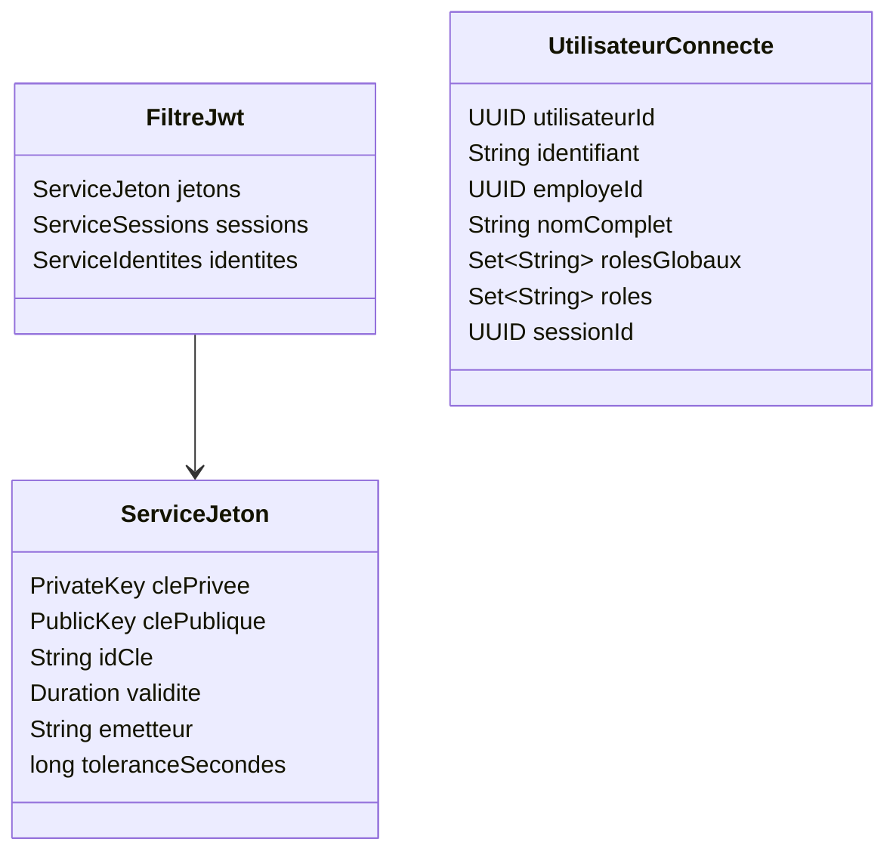
```mermaid
classDiagram
  class FiltreJwt {
    ServiceJeton jetons
    ServiceSessions sessions
    ServiceIdentites identites
  }
  class ServiceJeton {
    PrivateKey clePrivee
    PublicKey clePublique
    String idCle
    Duration validite
    String emetteur
    long toleranceSecondes
  }
  class UtilisateurConnecte {
    UUID utilisateurId
    String identifiant
    UUID employeId
    String nomComplet
    Set~String~ rolesGlobaux
    Set~String~ roles
    UUID sessionId
  }
  FiltreJwt --> ServiceJeton
```

## `autorisation` — Autorisation (E3) : habilitations, rôles, point d'application unique

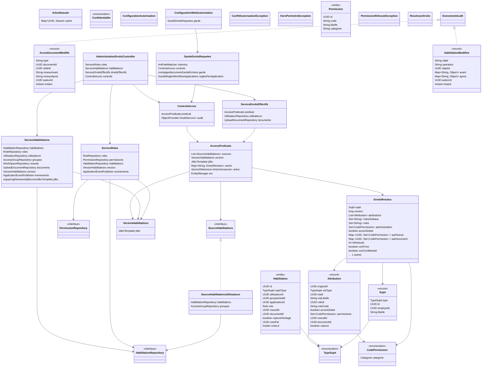
```mermaid
classDiagram
  class AccesDocumentModifie {
    <<record>>
    String type
    UUID documentId
    UUID cibleId
    String niveauAvant
    String niveauApres
    UUID auteurId
    Instant instant
  }
  class AccessPredicate {
    List~SourceHabilitations~ sources
    VersionHabilitations version
    JdbcTemplate jdbc
    Map~String, DroitsResolus~ cache
    AtomicReference~ArbreVersionne~ arbre
    EntityManager em
  }
  class AdministrationDroitsController {
    ServiceRoles roles
    ServiceHabilitations habilitations
    ServiceDroitsEffectifs droitsEffectifs
    ControleAcces controle
  }
  class ArbreNoeuds {
    Map~UUID, Noeud~ parId
  }
  class Attribution {
    <<record>>
    UUID origineId
    TypeSujet viaType
    UUID viaId
    String viaLibelle
    UUID roleId
    String roleCode
    boolean accesGlobal
    Set~CodePermission~ permissions
    UUID noeudId
    UUID documentId
    boolean rupture
  }
  class CodePermission {
    <<enumeration>>
    Categorie categorie
  }
  class Confidentialite {
    <<enumeration>>
  }
  class ConfigurationAutorisation {
  }
  class ConfigurationWebAutorisation {
    GardeDroitsRequetes garde
  }
  class ConflitAutorisationException {
  }
  class ControleAcces {
    AccessPredicate predicat
    ObjectProvider~AuditService~ audit
  }
  class DroitsResolus {
    Sujet sujet
    long version
    List~Attribution~ attributions
    Set~String~ rolesGlobaux
    Set~String~ roles
    Set~CodePermission~ administration
    boolean accesGlobal
    Map~UUID, Set~CodePermission~~ parNoeud
    Map~UUID, Set~CodePermission~~ parDocument
    int nbNoeuds
    boolean voirPrive
    boolean voirConfidentiel
    … 1 autres
  }
  class GardeDroitsRequetes {
    AntPathMatcher chemins
    ControleAcces controle
    comiptgeddocumentGardeEcriture garde
    GardeReglesWorkflowApplications reglesParApplication
  }
  class Habilitation {
    <<entity>>
    UUID id
    TypeSujet sujetType
    UUID utilisateurId
    UUID groupeGedId
    UUID applicationId
    Role role
    UUID noeudId
    UUID documentId
    boolean ruptureHeritage
    UUID creePar
    Instant creeLe
  }
  class HabilitationModifiee {
    <<record>>
    String objet
    String operation
    UUID objetId
    Map~String, Object~ avant
    Map~String, Object~ apres
    UUID auteurId
    Instant instant
  }
  class HabilitationRepository {
    <<interface>>
  }
  class HorsPerimetreException {
  }
  class Permission {
    <<entity>>
    UUID id
    String code
    String libelle
    String categorie
  }
  class PermissionRefuseeException {
  }
  class PermissionRepository {
    <<interface>>
  }
  class ResolveurDroits {
  }
  class ServiceDroitsEffectifs {
    AccessPredicate predicat
    UtilisateurRepository utilisateurs
    UploadDocumentRepository documents
  }
  class ServiceHabilitations {
    HabilitationRepository habilitations
    RoleRepository roles
    UtilisateurRepository utilisateurs
    AccessGroupRepository groupes
    WorkSpaceRepository noeuds
    UploadDocumentRepository documents
    VersionHabilitations version
    ApplicationEventPublisher evenements
    orgspringframeworkjdbccoreJdbcTemplate jdbc
  }
  class ServiceRoles {
    RoleRepository roles
    PermissionRepository permissions
    HabilitationRepository habilitations
    VersionHabilitations version
    ApplicationEventPublisher evenements
  }
  class SourceHabilitations {
    <<interface>>
  }
  class SourceHabilitationsUtilisateurs {
    HabilitationRepository habilitations
    AccessGroupRepository groupes
  }
  class Sujet {
    <<record>>
    TypeSujet type
    UUID id
    UUID employeId
    String libelle
  }
  class TypeSujet {
    <<enumeration>>
  }
  class VersionHabilitations {
    JdbcTemplate jdbc
  }
  EvenementAudit <|.. AccesDocumentModifie
  AccessPredicate --> SourceHabilitations
  AccessPredicate --> VersionHabilitations
  AccessPredicate --> DroitsResolus
  AdministrationDroitsController --> ServiceRoles
  AdministrationDroitsController --> ServiceHabilitations
  AdministrationDroitsController --> ServiceDroitsEffectifs
  AdministrationDroitsController --> ControleAcces
  Attribution --> TypeSujet
  Attribution --> CodePermission
  ConfigurationWebAutorisation --> GardeDroitsRequetes
  ControleAcces --> AccessPredicate
  DroitsResolus --> Sujet
  DroitsResolus --> Attribution
  DroitsResolus --> CodePermission
  GardeDroitsRequetes --> ControleAcces
  Habilitation --> TypeSujet
  EvenementAudit <|.. HabilitationModifiee
  ServiceDroitsEffectifs --> AccessPredicate
  ServiceHabilitations --> HabilitationRepository
  ServiceHabilitations --> VersionHabilitations
  ServiceRoles --> PermissionRepository
  ServiceRoles --> HabilitationRepository
  ServiceRoles --> VersionHabilitations
  SourceHabilitations <|.. SourceHabilitationsUtilisateurs
  SourceHabilitationsUtilisateurs --> HabilitationRepository
  Sujet --> TypeSujet
```

DTO : `HabilitationVue`.

## `accessgroup` — Groupes GED (E3)

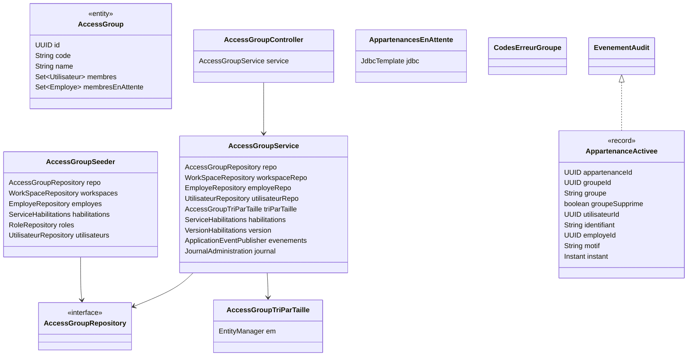
```mermaid
classDiagram
  class AccessGroup {
    <<entity>>
    UUID id
    String code
    String name
    Set~Utilisateur~ membres
    Set~Employe~ membresEnAttente
  }
  class AccessGroupController {
    AccessGroupService service
  }
  class AccessGroupRepository {
    <<interface>>
  }
  class AccessGroupSeeder {
    AccessGroupRepository repo
    WorkSpaceRepository workspaces
    EmployeRepository employes
    ServiceHabilitations habilitations
    RoleRepository roles
    UtilisateurRepository utilisateurs
  }
  class AccessGroupService {
    AccessGroupRepository repo
    WorkSpaceRepository workspaceRepo
    EmployeRepository employeRepo
    UtilisateurRepository utilisateurRepo
    AccessGroupTriParTaille triParTaille
    ServiceHabilitations habilitations
    VersionHabilitations version
    ApplicationEventPublisher evenements
    JournalAdministration journal
  }
  class AccessGroupTriParTaille {
    EntityManager em
  }
  class AppartenanceActivee {
    <<record>>
    UUID appartenanceId
    UUID groupeId
    String groupe
    boolean groupeSupprime
    UUID utilisateurId
    String identifiant
    UUID employeId
    String motif
    Instant instant
  }
  class AppartenancesEnAttente {
    JdbcTemplate jdbc
  }
  class CodesErreurGroupe {
  }
  AccessGroupController --> AccessGroupService
  AccessGroupSeeder --> AccessGroupRepository
  AccessGroupService --> AccessGroupRepository
  AccessGroupService --> AccessGroupTriParTaille
  EvenementAudit <|.. AppartenanceActivee
```

DTO : `AccessGroupResponse`.

## `workspace` — Nœuds : espaces et dossiers (E1, E3)

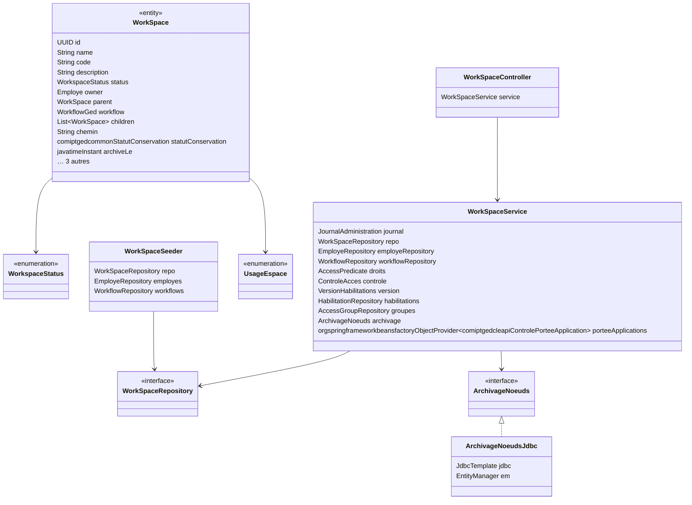
```mermaid
classDiagram
  class ArchivageNoeuds {
    <<interface>>
  }
  class ArchivageNoeudsJdbc {
    JdbcTemplate jdbc
    EntityManager em
  }
  class UsageEspace {
    <<enumeration>>
  }
  class WorkSpace {
    <<entity>>
    UUID id
    String name
    String code
    String description
    WorkspaceStatus status
    Employe owner
    WorkSpace parent
    WorkflowGed workflow
    List~WorkSpace~ children
    String chemin
    comiptgedcommonStatutConservation statutConservation
    javatimeInstant archiveLe
    … 3 autres
  }
  class WorkSpaceController {
    WorkSpaceService service
  }
  class WorkSpaceRepository {
    <<interface>>
  }
  class WorkSpaceSeeder {
    WorkSpaceRepository repo
    EmployeRepository employes
    WorkflowRepository workflows
  }
  class WorkSpaceService {
    JournalAdministration journal
    WorkSpaceRepository repo
    EmployeRepository employeRepository
    WorkflowRepository workflowRepository
    AccessPredicate droits
    ControleAcces controle
    VersionHabilitations version
    HabilitationRepository habilitations
    AccessGroupRepository groupes
    ArchivageNoeuds archivage
    orgspringframeworkbeansfactoryObjectProvider~comiptgedcleapiControlePorteeApplication~ porteeApplications
  }
  class WorkspaceStatus {
    <<enumeration>>
  }
  ArchivageNoeuds <|.. ArchivageNoeudsJdbc
  WorkSpace --> WorkspaceStatus
  WorkSpace --> UsageEspace
  WorkSpaceController --> WorkSpaceService
  WorkSpaceSeeder --> WorkSpaceRepository
  WorkSpaceService --> WorkSpaceRepository
  WorkSpaceService --> ArchivageNoeuds
```

DTO : `TreeNode`, `WorkSpaceResponse`.

## `document` — Documents, versions, rattachements (E1, E5)

```mermaid
classDiagram
  class Acteur {
    <<record>>
    UUID employeId
    UUID applicationId
  }
  class AgentsArchiveCompetents {
    JdbcTemplate jdbc
    AccessPredicate droits
  }
  class AlertesEcheanceConservation {
    JdbcTemplate jdbc
    VerrouTache verrou
    AgentsArchiveCompetents agents
    ApplicationEventPublisher evenements
    TransactionTemplate tranche
    int taille
    Duration bail
    Clock horloge
  }
  class ApercuConsulte {
    <<record>>
    UUID documentId
    UUID versionId
    Acteur acteur
    Instant survenuLe
    UUID cleFichierId
  }
  class ArchivageDocuments {
    <<interface>>
  }
  class ArchivageDocumentsJdbc {
    JdbcTemplate jdbc
    GardeEcriture garde
    EntityManager em
  }
  class ContenuIndexe {
    <<record>>
    UUID documentId
    UUID versionId
    Acteur acteur
    Instant survenuLe
    int nbPages
    String provenance
    Duration delaiDisponibilite
  }
  class ContraintesDepot {
  }
  class DocumentArchive {
    <<record>>
    UUID documentId
    UUID versionId
    Acteur acteur
    Instant survenuLe
    String empreinte
    String copieConservation
    String motifCopie
    UUID jobId
  }
  class DocumentConfidentielDesigne {
    <<entity>>
    UUID id
    UUID documentId
    UUID utilisateurId
    UUID creePar
    Instant creeLe
  }
  class DocumentConfidentielDesigneRepository {
    <<interface>>
  }
  class DocumentConsulte {
    <<record>>
    UUID documentId
    UUID versionId
    Acteur acteur
    Instant survenuLe
  }
  class DocumentController {
    DocumentService service
    comfasterxmljacksondatabindObjectMapper json
    comiptgeddocumentrechercheRechercheMetadonnees recherche
  }
  class DocumentDepose {
    <<record>>
    UUID documentId
    UUID versionId
    Acteur acteur
    Instant survenuLe
    String nom
    UUID typeDocumentId
    UUID workspaceId
    String nomFichier
    UUID cleFichierId
    String empreinte
    String typeMime
    long tailleOctets
    … 1 autres
  }
  class DocumentDesarchive {
    <<record>>
    UUID documentId
    UUID versionId
    Acteur acteur
    Instant survenuLe
    String empreinte
  }
  class DocumentExporte {
    <<record>>
    UUID documentId
    UUID versionId
    Acteur acteur
    Instant survenuLe
    UUID exportId
    String empreinte
  }
  class DocumentPurge {
    <<record>>
    UUID documentId
    UUID versionId
    Acteur acteur
    Instant survenuLe
    String nom
    int nbVersions
    int nbFichiers
  }
  class DocumentRattachement {
    <<entity>>
    UUID id
    UploadDocument document
    WorkSpace noeud
    UUID creePar
    Instant creeLe
  }
  class DocumentRattachementRepository {
    <<interface>>
  }
  class DocumentRestaure {
    <<record>>
    UUID documentId
    UUID versionId
    Acteur acteur
    Instant survenuLe
    String nom
  }
  class DocumentService {
    UploadDocumentRepository repo
    TypeDocumentRepository typeRepo
    ServiceCircuits circuits
    EtiquetteRepository etiquetteRepo
    EmployeRepository employeRepo
    DocumentVersionRepository versionRepo
    ControleFichiers controleFichiers
    StockageChiffre stockage
    EnfilageOcr ocr
    ApplicationEventPublisher evenements
    ArchivageNoeuds archivageNoeuds
    CopiesConservation copies
    … 12 autres
  }
  class DocumentSupprime {
    <<record>>
    UUID documentId
    UUID versionId
    Acteur acteur
    Instant survenuLe
    String nom
  }
  class DocumentTelecharge {
    <<record>>
    UUID documentId
    UUID versionId
    Acteur acteur
    Instant survenuLe
    String nomFichier
  }
  class DocumentVersion {
    <<entity>>
    UUID id
    UploadDocument document
    String fileName
    UUID cleFichierId
    String empreinte
    String typeMime
    Long tailleOctets
    String extension
    long sizeKo
    String observation
    boolean principale
    int numero
    … 1 autres
  }
  class DocumentVersionRepository {
    <<interface>>
  }
  class EcheanceConservationAtteinte {
    <<record>>
    UUID documentId
    String document
    LocalDate echeance
    List~UUID~ destinataires
  }
  class Echeances {
  }
  class EvenementModeleDocument {
    <<record>>
    String action
    UUID documentId
    Map~String, Object~ avant
    Map~String, Object~ apres
    String motif
    UUID auteurId
    ResultatAudit resultat
    Instant instant
  }
  class GardeEcriture {
    JdbcTemplate jdbc
  }
  class MetadonneesModifiees {
    <<record>>
    UUID documentId
    UUID versionId
    Acteur acteur
    Instant survenuLe
    Map~String, Object~ avant
    Map~String, Object~ apres
  }
  class OcrEnEchec {
    <<record>>
    UUID documentId
    UUID versionId
    Acteur acteur
    Instant survenuLe
    UUID jobId
    String motif
  }
  class RechercheMetadonnees {
    NamedParameterJdbcTemplate nomme
    JdbcTemplate jdbc
    AccessPredicate droits
    UploadDocumentRepository documents
    DocumentService service
    ObjectMapper json
  }
  class ServiceModeleDocument {
    ServiceVersionsPlan versionsPlan
    DocumentRattachementRepository rattachements
    JdbcTemplate jdbc
    ApplicationEventPublisher evenements
  }
  class ServiceVersions {
    DocumentVersionRepository versions
    JdbcTemplate jdbc
    EntityManager em
  }
  class TacheAlertesEcheance {
    AlertesEcheanceConservation alertes
  }
  class UploadDocument {
    <<entity>>
    UUID id
    String name
    WorkSpace workspace
    comiptgedcommonStatutConservation statutConservation
    javatimeInstant archiveLe
    UUID archivePar
    LocalDate echeanceConservation
    UUID planIndexationVersionId
    Confidentialite confidentialite
    TypeDocument typeDocument
    String fileName
    String extension
    … 19 autres
  }
  class VerrouModifie {
    <<record>>
    UUID documentId
    UUID versionId
    Acteur acteur
    Instant survenuLe
    boolean verrouilleAvant
    boolean verrouilleApres
    String motifVerrou
  }
  class VersionAjoutee {
    <<record>>
    UUID documentId
    UUID versionId
    Acteur acteur
    Instant survenuLe
    UUID versionPrecedenteId
    String nomFichier
    String observation
    UUID cleFichierId
    String empreinte
    String typeMime
    long tailleOctets
    String statutOcr
  }
  class VersionRestauree {
    <<record>>
    UUID documentId
    UUID versionId
    Acteur acteur
    Instant survenuLe
    UUID versionPrecedenteId
    String statutOcr
  }
  AlertesEcheanceConservation --> AgentsArchiveCompetents
  ApercuConsulte --> Acteur
  ArchivageDocuments <|.. ArchivageDocumentsJdbc
  ArchivageDocumentsJdbc --> GardeEcriture
  ContenuIndexe --> Acteur
  DocumentArchive --> Acteur
  DocumentConsulte --> Acteur
  DocumentController --> DocumentService
  DocumentController --> RechercheMetadonnees
  DocumentDepose --> Acteur
  DocumentDesarchive --> Acteur
  DocumentExporte --> Acteur
  DocumentPurge --> Acteur
  DocumentRattachement --> UploadDocument
  DocumentRestaure --> Acteur
  DocumentService --> DocumentVersionRepository
  DocumentService --> GardeEcriture
  DocumentService --> DocumentRattachementRepository
  DocumentService --> DocumentConfidentielDesigneRepository
  DocumentService --> ServiceModeleDocument
  DocumentService --> ServiceVersions
  DocumentSupprime --> Acteur
  DocumentTelecharge --> Acteur
  DocumentVersion --> UploadDocument
  EvenementAudit <|.. EcheanceConservationAtteinte
  EvenementNotifiable <|.. EcheanceConservationAtteinte
  EvenementAudit <|.. EvenementModeleDocument
  MetadonneesModifiees --> Acteur
  OcrEnEchec --> Acteur
  RechercheMetadonnees --> DocumentService
  ServiceModeleDocument --> DocumentRattachementRepository
  ServiceVersions --> DocumentVersionRepository
  TacheAlertesEcheance --> AlertesEcheanceConservation
  UploadDocument --> DocumentVersion
  VerrouModifie --> Acteur
  VersionAjoutee --> Acteur
  VersionRestauree --> Acteur
```

DTO : `DocumentRequest`, `DocumentResponse`.

## `depot` — Dépôt en deux temps (E5, §12.11)

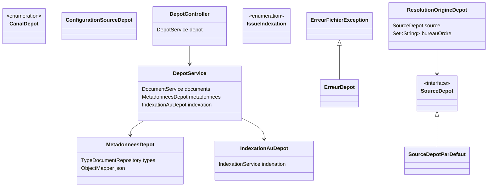
```mermaid
classDiagram
  class CanalDepot {
    <<enumeration>>
  }
  class ConfigurationSourceDepot {
  }
  class DepotController {
    DepotService depot
  }
  class DepotService {
    DocumentService documents
    MetadonneesDepot metadonnees
    IndexationAuDepot indexation
  }
  class ErreurDepot {
  }
  class IndexationAuDepot {
    IndexationService indexation
  }
  class IssueIndexation {
    <<enumeration>>
  }
  class MetadonneesDepot {
    TypeDocumentRepository types
    ObjectMapper json
  }
  class ResolutionOrigineDepot {
    SourceDepot source
    Set~String~ bureauOrdre
  }
  class SourceDepot {
    <<interface>>
  }
  class SourceDepotParDefaut {
  }
  DepotController --> DepotService
  DepotService --> MetadonneesDepot
  DepotService --> IndexationAuDepot
  ErreurFichierException <|-- ErreurDepot
  ResolutionOrigineDepot --> SourceDepot
  SourceDepot <|.. SourceDepotParDefaut
```

## `fichier` — Stockage chiffré, contrôles, antivirus, aperçu (E5)

```mermaid
classDiagram
  class AnalyseurAntivirus {
    <<interface>>
  }
  class AntivirusDesactive {
  }
  class CleEnveloppee {
    <<record>>
    String kekId
    byte[] octets
  }
  class CleFichier {
    <<record>>
    UUID id
    byte[] dekEnveloppee
    String kekId
    String algorithme
  }
  class CleIndisponibleException {
  }
  class ClientClamd {
    String hote
    int port
    int delaiConnexionMs
    int delaiLectureMs
    int tailleBloc
  }
  class CodesErreurFichier {
  }
  class ConfigurationFichiers {
  }
  class ContexteCle {
  }
  class ControleAccesPrevisualisation {
    <<interface>>
  }
  class ControleFichiers {
    DetecteurTypeReel detecteur
    AnalyseurAntivirus antivirus
    StockageChiffre stockage
    ApplicationEventPublisher evenements
    long tailleDefautOctets
    long plafondOctets
    List~String~ formatsParDefaut
  }
  class ConvertisseurBureautique {
    <<interface>>
  }
  class ConvertisseurLibreOffice {
    List~String~ commande
    Duration delai
    volatile Boolean disponible
  }
  class DepotClesFichier {
    <<interface>>
  }
  class DepotClesFichierJdbc {
    JdbcTemplate jdbc
  }
  class DetecteurTypeReel {
    Detector detecteur
  }
  class ErreurFichierException {
  }
  class FichierDejaPresentException {
    UUID id
  }
  class Fichiers {
  }
  class FileStore {
    <<interface>>
  }
  class FileStoreDisque {
    Path racine
  }
  class FluxChiffrant {
    OutputStream sortie
    SecretKey dek
    UUID id
    byte[] entete
    byte[] ivBase
    byte[] clair
    byte[] chiffre
    Cipher cipher
    int remplis
    long rang
    boolean ferme
  }
  class FluxDechiffrant {
    InputStream entree
    SecretKey dek
    UUID id
    byte[] entete
    byte[] ivBase
    byte[] chiffre
    byte[] clair
    Cipher cipher
    int disponibles
    int position
    long rang
    boolean termine
    … 1 autres
  }
  class FormatChiffre {
  }
  class FormatsReconnus {
  }
  class IntegriteController {
    VerificationALaDemande verification
    ControleAcces controle
  }
  class KeyProvider {
    <<interface>>
  }
  class KeystoreKeyProvider {
    Path chemin
    char[] motDePasse
    SecureRandom aleatoire
    volatile NavigableMap~String, SecretKey~ keks
  }
  class LanceurReprise {
    ProprietesFichiers proprietes
    JdbcTemplate jdbc
    PlatformTransactionManager transactions
    StockageChiffre stockage
    DetecteurTypeReel detecteur
    AnalyseurAntivirus antivirus
    EnfilageOcr ocr
  }
  class LanceurRotationKek {
    KeyProvider keyProvider
    RotationKek rotation
    boolean retirerAncienne
  }
  class LectureControlee {
    StockageChiffre stockage
    ApplicationEventPublisher evenements
  }
  class MetriquesIntegrite {
    Map~VerificationIntegriteStatut, Counter~ compteurs
    VerificationPeriodique fonds
    AtomicReference~Double~ derniere
  }
  class PrevisualisationController {
    ResolveurFichierVersion resolveur
    ControleAccesPrevisualisation controleAcces
    ServicePrevisualisation service
    ApplicationEventPublisher evenements
    comiptgedfichierintegriteLectureControlee lectures
  }
  class ProprietesFichiers {
    String racine
    String racineCacheApercu
    int tailleMaxDefautMo
    int plafondPlateformeMo
    List~String~ formatsParDefaut
    int tailleSegment
    Cles cles
    Antivirus antivirus
    Integrite integrite
    Previsualisation previsualisation
    Reprise reprise
  }
  class Refus {
  }
  class ReglesDepot {
    <<record>>
    long tailleMaxOctets
    Set~String~ typesAdmis
    Collection~String~ formatsAffiches
  }
  class RepriseVersionsEnClair {
    JdbcTemplate jdbc
    TransactionTemplate transaction
    StockageChiffre stockage
    DetecteurTypeReel detecteur
    AnalyseurAntivirus antivirus
    EnfilageOcr ocr
    long plafondOctets
  }
  class ResolveurFichierVersion {
    <<interface>>
  }
  class ResolveurFichierVersionJpa {
    DocumentVersionRepository versions
  }
  class RotationKek {
    KeyProvider keyProvider
    DepotClesFichier depot
  }
  class ServicePrevisualisation {
    StockageChiffre documents
    StockageChiffre cache
    ConvertisseurBureautique convertisseur
    Path repertoireTravail
    long plafondOctets
  }
  class SourceEmpreintes {
    <<interface>>
  }
  class SourceEmpreintesVersions {
    JdbcTemplate jdbc
  }
  class SourceFichier {
    <<interface>>
  }
  class StockageChiffre {
    FileStore store
    KeyProvider keyProvider
    DepotClesFichier cles
    int tailleSegment
    SecureRandom aleatoire
  }
  class VerificationALaDemande {
    JdbcTemplate jdbc
    VerificationIntegrite verification
    VerificationPeriodique fonds
    ApplicationEventPublisher evenements
  }
  class VerificationIntegrite {
    StockageChiffre stockage
    ApplicationEventPublisher evenements
  }
  class VerificationPeriodique {
    VerificationIntegrite verification
    SourceEmpreintes source
    AtomicBoolean enCours
    volatile Etat etat
  }
  AnalyseurAntivirus <|.. AntivirusDesactive
  AnalyseurAntivirus <|.. ClientClamd
  ControleFichiers --> DetecteurTypeReel
  ControleFichiers --> AnalyseurAntivirus
  ControleFichiers --> StockageChiffre
  ConvertisseurBureautique <|.. ConvertisseurLibreOffice
  DepotClesFichier <|.. DepotClesFichierJdbc
  FileStore <|.. FileStoreDisque
  IntegriteController --> VerificationALaDemande
  KeyProvider <|.. KeystoreKeyProvider
  LanceurReprise --> ProprietesFichiers
  LanceurReprise --> StockageChiffre
  LanceurReprise --> DetecteurTypeReel
  LanceurReprise --> AnalyseurAntivirus
  LanceurRotationKek --> KeyProvider
  LanceurRotationKek --> RotationKek
  LectureControlee --> StockageChiffre
  MetriquesIntegrite --> VerificationPeriodique
  PrevisualisationController --> ResolveurFichierVersion
  PrevisualisationController --> ControleAccesPrevisualisation
  PrevisualisationController --> ServicePrevisualisation
  PrevisualisationController --> LectureControlee
  RepriseVersionsEnClair --> StockageChiffre
  RepriseVersionsEnClair --> DetecteurTypeReel
  RepriseVersionsEnClair --> AnalyseurAntivirus
  ResolveurFichierVersion <|.. ResolveurFichierVersionJpa
  RotationKek --> KeyProvider
  RotationKek --> DepotClesFichier
  ServicePrevisualisation --> StockageChiffre
  ServicePrevisualisation --> ConvertisseurBureautique
  SourceEmpreintes <|.. SourceEmpreintesVersions
  StockageChiffre --> FileStore
  StockageChiffre --> KeyProvider
  StockageChiffre --> DepotClesFichier
  VerificationALaDemande --> VerificationIntegrite
  VerificationALaDemande --> VerificationPeriodique
  VerificationIntegrite --> StockageChiffre
  VerificationPeriodique --> VerificationIntegrite
  VerificationPeriodique --> SourceEmpreintes
```

## `ocr` — OCR asynchrone (E6)

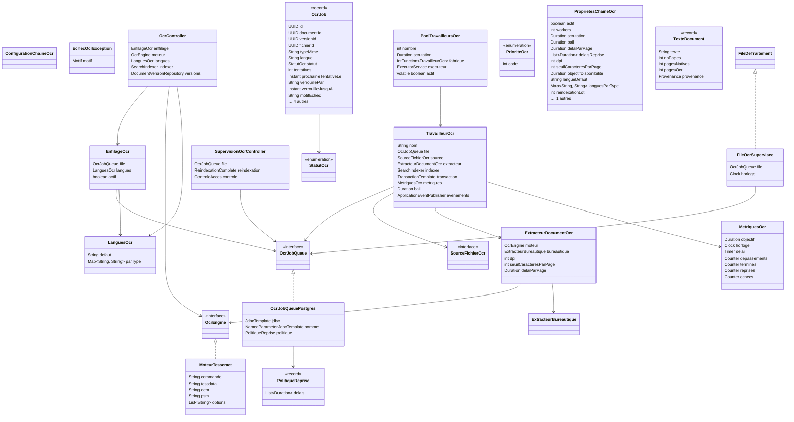
```mermaid
classDiagram
  class ConfigurationChaineOcr {
  }
  class EchecOcrException {
    Motif motif
  }
  class EnfilageOcr {
    OcrJobQueue file
    LanguesOcr langues
    boolean actif
  }
  class ExtracteurBureautique {
  }
  class ExtracteurDocumentOcr {
    OcrEngine moteur
    ExtracteurBureautique bureautique
    int dpi
    int seuilCaracteresParPage
    Duration delaiParPage
  }
  class FileOcrSupervisee {
    OcrJobQueue file
    Clock horloge
  }
  class LanguesOcr {
    String defaut
    Map~String, String~ parType
  }
  class MetriquesOcr {
    Duration objectif
    Clock horloge
    Timer delai
    Counter depassements
    Counter termines
    Counter reprises
    Counter echecs
  }
  class MoteurTesseract {
    String commande
    String tessdata
    String oem
    String psm
    List~String~ options
  }
  class OcrController {
    EnfilageOcr enfilage
    OcrEngine moteur
    LanguesOcr langues
    SearchIndexer indexer
    DocumentVersionRepository versions
  }
  class OcrEngine {
    <<interface>>
  }
  class OcrJob {
    <<record>>
    UUID id
    UUID documentId
    UUID versionId
    UUID fichierId
    String typeMime
    String langue
    StatutOcr statut
    int tentatives
    Instant prochaineTentativeLe
    String verrouillePar
    Instant verrouilleJusquA
    String motifEchec
    … 4 autres
  }
  class OcrJobQueue {
    <<interface>>
  }
  class OcrJobQueuePostgres {
    JdbcTemplate jdbc
    NamedParameterJdbcTemplate nomme
    PolitiqueReprise politique
  }
  class PolitiqueReprise {
    <<record>>
    List~Duration~ delais
  }
  class PoolTravailleursOcr {
    int nombre
    Duration scrutation
    IntFunction~TravailleurOcr~ fabrique
    ExecutorService executeur
    volatile boolean actif
  }
  class PrioriteOcr {
    <<enumeration>>
    int code
  }
  class ProprietesChaineOcr {
    boolean actif
    int workers
    Duration scrutation
    Duration bail
    Duration delaiParPage
    List~Duration~ delaisReprise
    int dpi
    int seuilCaracteresParPage
    Duration objectifDisponibilite
    String langueDefaut
    Map~String, String~ languesParType
    int reindexationLot
    … 1 autres
  }
  class SourceFichierOcr {
    <<interface>>
  }
  class StatutOcr {
    <<enumeration>>
  }
  class SupervisionOcrController {
    OcrJobQueue file
    ReindexationComplete reindexation
    ControleAcces controle
  }
  class TexteDocument {
    <<record>>
    String texte
    int nbPages
    int pagesNatives
    int pagesOcr
    Provenance provenance
  }
  class TravailleurOcr {
    String nom
    OcrJobQueue file
    SourceFichierOcr source
    ExtracteurDocumentOcr extracteur
    SearchIndexer indexer
    TransactionTemplate transaction
    MetriquesOcr metriques
    Duration bail
    ApplicationEventPublisher evenements
  }
  EnfilageOcr --> OcrJobQueue
  EnfilageOcr --> LanguesOcr
  ExtracteurDocumentOcr --> OcrEngine
  ExtracteurDocumentOcr --> ExtracteurBureautique
  FileDeTraitement <|.. FileOcrSupervisee
  FileOcrSupervisee --> OcrJobQueue
  OcrEngine <|.. MoteurTesseract
  OcrController --> EnfilageOcr
  OcrController --> OcrEngine
  OcrController --> LanguesOcr
  OcrJob --> StatutOcr
  OcrJobQueue <|.. OcrJobQueuePostgres
  OcrJobQueuePostgres --> PolitiqueReprise
  PoolTravailleursOcr --> TravailleurOcr
  SupervisionOcrController --> OcrJobQueue
  TravailleurOcr --> OcrJobQueue
  TravailleurOcr --> SourceFichierOcr
  TravailleurOcr --> ExtracteurDocumentOcr
  TravailleurOcr --> MetriquesOcr
```

## `recherche` — Recherche plein texte (E6)

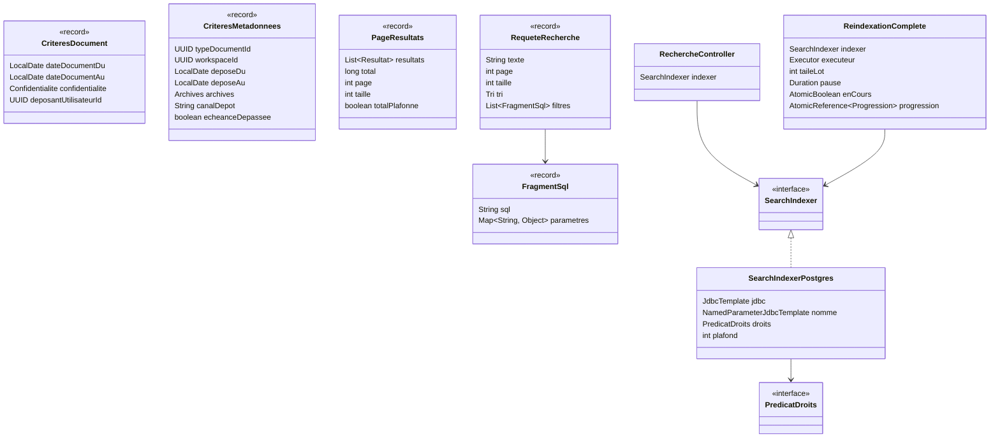
```mermaid
classDiagram
  class CriteresDocument {
    <<record>>
    LocalDate dateDocumentDu
    LocalDate dateDocumentAu
    Confidentialite confidentialite
    UUID deposantUtilisateurId
  }
  class CriteresMetadonnees {
    <<record>>
    UUID typeDocumentId
    UUID workspaceId
    LocalDate deposeDu
    LocalDate deposeAu
    Archives archives
    String canalDepot
    boolean echeanceDepassee
  }
  class FragmentSql {
    <<record>>
    String sql
    Map~String, Object~ parametres
  }
  class PageResultats {
    <<record>>
    List~Resultat~ resultats
    long total
    int page
    int taille
    boolean totalPlafonne
  }
  class PredicatDroits {
    <<interface>>
  }
  class RechercheController {
    SearchIndexer indexer
  }
  class ReindexationComplete {
    SearchIndexer indexer
    Executor executeur
    int taileLot
    Duration pause
    AtomicBoolean enCours
    AtomicReference~Progression~ progression
  }
  class RequeteRecherche {
    <<record>>
    String texte
    int page
    int taille
    Tri tri
    List~FragmentSql~ filtres
  }
  class SearchIndexer {
    <<interface>>
  }
  class SearchIndexerPostgres {
    JdbcTemplate jdbc
    NamedParameterJdbcTemplate nomme
    PredicatDroits droits
    int plafond
  }
  RechercheController --> SearchIndexer
  ReindexationComplete --> SearchIndexer
  RequeteRecherche --> FragmentSql
  SearchIndexer <|.. SearchIndexerPostgres
  SearchIndexerPostgres --> PredicatDroits
```

## `indexation` — Indexation et recherche multicritère (E1, E6)

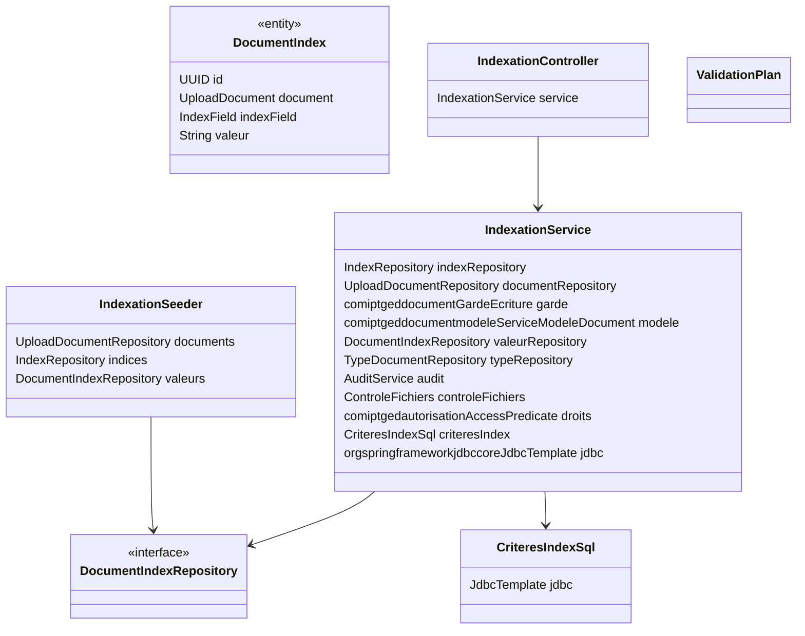
```mermaid
classDiagram
  class CriteresIndexSql {
    JdbcTemplate jdbc
  }
  class DocumentIndex {
    <<entity>>
    UUID id
    UploadDocument document
    IndexField indexField
    String valeur
  }
  class DocumentIndexRepository {
    <<interface>>
  }
  class IndexationController {
    IndexationService service
  }
  class IndexationSeeder {
    UploadDocumentRepository documents
    IndexRepository indices
    DocumentIndexRepository valeurs
  }
  class IndexationService {
    IndexRepository indexRepository
    UploadDocumentRepository documentRepository
    comiptgeddocumentGardeEcriture garde
    comiptgeddocumentmodeleServiceModeleDocument modele
    DocumentIndexRepository valeurRepository
    TypeDocumentRepository typeRepository
    AuditService audit
    ControleFichiers controleFichiers
    comiptgedautorisationAccessPredicate droits
    CriteresIndexSql criteresIndex
    orgspringframeworkjdbccoreJdbcTemplate jdbc
  }
  class ValidationPlan {
  }
  IndexationController --> IndexationService
  IndexationSeeder --> DocumentIndexRepository
  IndexationService --> DocumentIndexRepository
  IndexationService --> CriteresIndexSql
```

DTO : `AnalyseResponse`, `ApercuResponse`, `CritereResponse`, `GroupeResponse`, `RechercheRequest`, `ResultatResponse`, `ValeurRequest`.

## `cycledevie` — Cycle de vie : archivage, purge, export (E7)

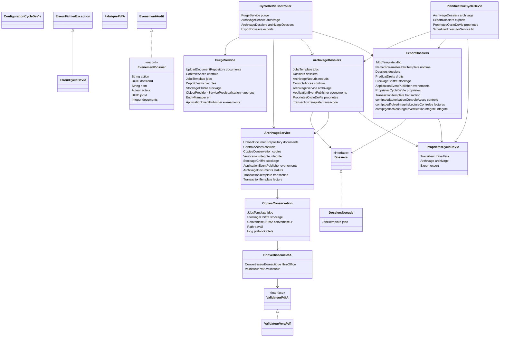
```mermaid
classDiagram
  class ArchivageDossiers {
    JdbcTemplate jdbc
    Dossiers dossiers
    ArchivageNoeuds noeuds
    ControleAcces controle
    ArchivageService archivage
    ApplicationEventPublisher evenements
    ProprietesCycleDeVie proprietes
    TransactionTemplate transaction
  }
  class ArchivageService {
    UploadDocumentRepository documents
    ControleAcces controle
    CopiesConservation copies
    VerificationIntegrite integrite
    StockageChiffre stockage
    ApplicationEventPublisher evenements
    ArchivageDocuments statuts
    TransactionTemplate transaction
    TransactionTemplate lecture
  }
  class ConfigurationCycleDeVie {
  }
  class ConvertisseurPdfA {
    ConvertisseurBureautique libreOffice
    ValidateurPdfA validateur
  }
  class CopiesConservation {
    JdbcTemplate jdbc
    StockageChiffre stockage
    ConvertisseurPdfA convertisseur
    Path travail
    long plafondOctets
  }
  class CycleDeVieController {
    PurgeService purge
    ArchivageService archivage
    ArchivageDossiers archivageDossiers
    ExportDossiers exports
  }
  class Dossiers {
    <<interface>>
  }
  class DossiersNoeuds {
    JdbcTemplate jdbc
  }
  class ErreurCycleDeVie {
  }
  class EvenementDossier {
    <<record>>
    String action
    UUID dossierId
    String nom
    Acteur acteur
    UUID jobId
    Integer documents
  }
  class ExportDossiers {
    JdbcTemplate jdbc
    NamedParameterJdbcTemplate nomme
    Dossiers dossiers
    PredicatDroits droits
    StockageChiffre stockage
    ApplicationEventPublisher evenements
    ProprietesCycleDeVie proprietes
    TransactionTemplate transaction
    comiptgedautorisationControleAcces controle
    comiptgedfichierintegriteLectureControlee lectures
    comiptgedfichierintegriteVerificationIntegrite integrite
  }
  class FabriquePdfA {
  }
  class PlanificateurCycleDeVie {
    ArchivageDossiers archivage
    ExportDossiers exports
    ProprietesCycleDeVie proprietes
    ScheduledExecutorService fil
  }
  class ProprietesCycleDeVie {
    Travailleur travailleur
    Archivage archivage
    Export export
  }
  class PurgeService {
    UploadDocumentRepository documents
    ControleAcces controle
    JdbcTemplate jdbc
    DepotClesFichier cles
    StockageChiffre stockage
    ObjectProvider~ServicePrevisualisation~ apercus
    EntityManager em
    ApplicationEventPublisher evenements
  }
  class ValidateurPdfA {
    <<interface>>
  }
  class ValidateurVeraPdf {
  }
  ArchivageDossiers --> Dossiers
  ArchivageDossiers --> ArchivageService
  ArchivageDossiers --> ProprietesCycleDeVie
  ArchivageService --> CopiesConservation
  ConvertisseurPdfA --> ValidateurPdfA
  CopiesConservation --> ConvertisseurPdfA
  CycleDeVieController --> PurgeService
  CycleDeVieController --> ArchivageService
  CycleDeVieController --> ArchivageDossiers
  CycleDeVieController --> ExportDossiers
  Dossiers <|.. DossiersNoeuds
  ErreurFichierException <|-- ErreurCycleDeVie
  EvenementAudit <|.. EvenementDossier
  ExportDossiers --> Dossiers
  ExportDossiers --> ProprietesCycleDeVie
  PlanificateurCycleDeVie --> ArchivageDossiers
  PlanificateurCycleDeVie --> ExportDossiers
  PlanificateurCycleDeVie --> ProprietesCycleDeVie
  ValidateurPdfA <|.. ValidateurVeraPdf
```

## `workflow` — Règles de workflow (E1, E8)

```mermaid
classDiagram
  class AccesApiWorkflow {
    <<interface>>
  }
  class AccesApiWorkflowCles {
    AccesApiWorkflowUtilisateurs utilisateurs
    ControlePorteeApplication portee
  }
  class AccesApiWorkflowUtilisateurs {
  }
  class ActeurWorkflow {
    <<record>>
    UUID utilisateurId
    UUID employeId
    UUID applicationId
    String libelle
  }
  class Circuit {
    <<entity>>
    UUID id
    UploadDocument document
    UUID regleWorkflowId
    Statut statut
    UUID initiateurId
    Instant ouvertLe
    Instant closLe
    UUID annulePar
    Instant annuleLe
    String motifAnnulation
    List~CircuitValidateur~ validateurs
  }
  class CircuitController {
    ServiceCircuits service
    RattachementRegles rattachements
    AccesApiWorkflow acces
  }
  class CircuitRepository {
    <<interface>>
  }
  class CircuitValidateur {
    <<entity>>
    UUID id
    Circuit circuit
    Employe employe
    Role role
    UUID perimetreNoeudId
    String libelle
    int position
    UUID reaffecteDeEmployeId
    UUID reaffectePar
    Instant reaffecteLe
    String motifReaffectation
  }
  class Decision {
    <<entity>>
    UUID id
    CircuitValidateur validateur
    UUID versionId
    Type decision
    String motif
    Instant creeLe
    UUID auteurId
    UUID applicationId
  }
  class DecisionRepository {
    <<interface>>
  }
  class ErreurWorkflowException {
  }
  class EvenementWorkflow {
    <<record>>
    String action
    UUID objetId
    String objetType
    Map~String, Object~ avant
    Map~String, Object~ apres
    String motifAction
    UUID utilisateurId
    UUID applicationId
    String nomActeur
    DemandeNotification demande
    Instant instant
  }
  class OperationWorkflow {
    <<enumeration>>
  }
  class RattachementRegles {
    WorkSpaceRepository noeuds
    TypeDocumentRepository types
    WorkflowRepository regles
    AccessPredicate predicat
    ApplicationEventPublisher evenements
  }
  class ReglesApplicables {
  }
  class ServiceCircuits {
    CircuitRepository circuits
    DecisionRepository decisions
    UploadDocumentRepository documents
    DocumentVersionRepository versions
    EmployeRepository employes
    UtilisateurRepository utilisateurs
    RoleRepository roles
    HabilitationRepository habilitations
    ServiceHabilitations serviceHabilitations
    AccessPredicate predicat
    ReglesApplicables regles
    comiptgedautorisationControleAcces controle
    … 4 autres
  }
  class WorkflowController {
    WorkflowService service
  }
  class WorkflowGed {
    <<entity>>
    UUID id
    String name
    List~WorkflowStep~ steps
  }
  class WorkflowRepository {
    <<interface>>
  }
  class WorkflowService {
    JournalAdministration journal
    WorkflowRepository workflowRepository
    EmployeRepository employeRepository
    comiptgedidentiteRoleRepository roles
    comiptgedworkspaceWorkSpaceRepository noeuds
  }
  class WorkflowStep {
    <<entity>>
    UUID id
    WorkflowGed workflow
    Employe employe
    comiptgedidentiteRole role
    UUID perimetreNoeudId
    String label
    int stepOrder
  }
  AccesApiWorkflow <|.. AccesApiWorkflowCles
  AccesApiWorkflowCles --> AccesApiWorkflowUtilisateurs
  AccesApiWorkflow <|.. AccesApiWorkflowUtilisateurs
  Circuit --> CircuitValidateur
  CircuitController --> ServiceCircuits
  CircuitController --> RattachementRegles
  CircuitController --> AccesApiWorkflow
  CircuitValidateur --> Circuit
  Decision --> CircuitValidateur
  EvenementAudit <|.. EvenementWorkflow
  EvenementNotifiable <|.. EvenementWorkflow
  RattachementRegles --> WorkflowRepository
  ServiceCircuits --> CircuitRepository
  ServiceCircuits --> DecisionRepository
  ServiceCircuits --> ReglesApplicables
  WorkflowController --> WorkflowService
  WorkflowGed --> WorkflowStep
  WorkflowService --> WorkflowRepository
  WorkflowStep --> WorkflowGed
```

DTO : `CircuitResponse`, `VuesWorkflow`, `WorkflowResponse`.

## `notification` — Notifications (E8, §12.9)

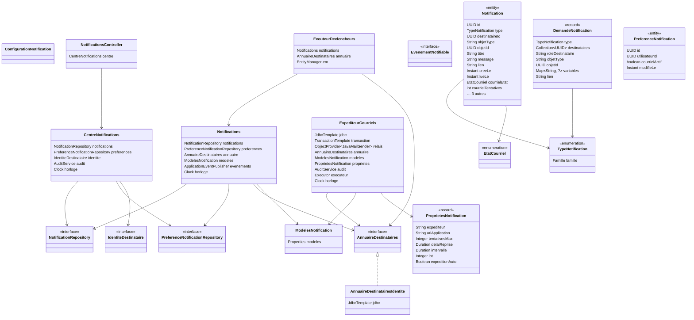
```mermaid
classDiagram
  class AnnuaireDestinataires {
    <<interface>>
  }
  class AnnuaireDestinatairesIdentite {
    JdbcTemplate jdbc
  }
  class CentreNotifications {
    NotificationRepository notifications
    PreferenceNotificationRepository preferences
    IdentiteDestinataire identite
    AuditService audit
    Clock horloge
  }
  class ConfigurationNotification {
  }
  class DemandeNotification {
    <<record>>
    TypeNotification type
    Collection~UUID~ destinataires
    String roleDestinataire
    String objetType
    UUID objetId
    Map~String, ?~ variables
    String lien
  }
  class EcouteurDeclencheurs {
    Notifications notifications
    AnnuaireDestinataires annuaire
    EntityManager em
  }
  class EtatCourriel {
    <<enumeration>>
  }
  class EvenementNotifiable {
    <<interface>>
  }
  class ExpediteurCourriels {
    JdbcTemplate jdbc
    TransactionTemplate transaction
    ObjectProvider~JavaMailSender~ relais
    AnnuaireDestinataires annuaire
    ModelesNotification modeles
    ProprietesNotification proprietes
    AuditService audit
    Executor executeur
    Clock horloge
  }
  class IdentiteDestinataire {
    <<interface>>
  }
  class ModelesNotification {
    Properties modeles
  }
  class Notification {
    <<entity>>
    UUID id
    TypeNotification type
    UUID destinataireId
    String objetType
    UUID objetId
    String titre
    String message
    String lien
    Instant creeLe
    Instant lueLe
    EtatCourriel courrielEtat
    int courrielTentatives
    … 3 autres
  }
  class NotificationRepository {
    <<interface>>
  }
  class Notifications {
    NotificationRepository notifications
    PreferenceNotificationRepository preferences
    AnnuaireDestinataires annuaire
    ModelesNotification modeles
    ApplicationEventPublisher evenements
    Clock horloge
  }
  class NotificationsController {
    CentreNotifications centre
  }
  class PreferenceNotification {
    <<entity>>
    UUID id
    UUID utilisateurId
    boolean courrielActif
    Instant modifieLe
  }
  class PreferenceNotificationRepository {
    <<interface>>
  }
  class ProprietesNotification {
    <<record>>
    String expediteur
    String urlApplication
    Integer tentativesMax
    Duration delaiReprise
    Duration intervalle
    Integer lot
    Boolean expeditionAuto
  }
  class TypeNotification {
    <<enumeration>>
    Famille famille
  }
  AnnuaireDestinataires <|.. AnnuaireDestinatairesIdentite
  CentreNotifications --> NotificationRepository
  CentreNotifications --> PreferenceNotificationRepository
  CentreNotifications --> IdentiteDestinataire
  DemandeNotification --> TypeNotification
  EcouteurDeclencheurs --> Notifications
  EcouteurDeclencheurs --> AnnuaireDestinataires
  ExpediteurCourriels --> AnnuaireDestinataires
  ExpediteurCourriels --> ModelesNotification
  ExpediteurCourriels --> ProprietesNotification
  Notification --> TypeNotification
  Notification --> EtatCourriel
  Notifications --> NotificationRepository
  Notifications --> PreferenceNotificationRepository
  Notifications --> AnnuaireDestinataires
  Notifications --> ModelesNotification
  NotificationsController --> CentreNotifications
```

DTO : `DtoNotification`.

## `audit` — Journal d'audit (E4, §7.4)

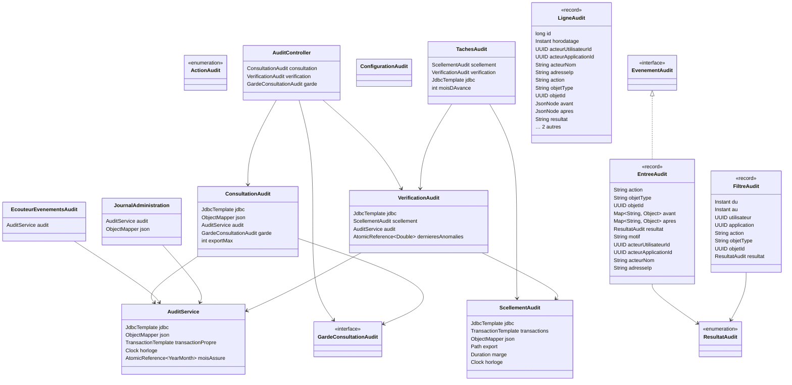
```mermaid
classDiagram
  class ActionAudit {
    <<enumeration>>
  }
  class AuditController {
    ConsultationAudit consultation
    VerificationAudit verification
    GardeConsultationAudit garde
  }
  class AuditService {
    JdbcTemplate jdbc
    ObjectMapper json
    TransactionTemplate transactionPropre
    Clock horloge
    AtomicReference~YearMonth~ moisAssure
  }
  class ConfigurationAudit {
  }
  class ConsultationAudit {
    JdbcTemplate jdbc
    ObjectMapper json
    AuditService audit
    GardeConsultationAudit garde
    int exportMax
  }
  class EcouteurEvenementsAudit {
    AuditService audit
  }
  class EntreeAudit {
    <<record>>
    String action
    String objetType
    UUID objetId
    Map~String, Object~ avant
    Map~String, Object~ apres
    ResultatAudit resultat
    String motif
    UUID acteurUtilisateurId
    UUID acteurApplicationId
    String acteurNom
    String adresseIp
  }
  class EvenementAudit {
    <<interface>>
  }
  class FiltreAudit {
    <<record>>
    Instant du
    Instant au
    UUID utilisateur
    UUID application
    String action
    String objetType
    UUID objetId
    ResultatAudit resultat
  }
  class GardeConsultationAudit {
    <<interface>>
  }
  class JournalAdministration {
    AuditService audit
    ObjectMapper json
  }
  class LigneAudit {
    <<record>>
    long id
    Instant horodatage
    UUID acteurUtilisateurId
    UUID acteurApplicationId
    String acteurNom
    String adresseIp
    String action
    String objetType
    UUID objetId
    JsonNode avant
    JsonNode apres
    String resultat
    … 2 autres
  }
  class ResultatAudit {
    <<enumeration>>
  }
  class ScellementAudit {
    JdbcTemplate jdbc
    TransactionTemplate transactions
    ObjectMapper json
    Path export
    Duration marge
    Clock horloge
  }
  class TachesAudit {
    ScellementAudit scellement
    VerificationAudit verification
    JdbcTemplate jdbc
    int moisDAvance
  }
  class VerificationAudit {
    JdbcTemplate jdbc
    ScellementAudit scellement
    AuditService audit
    AtomicReference~Double~ dernieresAnomalies
  }
  AuditController --> ConsultationAudit
  AuditController --> VerificationAudit
  AuditController --> GardeConsultationAudit
  ConsultationAudit --> AuditService
  ConsultationAudit --> GardeConsultationAudit
  EcouteurEvenementsAudit --> AuditService
  EvenementAudit <|.. EntreeAudit
  EntreeAudit --> ResultatAudit
  FiltreAudit --> ResultatAudit
  JournalAdministration --> AuditService
  TachesAudit --> ScellementAudit
  TachesAudit --> VerificationAudit
  VerificationAudit --> ScellementAudit
  VerificationAudit --> AuditService
```

## `cleapi` — Clés d'API, portée et délégation (E9, §5.4, §5.5)

```mermaid
classDiagram
  class Application {
    <<entity>>
    UUID id
    String code
    String nom
    String description
    String adressesAutorisees
    int quotaMinute
    int quotaJour
    boolean active
    Instant creeLe
    Instant modifieLe
  }
  class ApplicationAuthentifiee {
    UUID applicationId
    String code
    UUID cleId
    boolean delegation
    UtilisateurConnecte deleguee
    boolean lecture
  }
  class ApplicationRepository {
    <<interface>>
  }
  class AuthentificationCleApi {
    CleApiRepository cles
    QuotasCleApi quotas
    ProprietesCleApi proprietes
    Clock horloge
  }
  class CleApi {
    <<entity>>
    UUID id
    Application application
    String identifiant
    String environnement
    String empreinte
    boolean delegation
    Instant creeLe
    Instant expireLe
    Instant revoqueeLe
    String motifRevocation
    UUID remplaceeParCleApiId
    Instant derniereUtilisation
    … 2 autres
  }
  class CleApiRepository {
    <<interface>>
  }
  class ClesApiController {
    ServiceClesApi service
    ServicePorteeCles portees
  }
  class CodesErreurCleApi {
  }
  class ConfigurationCleApi {
  }
  class ConfigurationSecuriteApplications {
  }
  class ControlePorteeApplication {
    <<interface>>
  }
  class FiltreCleApi {
    AuthentificationCleApi authentification
    ResolveurIdentiteDeleguee delegation
    ReponsesSecuriteProblem reponses
    AuditService audit
    MeterRegistry metriques
  }
  class FormatCleApi {
  }
  class GardeAdministrationCles {
    <<interface>>
  }
  class GardeReglesWorkflowApplications {
  }
  class OperationApi {
    <<enumeration>>
    Set~CodePermission~ permissions
  }
  class PorteeCleApi {
    <<entity>>
    UUID id
    UUID cleApiId
    UUID noeudId
    String operations
  }
  class PorteeCleApiRepository {
    <<interface>>
  }
  class PorteeReglesWorkflowCorps {
    GardeReglesWorkflowApplications garde
  }
  class ProprietesCleApi {
    <<record>>
    String environnement
    Duration validite
    Duration chevauchement
    Duration alerteExpiration
    Integer quotaMinute
    Integer quotaJour
    Duration persistanceCompteurs
  }
  class ProprietesDelegation {
    <<record>>
    Boolean provisionnerInconnus
    Boolean verifierCompteAnnuaire
    Duration cacheEtatCompte
  }
  class QuotasCleApi {
    JdbcTemplate jdbc
    Clock horloge
    Map~UUID, Compteur~ compteurs
  }
  class ResolveurDelegationAnnuaire {
    UtilisateurRepository utilisateurs
    ServiceIdentites identites
    Annuaire annuaire
    EtatCompteAnnuaire etatCompte
    ApplicationRepository applications
    ProprietesDelegation proprietes
  }
  class ResolveurIdentiteDeleguee {
    <<interface>>
  }
  class ServiceClesApi {
    ApplicationRepository applications
    CleApiRepository cles
    QuotasCleApi quotas
    ProprietesCleApi proprietes
    GardeAdministrationCles garde
    JournalAdministration journal
    ServicePorteeCles portees
    Clock horloge
  }
  class ServicePorteeCles {
    CleApiRepository cles
    PorteeCleApiRepository portees
    GardeAdministrationCles garde
    VersionHabilitations version
    JournalAdministration journal
    JdbcTemplate jdbc
  }
  class SourceDepotApplications {
    SourceDepot interfaceWeb
  }
  class SourceHabilitationsApplications {
    JdbcTemplate jdbc
    HabilitationRepository habilitations
    ObjectProvider~AccessPredicate~ predicat
    Map~UUID, Composition~ compositions
  }
  AuthentificationCleApi --> CleApiRepository
  AuthentificationCleApi --> QuotasCleApi
  AuthentificationCleApi --> ProprietesCleApi
  CleApi --> Application
  ClesApiController --> ServiceClesApi
  ClesApiController --> ServicePorteeCles
  FiltreCleApi --> AuthentificationCleApi
  FiltreCleApi --> ResolveurIdentiteDeleguee
  PorteeReglesWorkflowCorps --> GardeReglesWorkflowApplications
  ResolveurIdentiteDeleguee <|.. ResolveurDelegationAnnuaire
  ResolveurDelegationAnnuaire --> ApplicationRepository
  ResolveurDelegationAnnuaire --> ProprietesDelegation
  ServiceClesApi --> ApplicationRepository
  ServiceClesApi --> CleApiRepository
  ServiceClesApi --> QuotasCleApi
  ServiceClesApi --> ProprietesCleApi
  ServiceClesApi --> GardeAdministrationCles
  ServiceClesApi --> ServicePorteeCles
  ServicePorteeCles --> CleApiRepository
  ServicePorteeCles --> PorteeCleApiRepository
  ServicePorteeCles --> GardeAdministrationCles
  SourceDepot <|.. SourceDepotApplications
  SourceHabilitations <|.. SourceHabilitationsApplications
```

DTO : `DtoCleApi`.

## `idempotence` — Idempotence des créations (E9, §5.3.2)

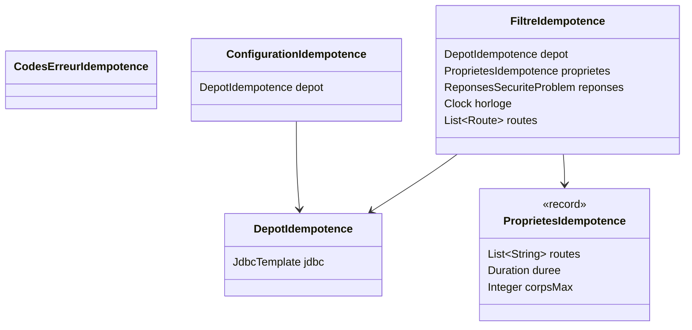
```mermaid
classDiagram
  class CodesErreurIdempotence {
  }
  class ConfigurationIdempotence {
    DepotIdempotence depot
  }
  class DepotIdempotence {
    JdbcTemplate jdbc
  }
  class FiltreIdempotence {
    DepotIdempotence depot
    ProprietesIdempotence proprietes
    ReponsesSecuriteProblem reponses
    Clock horloge
    List~Route~ routes
  }
  class ProprietesIdempotence {
    <<record>>
    List~String~ routes
    Duration duree
    Integer corpsMax
  }
  ConfigurationIdempotence --> DepotIdempotence
  FiltreIdempotence --> DepotIdempotence
  FiltreIdempotence --> ProprietesIdempotence
```

## `conventionsapi` — Conventions de l'API (E9, §5.3.2)

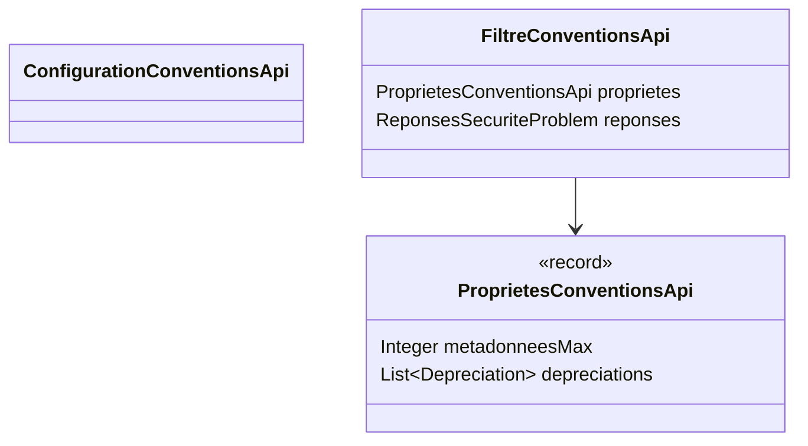
```mermaid
classDiagram
  class ConfigurationConventionsApi {
  }
  class FiltreConventionsApi {
    ProprietesConventionsApi proprietes
    ReponsesSecuriteProblem reponses
  }
  class ProprietesConventionsApi {
    <<record>>
    Integer metadonneesMax
    List~Depreciation~ depreciations
  }
  FiltreConventionsApi --> ProprietesConventionsApi
```

## `contratapi` — Chemins du contrat d'API (§5.3.1)

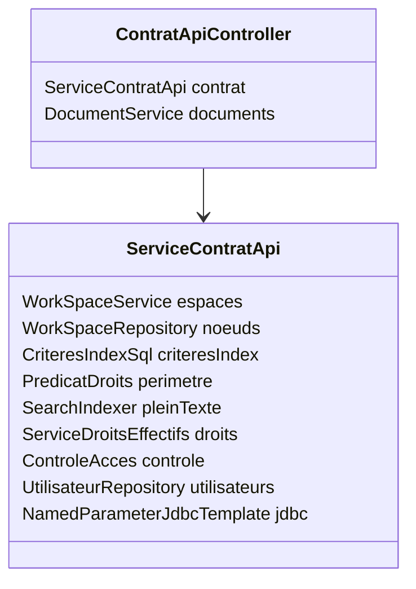
```mermaid
classDiagram
  class ContratApiController {
    ServiceContratApi contrat
    DocumentService documents
  }
  class ServiceContratApi {
    WorkSpaceService espaces
    WorkSpaceRepository noeuds
    CriteresIndexSql criteresIndex
    PredicatDroits perimetre
    SearchIndexer pleinTexte
    ServiceDroitsEffectifs droits
    ControleAcces controle
    UtilisateurRepository utilisateurs
    NamedParameterJdbcTemplate jdbc
  }
  ContratApiController --> ServiceContratApi
```

DTO : `DtoContratApi`.

## `documentationapi` — Spécification OpenAPI (§5.3)

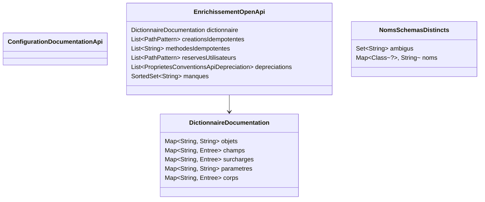
```mermaid
classDiagram
  class ConfigurationDocumentationApi {
  }
  class DictionnaireDocumentation {
    Map~String, String~ objets
    Map~String, Entree~ champs
    Map~String, Entree~ surcharges
    Map~String, String~ parametres
    Map~String, Entree~ corps
  }
  class EnrichissementOpenApi {
    DictionnaireDocumentation dictionnaire
    List~PathPattern~ creationsIdempotentes
    List~String~ methodesIdempotentes
    List~PathPattern~ reservesUtilisateurs
    List~ProprietesConventionsApiDepreciation~ depreciations
    SortedSet~String~ manques
  }
  class NomsSchemasDistincts {
    Set~String~ ambigus
    Map~Class~?~, String~ noms
  }
  EnrichissementOpenApi --> DictionnaireDocumentation
```

## `supervision` — Sondes et métriques (E10, §6.7)

```mermaid
classDiagram
  class FileDeTraitement {
    <<interface>>
  }
  class MetriquesSupervision {
    ObjectProvider~HealthEndpoint~ sante
    SondeReferentielFichiers referentiel
    List~FileDeTraitement~ files
    Duration objectifOcr
  }
  class SecuritePortManagement {
    AtomicInteger portManagement
  }
  class SondeAntivirus {
    boolean actif
    String hote
    int port
    int delaiMs
    VerificationAntivirus externe
  }
  class SondeFilesTraitement {
    List~FileDeTraitement~ files
    long profondeurMax
  }
  class SondeReferentielFichiers {
    Path racine
    double seuilCritique
  }
  class VerificationAntivirus {
    <<interface>>
  }
  MetriquesSupervision --> SondeReferentielFichiers
  MetriquesSupervision --> FileDeTraitement
  SondeAntivirus --> VerificationAntivirus
  SondeFilesTraitement --> FileDeTraitement
```

## `journalisation` — Journalisation technique (E10, §7.1)

```mermaid
classDiagram
  class ConfigurationJournalisation {
  }
  class ConfigurationProxysDeConfiance {
  }
  class ContexteJournalisation {
  }
  class DecorateurTacheMdc {
  }
  class FiltreContexteRequete {
    List~IpAddressMatcher~ proxysDeConfiance
  }
  class FiltreUtilisateurJournalisation {
  }
  class TraceW3C {
    <<record>>
    String traceId
    String spanId
  }
```

## `securite` — Contrôles de sécurité transverses (E11)

```mermaid
classDiagram
  class ControleTransportsChiffres {
    Environment env
  }
```

