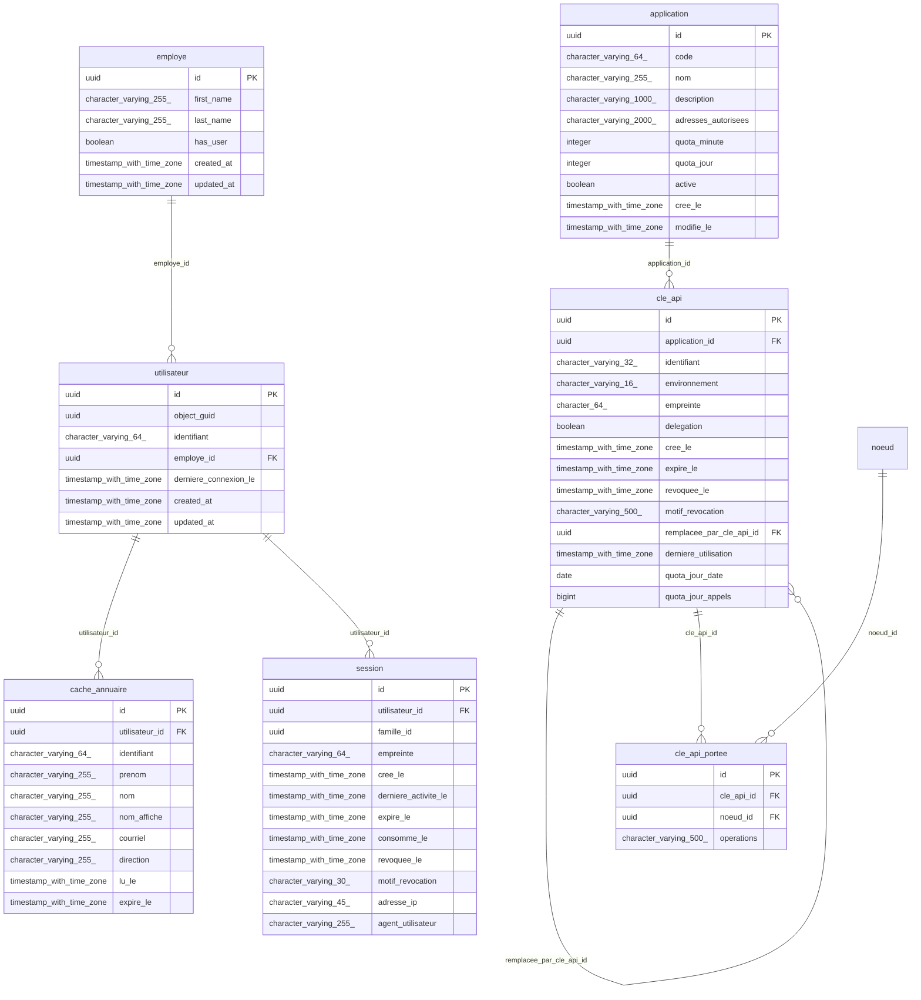
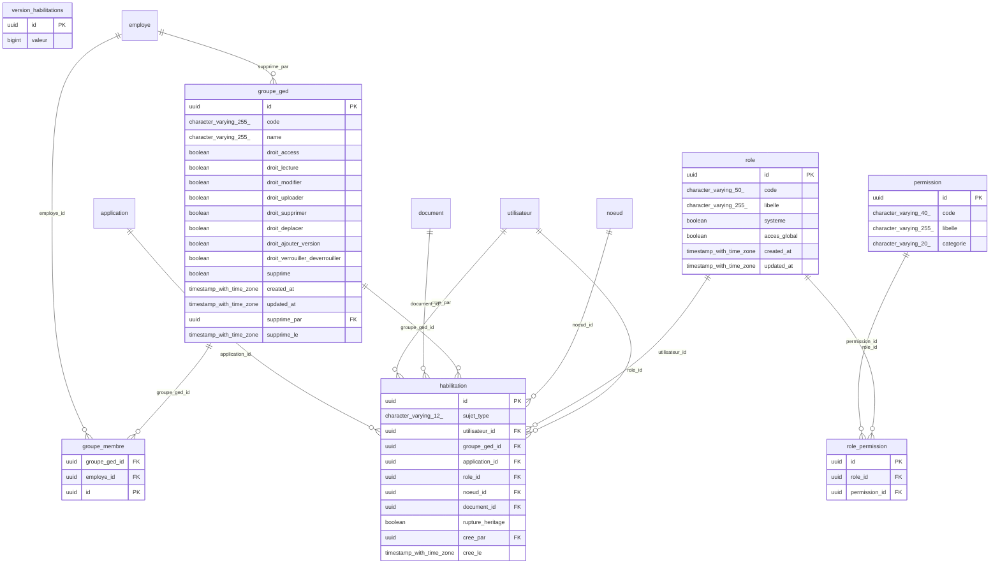
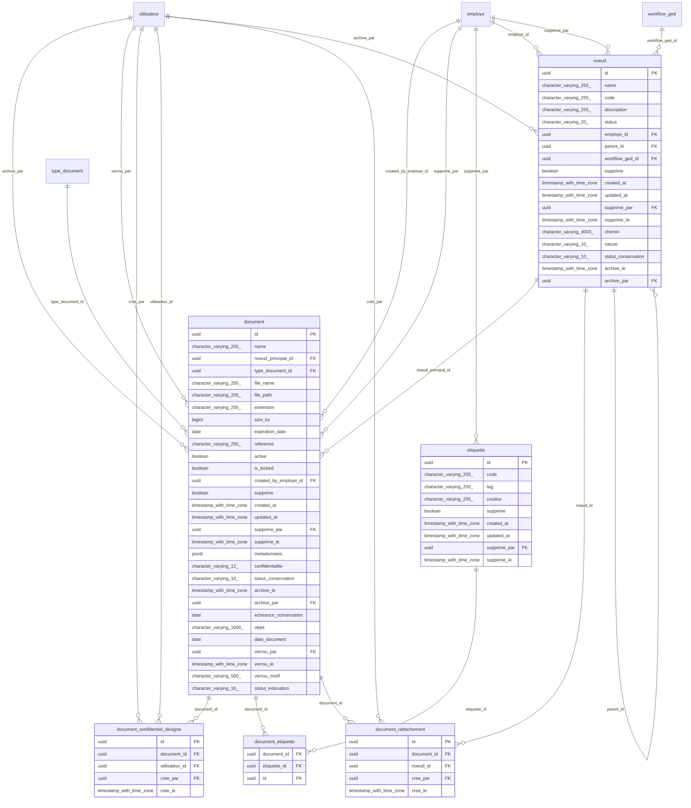
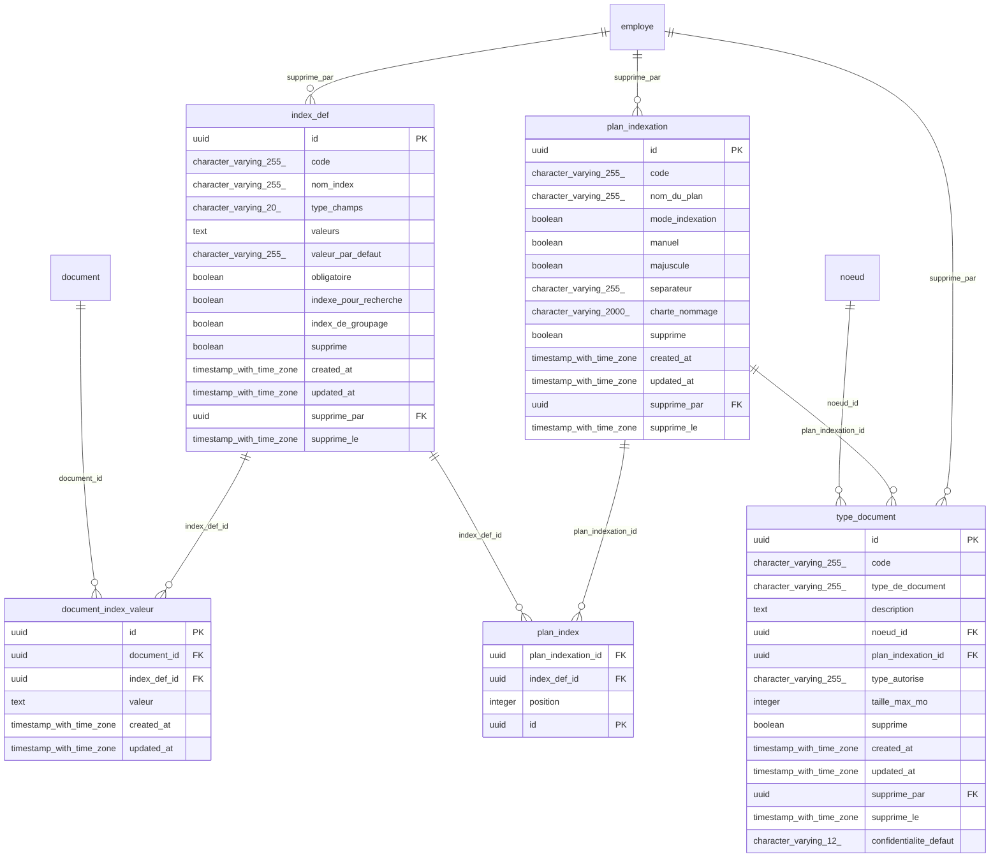
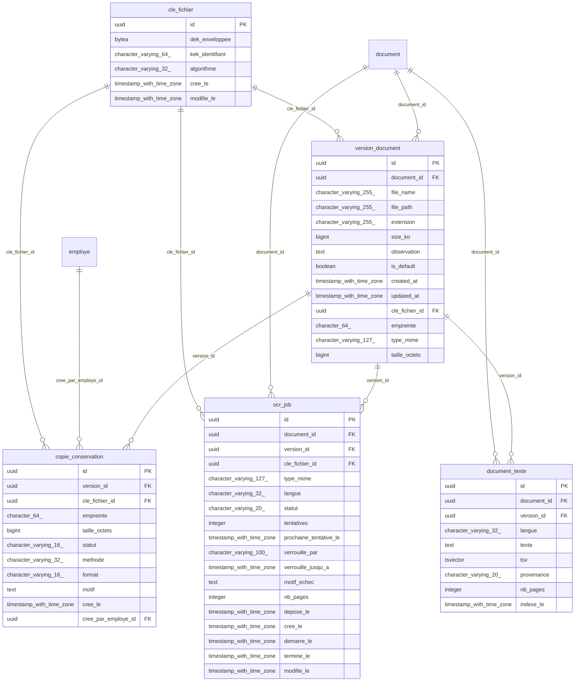
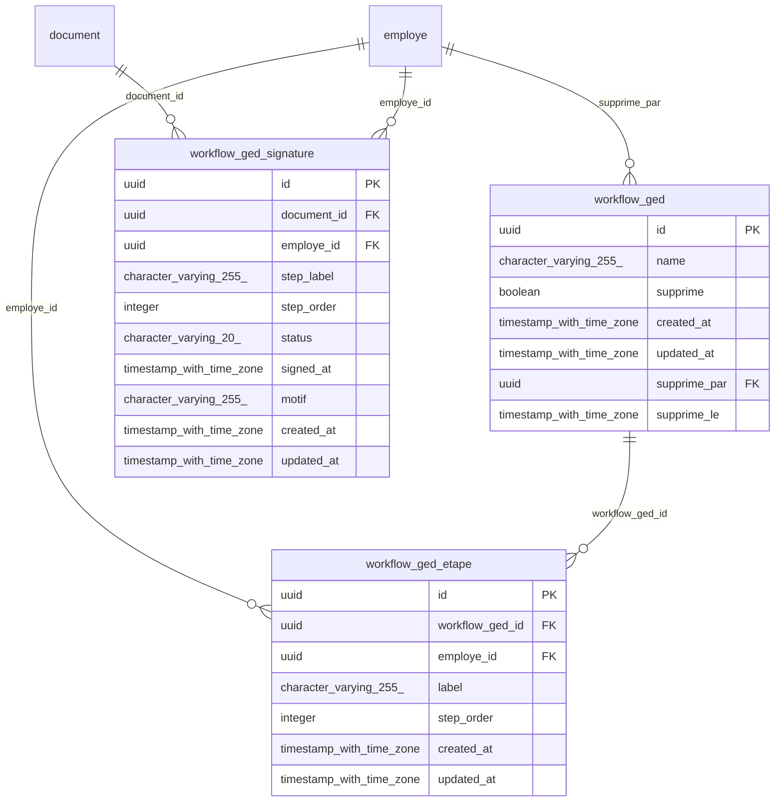
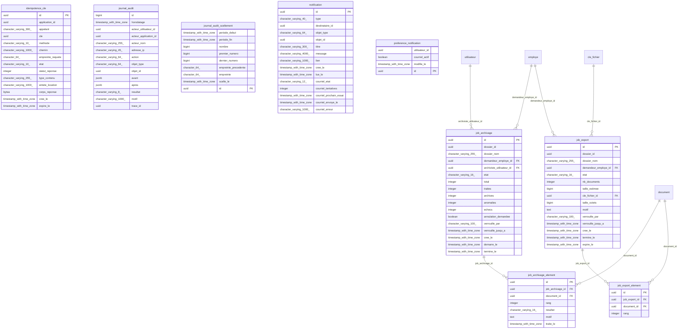

# Schéma de la base de données (P-05, DAT §4.5, §12.1)

> Généré par `node outils/schema-base.mjs` depuis la base `ged_dev2_test`, schéma `ged`, migrée par Liquibase (81 changesets ; jalons : `socle-e1`, `identite-e2`, `autorisation-e3`, `audit-e4`, `api-e9-v3`, `notification-e8`, `api-e9-v4`, `fichiers-ocr-e5-e6`). Ne pas modifier à la main : régénérer après chaque changeset.

Conventions (§4.2.2) : snake_case, clé primaire `id` UUID (sauf le journal d'audit : `bigint` séquentiel, ordre du scellement chaîné), clés étrangères `<table>_id`, préfixes `pk_`, `uk_`, `fk_`, `ck_`, `idx_`. Les partitions mensuelles `journal_audit_AAAAMM` ne sont pas listées.

## Synthèse et volumétrie estimée à 5 ans (§6.6)

| Groupe (§12.1) | Table | Colonnes | Lignes à 5 ans | Taille estimée | Base de l'estimation |
|---|---|---|---|---|---|
| Circuits de validation | `workflow_ged` | 7 | référentiel (< 10 000) | < 10 Mo | — |
| Circuits de validation | `workflow_ged_etape` | 7 | référentiel (< 10 000) | < 10 Mo | — |
| Circuits de validation | `workflow_ged_signature` | 10 | référentiel (< 10 000) | < 10 Mo | — |
| Habilitations | `groupe_ged` | 16 | référentiel (< 10 000) | < 10 Mo | — |
| Habilitations | `groupe_membre` | 3 | référentiel (< 10 000) | < 10 Mo | — |
| Habilitations | `habilitation` | 11 | 20 000 | 3.3 Mo | attributions |
| Habilitations | `permission` | 4 | référentiel (< 10 000) | < 10 Mo | — |
| Habilitations | `role` | 7 | référentiel (< 10 000) | < 10 Mo | — |
| Habilitations | `role_permission` | 3 | référentiel (< 10 000) | < 10 Mo | — |
| Habilitations | `version_habilitations` | 2 | référentiel (< 10 000) | < 10 Mo | — |
| Identités et accès | `application` | 10 | référentiel (< 10 000) | < 10 Mo | — |
| Identités et accès | `cache_annuaire` | 10 | référentiel (< 10 000) | < 10 Mo | — |
| Identités et accès | `cle_api` | 14 | référentiel (< 10 000) | < 10 Mo | — |
| Identités et accès | `cle_api_portee` | 4 | référentiel (< 10 000) | < 10 Mo | — |
| Identités et accès | `employe` | 6 | référentiel (< 10 000) | < 10 Mo | — |
| Identités et accès | `session` | 12 | 5 000 | 1.2 Mo | sessions de 5 ans purgées ; ordre de grandeur |
| Identités et accès | `utilisateur` | 7 | référentiel (< 10 000) | < 10 Mo | — |
| Organisation documentaire | `document` | 30 | 450 000 | 437.4 Mo | reprise 150 000 + 60 000 / an |
| Organisation documentaire | `document_confidentiel_designe` | 5 | référentiel (< 10 000) | < 10 Mo | — |
| Organisation documentaire | `document_etiquette` | 3 | 225 000 | 16.2 Mo | une étiquette pour un document sur deux |
| Organisation documentaire | `document_rattachement` | 5 | 45 000 | 4.3 Mo | un rattachement pour 10 % des documents |
| Organisation documentaire | `etiquette` | 9 | référentiel (< 10 000) | < 10 Mo | — |
| Organisation documentaire | `noeud` | 18 | 20 000 | 9.7 Mo | espaces et dossiers |
| Traçabilité et exploitation | `idempotence_cle` | 14 | 480 | 307 Ko | fenêtre de 24 h : créations d'une journée de pointe |
| Traçabilité et exploitation | `job_archivage` | 17 | référentiel (< 10 000) | < 10 Mo | — |
| Traçabilité et exploitation | `job_archivage_element` | 7 | 135 000 | 39.0 Mo | une ligne par document archivé en masse |
| Traçabilité et exploitation | `job_export` | 15 | référentiel (< 10 000) | < 10 Mo | — |
| Traçabilité et exploitation | `job_export_element` | 4 | 90 000 | 6.8 Mo | exports de dossiers |
| Traçabilité et exploitation | `journal_audit` | 14 | 25 000 000 | 12.8 Go | 5 millions d'événements par an, 0,5 Ko |
| Traçabilité et exploitation | `journal_audit_scellement` | 9 | 43 800 | 5.7 Mo | un scellement par heure |
| Traçabilité et exploitation | `notification` | 15 | 900 000 | 420.3 Mo | circuits, accès, échéances : environ 2 par document |
| Traçabilité et exploitation | `preference_notification` | 4 | référentiel (< 10 000) | < 10 Mo | — |
| Typologie | `document_index_valeur` | 6 | 2 250 000 | 648.0 Mo | environ 5 index renseignés par document |
| Typologie | `index_def` | 14 | référentiel (< 10 000) | < 10 Mo | — |
| Typologie | `plan_index` | 4 | référentiel (< 10 000) | < 10 Mo | — |
| Typologie | `plan_indexation` | 13 | référentiel (< 10 000) | < 10 Mo | — |
| Typologie | `type_document` | 14 | référentiel (< 10 000) | < 10 Mo | — |
| Versions et contenu | `cle_fichier` | 6 | 635 000 | 182.9 Mo | une par version, plus copies PDF/A et aperçus |
| Versions et contenu | `copie_conservation` | 11 | 135 000 | 46.8 Mo | documents archivés (hypothèse 30 %) |
| Versions et contenu | `document_texte` | 9 | 450 000 | 22.1 Go | texte de la version courante (8 pages × 3 Ko) et son vecteur tsv |
| Versions et contenu | `ocr_job` | 18 | 585 000 | 260.3 Mo | un par version à OCRiser |
| Versions et contenu | `version_document` | 14 | 585 000 | 356.3 Mo | facteur 1,3 de versions |

Total estimé des tables volumineuses : **37.4 Go** y compris le vecteur plein texte, hors index et WAL ; le §6.6 retient ≈ 40 Go de base à 5 ans (texte ≈ 11 Go, index plein texte ≈ 11 Go, audit ≈ 12 Go) et 200 Go à provisionner.

## Diagrammes entité-association par groupe

### Identités et accès

Tables d'autres groupes référencées : `noeud`.

### Habilitations

Tables d'autres groupes référencées : `employe`, `application`, `utilisateur`, `document`, `noeud`.

### Organisation documentaire

Tables d'autres groupes référencées : `utilisateur`, `employe`, `type_document`, `workflow_ged`.

### Typologie

Tables d'autres groupes référencées : `document`, `employe`, `noeud`.

### Versions et contenu

Tables d'autres groupes référencées : `employe`, `document`.

### Circuits de validation

Tables d'autres groupes référencées : `employe`, `document`.

### Traçabilité et exploitation

Tables d'autres groupes référencées : `utilisateur`, `employe`, `document`, `cle_fichier`.

## Détail des tables

### `application`

| Colonne | Type | Nul | Défaut |
|---|---|---|---|
| `id` | uuid | non |  |
| `code` | character varying(64) | non |  |
| `nom` | character varying(255) | non |  |
| `description` | character varying(1000) | oui |  |
| `adresses_autorisees` | character varying(2000) | oui |  |
| `quota_minute` | integer | non | `600` |
| `quota_jour` | integer | non | `100000` |
| `active` | boolean | non | `true` |
| `cree_le` | timestamp with time zone | non |  |
| `modifie_le` | timestamp with time zone | oui |  |

Contraintes :

- `ck_application_code` (vérification) : `CHECK (((code)::text ~ '^[a-z0-9][a-z0-9-]{1,63}$'::text))`
- `ck_application_quotas` (vérification) : `CHECK (((quota_minute > 0) AND (quota_jour > 0)))`
- `pk_application` (clé primaire) : `PRIMARY KEY (id)`
- `uk_application_code` (unicité) : `UNIQUE (code)`

### `cache_annuaire`

| Colonne | Type | Nul | Défaut |
|---|---|---|---|
| `id` | uuid | non |  |
| `utilisateur_id` | uuid | non |  |
| `identifiant` | character varying(64) | non |  |
| `prenom` | character varying(255) | oui |  |
| `nom` | character varying(255) | oui |  |
| `nom_affiche` | character varying(255) | oui |  |
| `courriel` | character varying(255) | oui |  |
| `direction` | character varying(255) | oui |  |
| `lu_le` | timestamp with time zone | non |  |
| `expire_le` | timestamp with time zone | non |  |

Contraintes :

- `ck_cache_annuaire_expiration` (vérification) : `CHECK ((expire_le >= lu_le))`
- `fk_cache_annuaire_utilisateur` (clé étrangère) : `FOREIGN KEY (utilisateur_id) REFERENCES ged.utilisateur(id) ON DELETE CASCADE`
- `pk_cache_annuaire` (clé primaire) : `PRIMARY KEY (id)`
- `uk_cache_annuaire_utilisateur_id` (unicité) : `UNIQUE (utilisateur_id)`

### `cle_api`

| Colonne | Type | Nul | Défaut |
|---|---|---|---|
| `id` | uuid | non |  |
| `application_id` | uuid | non |  |
| `identifiant` | character varying(32) | non |  |
| `environnement` | character varying(16) | non |  |
| `empreinte` | character(64) | non |  |
| `delegation` | boolean | non | `false` |
| `cree_le` | timestamp with time zone | non |  |
| `expire_le` | timestamp with time zone | non |  |
| `revoquee_le` | timestamp with time zone | oui |  |
| `motif_revocation` | character varying(500) | oui |  |
| `remplacee_par_cle_api_id` | uuid | oui |  |
| `derniere_utilisation` | timestamp with time zone | oui |  |
| `quota_jour_date` | date | oui |  |
| `quota_jour_appels` | bigint | non | `0` |

Contraintes :

- `ck_cle_api_empreinte` (vérification) : `CHECK ((empreinte ~ '^[0-9a-f]{64}$'::text))`
- `ck_cle_api_identifiant` (vérification) : `CHECK (((identifiant)::text ~ '^[0-9a-f]{16}$'::text))`
- `ck_cle_api_validite` (vérification) : `CHECK ((expire_le > cree_le))`
- `fk_cle_api_application_id` (clé étrangère) : `FOREIGN KEY (application_id) REFERENCES ged.application(id)`
- `fk_cle_api_remplacee_par_cle_api_id` (clé étrangère) : `FOREIGN KEY (remplacee_par_cle_api_id) REFERENCES ged.cle_api(id)`
- `pk_cle_api` (clé primaire) : `PRIMARY KEY (id)`
- `uk_cle_api_identifiant` (unicité) : `UNIQUE (identifiant)`

Index :

- `idx_cle_api_application_id` : `USING btree (application_id)`

### `cle_api_portee`

| Colonne | Type | Nul | Défaut |
|---|---|---|---|
| `id` | uuid | non |  |
| `cle_api_id` | uuid | non |  |
| `noeud_id` | uuid | non |  |
| `operations` | character varying(500) | non |  |

Contraintes :

- `fk_cle_api_portee_cle_api_id` (clé étrangère) : `FOREIGN KEY (cle_api_id) REFERENCES ged.cle_api(id) ON DELETE CASCADE`
- `fk_cle_api_portee_noeud` (clé étrangère) : `FOREIGN KEY (noeud_id) REFERENCES ged.noeud(id)`
- `pk_cle_api_portee` (clé primaire) : `PRIMARY KEY (id)`
- `uk_cle_api_portee_cle_api_id_noeud_id` (unicité) : `UNIQUE (cle_api_id, noeud_id)`

Index :

- `idx_cle_api_portee_noeud_id` : `USING btree (noeud_id)`

### `cle_fichier`

| Colonne | Type | Nul | Défaut |
|---|---|---|---|
| `id` | uuid | non |  |
| `dek_enveloppee` | bytea | non |  |
| `kek_identifiant` | character varying(64) | non |  |
| `algorithme` | character varying(32) | non | `'AES-256-GCM'::character varying` |
| `cree_le` | timestamp with time zone | non | `now()` |
| `modifie_le` | timestamp with time zone | oui |  |

Contraintes :

- `ck_cle_fichier_algorithme` (vérification) : `CHECK (((algorithme)::text = 'AES-256-GCM'::text))`
- `ck_cle_fichier_dek_enveloppee` (vérification) : `CHECK (((octet_length(dek_enveloppee) >= 28) AND (octet_length(dek_enveloppee) <= 1024)))`
- `pk_cle_fichier` (clé primaire) : `PRIMARY KEY (id)`

Index :

- `idx_cle_fichier_kek_identifiant` : `USING btree (kek_identifiant)`

### `copie_conservation`

| Colonne | Type | Nul | Défaut |
|---|---|---|---|
| `id` | uuid | non |  |
| `version_id` | uuid | non |  |
| `cle_fichier_id` | uuid | oui |  |
| `empreinte` | character(64) | oui |  |
| `taille_octets` | bigint | oui |  |
| `statut` | character varying(16) | non |  |
| `methode` | character varying(32) | oui |  |
| `format` | character varying(16) | oui |  |
| `motif` | text | oui |  |
| `cree_le` | timestamp with time zone | non | `now()` |
| `cree_par_employe_id` | uuid | oui |  |

Contraintes :

- `ck_copie_conservation_fichier` (vérification) : `CHECK ((((statut)::text = 'VALIDE'::text) = ((cle_fichier_id IS NOT NULL) AND (empreinte IS NOT NULL))))`
- `ck_copie_conservation_statut` (vérification) : `CHECK (((statut)::text = ANY ((ARRAY['VALIDE'::character varying, 'ECHEC'::character varying])::text[])))`
- `fk_copie_conservation_cle_fichier` (clé étrangère) : `FOREIGN KEY (cle_fichier_id) REFERENCES ged.cle_fichier(id)`
- `fk_copie_conservation_cree_par_employe` (clé étrangère) : `FOREIGN KEY (cree_par_employe_id) REFERENCES ged.employe(id)`
- `fk_copie_conservation_version_document` (clé étrangère) : `FOREIGN KEY (version_id) REFERENCES ged.version_document(id)`
- `pk_copie_conservation` (clé primaire) : `PRIMARY KEY (id)`
- `uk_copie_conservation_version_id` (unicité) : `UNIQUE (version_id)`

Index :

- `idx_copie_conservation_cle_fichier_id` : `USING btree (cle_fichier_id)`
- `idx_copie_conservation_cree_par_employe_id` : `USING btree (cree_par_employe_id)`

### `document`

| Colonne | Type | Nul | Défaut |
|---|---|---|---|
| `id` | uuid | non |  |
| `name` | character varying(255) | non |  |
| `noeud_principal_id` | uuid | non |  |
| `type_document_id` | uuid | non |  |
| `file_name` | character varying(255) | oui |  |
| `file_path` | character varying(255) | oui |  |
| `extension` | character varying(255) | oui |  |
| `size_ko` | bigint | non | `0` |
| `expiration_date` | date | oui |  |
| `reference` | character varying(255) | oui |  |
| `active` | boolean | non | `true` |
| `is_locked` | boolean | non | `false` |
| `created_by_employe_id` | uuid | oui |  |
| `supprime` | boolean | non | `false` |
| `created_at` | timestamp with time zone | oui |  |
| `updated_at` | timestamp with time zone | oui |  |
| `supprime_par` | uuid | oui |  |
| `supprime_le` | timestamp with time zone | oui |  |
| `metadonnees` | jsonb | non | `'{}'::jsonb` |
| `confidentialite` | character varying(12) | non | `'PUBLIC'::character varying` |
| `statut_conservation` | character varying(10) | non | `'ACTIF'::character varying` |
| `archive_le` | timestamp with time zone | oui |  |
| `archive_par` | uuid | oui |  |
| `echeance_conservation` | date | oui |  |
| `objet` | character varying(1000) | oui |  |
| `date_document` | date | non | `CURRENT_DATE` |
| `verrou_par` | uuid | oui |  |
| `verrou_le` | timestamp with time zone | oui |  |
| `verrou_motif` | character varying(500) | oui |  |
| `statut_indexation` | character varying(16) | non | `'A_INDEXER'::character varying` |

Contraintes :

- `ck_document_confidentialite` (vérification) : `CHECK (((confidentialite)::text = ANY ((ARRAY['PUBLIC'::character varying, 'PRIVE'::character varying, 'CONFIDENTIEL'::character varying])::text[])))`
- `ck_document_metadonnees` (vérification) : `CHECK ((jsonb_typeof(metadonnees) = 'object'::text))`
- `ck_document_size_ko` (vérification) : `CHECK ((size_ko >= 0))`
- `ck_document_statut_conservation` (vérification) : `CHECK ((((statut_conservation)::text = ANY ((ARRAY['ACTIF'::character varying, 'ARCHIVE'::character varying])::text[])) AND (((statut_conservation)::text = 'ARCHIVE'::text) = (archive_le IS NOT NULL))))`
- `ck_document_statut_indexation` (vérification) : `CHECK (((statut_indexation)::text = ANY ((ARRAY['INDEXE'::character varying, 'SANS_PLAN'::character varying, 'A_INDEXER'::character varying])::text[])))`
- `ck_document_suppression` (vérification) : `CHECK ((supprime OR ((supprime_par IS NULL) AND (supprime_le IS NULL))))`
- `ck_document_verrou` (vérification) : `CHECK ((is_locked = (verrou_le IS NOT NULL)))`
- `fk_document_archive_par` (clé étrangère) : `FOREIGN KEY (archive_par) REFERENCES ged.utilisateur(id) ON DELETE SET NULL`
- `fk_document_created_by_employe` (clé étrangère) : `FOREIGN KEY (created_by_employe_id) REFERENCES ged.employe(id)`
- `fk_document_noeud_principal` (clé étrangère) : `FOREIGN KEY (noeud_principal_id) REFERENCES ged.noeud(id)`
- `fk_document_supprime_par` (clé étrangère) : `FOREIGN KEY (supprime_par) REFERENCES ged.employe(id)`
- `fk_document_type_document` (clé étrangère) : `FOREIGN KEY (type_document_id) REFERENCES ged.type_document(id)`
- `fk_document_verrou_par` (clé étrangère) : `FOREIGN KEY (verrou_par) REFERENCES ged.utilisateur(id) ON DELETE SET NULL`
- `pk_document` (clé primaire) : `PRIMARY KEY (id)`

Index :

- `idx_document_archive_par` : `USING btree (archive_par)`
- `idx_document_confidentialite` : `USING btree (confidentialite)`
- `idx_document_created_at` : `USING btree (created_at)`
- `idx_document_created_by_employe_id` : `USING btree (created_by_employe_id)`
- `idx_document_date_document` : `USING btree (date_document)`
- `idx_document_echeance_conservation` : `USING btree (echeance_conservation)`
- `idx_document_expiration_date` : `USING btree (expiration_date)`
- `idx_document_metadonnees` : `USING gin (metadonnees)`
- `idx_document_name` : `USING btree (name)`
- `idx_document_noeud_principal_id` : `USING btree (noeud_principal_id)`
- `idx_document_statut_conservation` : `USING btree (statut_conservation)`
- `idx_document_statut_indexation` : `USING btree (statut_indexation)`
- `idx_document_supprime` : `USING btree (supprime)`
- `idx_document_type_document_id` : `USING btree (type_document_id)`
- `idx_document_verrou_par` : `USING btree (verrou_par)`

### `document_confidentiel_designe`

| Colonne | Type | Nul | Défaut |
|---|---|---|---|
| `id` | uuid | non | `ged.uuid_v7()` |
| `document_id` | uuid | non |  |
| `utilisateur_id` | uuid | non |  |
| `cree_par` | uuid | oui |  |
| `cree_le` | timestamp with time zone | non | `now()` |

Contraintes :

- `fk_document_confidentiel_designe_cree_par` (clé étrangère) : `FOREIGN KEY (cree_par) REFERENCES ged.utilisateur(id) ON DELETE SET NULL`
- `fk_document_confidentiel_designe_document` (clé étrangère) : `FOREIGN KEY (document_id) REFERENCES ged.document(id) ON DELETE CASCADE`
- `fk_document_confidentiel_designe_utilisateur` (clé étrangère) : `FOREIGN KEY (utilisateur_id) REFERENCES ged.utilisateur(id) ON DELETE CASCADE`
- `pk_document_confidentiel_designe` (clé primaire) : `PRIMARY KEY (id)`
- `uk_document_confidentiel_designe_document_id_utilisateur_id` (unicité) : `UNIQUE (document_id, utilisateur_id)`

Index :

- `idx_document_confidentiel_designe_utilisateur_id` : `USING btree (utilisateur_id)`

### `document_etiquette`

| Colonne | Type | Nul | Défaut |
|---|---|---|---|
| `document_id` | uuid | non |  |
| `etiquette_id` | uuid | non |  |
| `id` | uuid | non | `ged.uuid_v7()` |

Contraintes :

- `fk_document_etiquette_document` (clé étrangère) : `FOREIGN KEY (document_id) REFERENCES ged.document(id) ON DELETE CASCADE`
- `fk_document_etiquette_etiquette` (clé étrangère) : `FOREIGN KEY (etiquette_id) REFERENCES ged.etiquette(id) ON DELETE CASCADE`
- `pk_document_etiquette` (clé primaire) : `PRIMARY KEY (id)`
- `uk_document_etiquette_document_id_etiquette_id` (unicité) : `UNIQUE (document_id, etiquette_id)`

Index :

- `idx_document_etiquette_etiquette_id` : `USING btree (etiquette_id)`

### `document_index_valeur`

| Colonne | Type | Nul | Défaut |
|---|---|---|---|
| `id` | uuid | non |  |
| `document_id` | uuid | non |  |
| `index_def_id` | uuid | non |  |
| `valeur` | text | oui |  |
| `created_at` | timestamp with time zone | oui |  |
| `updated_at` | timestamp with time zone | oui |  |

Contraintes :

- `fk_document_index_valeur_document` (clé étrangère) : `FOREIGN KEY (document_id) REFERENCES ged.document(id)`
- `fk_document_index_valeur_index_def` (clé étrangère) : `FOREIGN KEY (index_def_id) REFERENCES ged.index_def(id)`
- `pk_document_index_valeur` (clé primaire) : `PRIMARY KEY (id)`
- `uk_document_index_valeur_document_id_index_def_id` (unicité) : `UNIQUE (document_id, index_def_id)`

Index :

- `idx_document_index_valeur_index_def_id` : `USING btree (index_def_id)`

### `document_rattachement`

| Colonne | Type | Nul | Défaut |
|---|---|---|---|
| `id` | uuid | non | `ged.uuid_v7()` |
| `document_id` | uuid | non |  |
| `noeud_id` | uuid | non |  |
| `cree_par` | uuid | oui |  |
| `cree_le` | timestamp with time zone | non | `now()` |

Contraintes :

- `fk_document_rattachement_cree_par` (clé étrangère) : `FOREIGN KEY (cree_par) REFERENCES ged.utilisateur(id) ON DELETE SET NULL`
- `fk_document_rattachement_document` (clé étrangère) : `FOREIGN KEY (document_id) REFERENCES ged.document(id) ON DELETE CASCADE`
- `fk_document_rattachement_noeud` (clé étrangère) : `FOREIGN KEY (noeud_id) REFERENCES ged.noeud(id)`
- `pk_document_rattachement` (clé primaire) : `PRIMARY KEY (id)`
- `uk_document_rattachement_document_id_noeud_id` (unicité) : `UNIQUE (document_id, noeud_id)`

Index :

- `idx_document_rattachement_noeud_id` : `USING btree (noeud_id)`

### `document_texte`

| Colonne | Type | Nul | Défaut |
|---|---|---|---|
| `id` | uuid | non |  |
| `document_id` | uuid | non |  |
| `version_id` | uuid | non |  |
| `langue` | character varying(32) | non |  |
| `texte` | text | non |  |
| `tsv` | tsvector | non |  |
| `provenance` | character varying(20) | non |  |
| `nb_pages` | integer | oui |  |
| `indexe_le` | timestamp with time zone | non | `now()` |

Contraintes :

- `ck_document_texte_provenance` (vérification) : `CHECK (((provenance)::text = ANY ((ARRAY['COUCHE_TEXTE'::character varying, 'OCR'::character varying, 'MIXTE'::character varying, 'NATIF'::character varying])::text[])))`
- `fk_document_texte_document` (clé étrangère) : `FOREIGN KEY (document_id) REFERENCES ged.document(id) ON DELETE CASCADE`
- `fk_document_texte_version_document` (clé étrangère) : `FOREIGN KEY (version_id) REFERENCES ged.version_document(id) ON DELETE CASCADE`
- `pk_document_texte` (clé primaire) : `PRIMARY KEY (id)`
- `uk_document_texte_document_id` (unicité) : `UNIQUE (document_id)`
- `uk_document_texte_version_id` (unicité) : `UNIQUE (version_id)`

Index :

- `idx_document_texte_tsv` : `USING gin (tsv)`

### `employe`

| Colonne | Type | Nul | Défaut |
|---|---|---|---|
| `id` | uuid | non |  |
| `first_name` | character varying(255) | non |  |
| `last_name` | character varying(255) | non |  |
| `has_user` | boolean | non | `false` |
| `created_at` | timestamp with time zone | oui |  |
| `updated_at` | timestamp with time zone | oui |  |

Contraintes :

- `pk_employe` (clé primaire) : `PRIMARY KEY (id)`

### `etiquette`

| Colonne | Type | Nul | Défaut |
|---|---|---|---|
| `id` | uuid | non |  |
| `code` | character varying(255) | non |  |
| `tag` | character varying(255) | non |  |
| `couleur` | character varying(255) | non |  |
| `supprime` | boolean | non | `false` |
| `created_at` | timestamp with time zone | oui |  |
| `updated_at` | timestamp with time zone | oui |  |
| `supprime_par` | uuid | oui |  |
| `supprime_le` | timestamp with time zone | oui |  |

Contraintes :

- `ck_etiquette_suppression` (vérification) : `CHECK ((supprime OR ((supprime_par IS NULL) AND (supprime_le IS NULL))))`
- `fk_etiquette_supprime_par` (clé étrangère) : `FOREIGN KEY (supprime_par) REFERENCES ged.employe(id)`
- `pk_etiquette` (clé primaire) : `PRIMARY KEY (id)`
- `uk_etiquette_code` (unicité) : `UNIQUE (code)`

Index :

- `idx_etiquette_supprime` : `USING btree (supprime)`

### `groupe_ged`

| Colonne | Type | Nul | Défaut |
|---|---|---|---|
| `id` | uuid | non |  |
| `code` | character varying(255) | non |  |
| `name` | character varying(255) | non |  |
| `droit_access` | boolean | non | `false` |
| `droit_lecture` | boolean | non | `false` |
| `droit_modifier` | boolean | non | `false` |
| `droit_uploader` | boolean | non | `false` |
| `droit_supprimer` | boolean | non | `false` |
| `droit_deplacer` | boolean | non | `false` |
| `droit_ajouter_version` | boolean | non | `false` |
| `droit_verrouiller_deverrouiller` | boolean | non | `false` |
| `supprime` | boolean | non | `false` |
| `created_at` | timestamp with time zone | oui |  |
| `updated_at` | timestamp with time zone | oui |  |
| `supprime_par` | uuid | oui |  |
| `supprime_le` | timestamp with time zone | oui |  |

Contraintes :

- `ck_groupe_ged_suppression` (vérification) : `CHECK ((supprime OR ((supprime_par IS NULL) AND (supprime_le IS NULL))))`
- `fk_groupe_ged_supprime_par` (clé étrangère) : `FOREIGN KEY (supprime_par) REFERENCES ged.employe(id)`
- `pk_groupe_ged` (clé primaire) : `PRIMARY KEY (id)`
- `uk_groupe_ged_code` (unicité) : `UNIQUE (code)`
- `uk_groupe_ged_name` (unicité) : `UNIQUE (name)`

Index :

- `idx_groupe_ged_supprime` : `USING btree (supprime)`

### `groupe_membre`

| Colonne | Type | Nul | Défaut |
|---|---|---|---|
| `groupe_ged_id` | uuid | non |  |
| `employe_id` | uuid | non |  |
| `id` | uuid | non | `ged.uuid_v7()` |

Contraintes :

- `fk_groupe_membre_employe` (clé étrangère) : `FOREIGN KEY (employe_id) REFERENCES ged.employe(id) ON DELETE CASCADE`
- `fk_groupe_membre_groupe_ged` (clé étrangère) : `FOREIGN KEY (groupe_ged_id) REFERENCES ged.groupe_ged(id) ON DELETE CASCADE`
- `pk_groupe_membre` (clé primaire) : `PRIMARY KEY (id)`
- `uk_groupe_membre_groupe_ged_id_employe_id` (unicité) : `UNIQUE (groupe_ged_id, employe_id)`

Index :

- `idx_groupe_membre_employe_id` : `USING btree (employe_id)`

### `habilitation`

| Colonne | Type | Nul | Défaut |
|---|---|---|---|
| `id` | uuid | non |  |
| `sujet_type` | character varying(12) | non |  |
| `utilisateur_id` | uuid | oui |  |
| `groupe_ged_id` | uuid | oui |  |
| `application_id` | uuid | oui |  |
| `role_id` | uuid | oui |  |
| `noeud_id` | uuid | oui |  |
| `document_id` | uuid | oui |  |
| `rupture_heritage` | boolean | non | `false` |
| `cree_par` | uuid | oui |  |
| `cree_le` | timestamp with time zone | non | `now()` |

Contraintes :

- `ck_habilitation_cible` (vérification) : `CHECK (((noeud_id IS NULL) OR (document_id IS NULL)))`
- `ck_habilitation_role` (vérification) : `CHECK (((role_id IS NOT NULL) OR rupture_heritage))`
- `ck_habilitation_rupture` (vérification) : `CHECK (((NOT rupture_heritage) OR (noeud_id IS NOT NULL)))`
- `ck_habilitation_sujet` (vérification) : `CHECK (((((sujet_type)::text = 'UTILISATEUR'::text) AND (utilisateur_id IS NOT NULL) AND (groupe_ged_id IS NULL) AND (application_id IS NULL)) OR (((sujet_type)::text = 'GROUPE'::text) AND (groupe_ged_id IS NOT NULL) AND (utilisateur_id IS NULL) AND (application_id IS NULL)) OR (((sujet_type)::text = 'APPLICATION'::text) AND (application_id IS NOT NULL) AND (utilisateur_id IS NULL) AND (groupe_ged_id IS NULL))))`
- `fk_habilitation_application` (clé étrangère) : `FOREIGN KEY (application_id) REFERENCES ged.application(id)`
- `fk_habilitation_cree_par` (clé étrangère) : `FOREIGN KEY (cree_par) REFERENCES ged.utilisateur(id) ON DELETE SET NULL`
- `fk_habilitation_document` (clé étrangère) : `FOREIGN KEY (document_id) REFERENCES ged.document(id) ON DELETE CASCADE`
- `fk_habilitation_groupe_ged` (clé étrangère) : `FOREIGN KEY (groupe_ged_id) REFERENCES ged.groupe_ged(id) ON DELETE CASCADE`
- `fk_habilitation_noeud` (clé étrangère) : `FOREIGN KEY (noeud_id) REFERENCES ged.noeud(id) ON DELETE CASCADE`
- `fk_habilitation_role` (clé étrangère) : `FOREIGN KEY (role_id) REFERENCES ged.role(id)`
- `fk_habilitation_utilisateur` (clé étrangère) : `FOREIGN KEY (utilisateur_id) REFERENCES ged.utilisateur(id) ON DELETE CASCADE`
- `pk_habilitation` (clé primaire) : `PRIMARY KEY (id)`

Index :

- `idx_habilitation_application_id` : `USING btree (application_id)`
- `idx_habilitation_document_id` : `USING btree (document_id)`
- `idx_habilitation_groupe_ged_id` : `USING btree (groupe_ged_id)`
- `idx_habilitation_noeud_id` : `USING btree (noeud_id)`
- `idx_habilitation_role_id` : `USING btree (role_id)`
- `idx_habilitation_utilisateur_id` : `USING btree (utilisateur_id)`
- `uk_habilitation_sujet_role_cible` : `USING btree (sujet_type, COALESCE(utilisateur_id, groupe_ged_id, application_id), COALESCE(role_id, '00000000-0000-0000-0000-000000000000'::uuid), COALESCE(noeud_id, '00000000-0000-0000-0000-000000000000'::uuid), COALESCE(document_id, '00000000-0000-0000-0000-000000000000'::uuid))`

### `idempotence_cle`

| Colonne | Type | Nul | Défaut |
|---|---|---|---|
| `id` | uuid | non |  |
| `application_id` | uuid | oui |  |
| `appelant` | character varying(300) | non |  |
| `cle` | uuid | non |  |
| `methode` | character varying(10) | non |  |
| `chemin` | character varying(1000) | non |  |
| `empreinte_requete` | character(64) | non |  |
| `etat` | character varying(10) | non |  |
| `statut_reponse` | integer | oui |  |
| `type_contenu` | character varying(255) | oui |  |
| `entete_location` | character varying(1000) | oui |  |
| `corps_reponse` | bytea | oui |  |
| `cree_le` | timestamp with time zone | non |  |
| `expire_le` | timestamp with time zone | non |  |

Contraintes :

- `ck_idempotence_cle_etat` (vérification) : `CHECK (((etat)::text = ANY ((ARRAY['EN_COURS'::character varying, 'TERMINEE'::character varying])::text[])))`
- `pk_idempotence_cle` (clé primaire) : `PRIMARY KEY (id)`
- `uk_idempotence_cle_appelant_cle` (unicité) : `UNIQUE (appelant, cle)`

Index :

- `idx_idempotence_cle_expire_le` : `USING btree (expire_le)`

### `index_def`

| Colonne | Type | Nul | Défaut |
|---|---|---|---|
| `id` | uuid | non |  |
| `code` | character varying(255) | non |  |
| `nom_index` | character varying(255) | non |  |
| `type_champs` | character varying(20) | non |  |
| `valeurs` | text | oui |  |
| `valeur_par_defaut` | character varying(255) | oui |  |
| `obligatoire` | boolean | non | `false` |
| `indexe_pour_recherche` | boolean | non | `false` |
| `index_de_groupage` | boolean | non | `false` |
| `supprime` | boolean | non | `false` |
| `created_at` | timestamp with time zone | oui |  |
| `updated_at` | timestamp with time zone | oui |  |
| `supprime_par` | uuid | oui |  |
| `supprime_le` | timestamp with time zone | oui |  |

Contraintes :

- `ck_index_def_suppression` (vérification) : `CHECK ((supprime OR ((supprime_par IS NULL) AND (supprime_le IS NULL))))`
- `ck_index_def_type_champs` (vérification) : `CHECK (((type_champs)::text = ANY ((ARRAY['DATE'::character varying, 'LISTE'::character varying, 'NOMBRE'::character varying, 'TEXTE'::character varying])::text[])))`
- `fk_index_def_supprime_par` (clé étrangère) : `FOREIGN KEY (supprime_par) REFERENCES ged.employe(id)`
- `pk_index_def` (clé primaire) : `PRIMARY KEY (id)`
- `uk_index_def_code` (unicité) : `UNIQUE (code)`

Index :

- `idx_index_def_supprime` : `USING btree (supprime)`

### `job_archivage`

| Colonne | Type | Nul | Défaut |
|---|---|---|---|
| `id` | uuid | non |  |
| `dossier_id` | uuid | non |  |
| `dossier_nom` | character varying(255) | oui |  |
| `demandeur_employe_id` | uuid | oui |  |
| `archiviste_utilisateur_id` | uuid | oui |  |
| `etat` | character varying(16) | non | `'EN_ATTENTE'::character varying` |
| `total` | integer | non | `0` |
| `traites` | integer | non | `0` |
| `archives` | integer | non | `0` |
| `anomalies` | integer | non | `0` |
| `echecs` | integer | non | `0` |
| `annulation_demandee` | boolean | non | `false` |
| `verrouille_par` | character varying(100) | oui |  |
| `verrouille_jusqu_a` | timestamp with time zone | oui |  |
| `cree_le` | timestamp with time zone | non | `now()` |
| `demarre_le` | timestamp with time zone | oui |  |
| `termine_le` | timestamp with time zone | oui |  |

Contraintes :

- `ck_job_archivage_compteurs` (vérification) : `CHECK (((traites >= 0) AND (traites <= total) AND ((archives + echecs) <= traites) AND (anomalies <= archives)))`
- `ck_job_archivage_etat` (vérification) : `CHECK (((etat)::text = ANY ((ARRAY['EN_ATTENTE'::character varying, 'EN_COURS'::character varying, 'TERMINE'::character varying, 'ANNULE'::character varying])::text[])))`
- `fk_job_archivage_archiviste_utilisateur` (clé étrangère) : `FOREIGN KEY (archiviste_utilisateur_id) REFERENCES ged.utilisateur(id) ON DELETE SET NULL`
- `fk_job_archivage_demandeur_employe` (clé étrangère) : `FOREIGN KEY (demandeur_employe_id) REFERENCES ged.employe(id)`
- `pk_job_archivage` (clé primaire) : `PRIMARY KEY (id)`

Index :

- `idx_job_archivage_archiviste_utilisateur_id` : `USING btree (archiviste_utilisateur_id)`
- `idx_job_archivage_demandeur_employe_id` : `USING btree (demandeur_employe_id)`
- `idx_job_archivage_etat` : `USING btree (etat)`

### `job_archivage_element`

| Colonne | Type | Nul | Défaut |
|---|---|---|---|
| `id` | uuid | non | `ged.uuid_v7()` |
| `job_archivage_id` | uuid | non |  |
| `document_id` | uuid | non |  |
| `rang` | integer | non |  |
| `resultat` | character varying(16) | oui |  |
| `motif` | text | oui |  |
| `traite_le` | timestamp with time zone | oui |  |

Contraintes :

- `ck_job_archivage_element_resultat` (vérification) : `CHECK (((resultat IS NULL) OR ((resultat)::text = ANY ((ARRAY['ARCHIVE'::character varying, 'ANOMALIE'::character varying, 'DEJA_ARCHIVE'::character varying, 'IGNORE'::character varying, 'ECHEC'::character varying])::text[]))))`
- `fk_job_archivage_element_document` (clé étrangère) : `FOREIGN KEY (document_id) REFERENCES ged.document(id) ON DELETE CASCADE`
- `fk_job_archivage_element_job_archivage` (clé étrangère) : `FOREIGN KEY (job_archivage_id) REFERENCES ged.job_archivage(id) ON DELETE CASCADE`
- `pk_job_archivage_element` (clé primaire) : `PRIMARY KEY (id)`
- `uk_job_archivage_element_job_archivage_id_document_id` (unicité) : `UNIQUE (job_archivage_id, document_id)`

Index :

- `idx_job_archivage_element_document_id` : `USING btree (document_id)`
- `idx_job_archivage_element_job_archivage_id_rang` : `USING btree (job_archivage_id, rang)`

### `job_export`

| Colonne | Type | Nul | Défaut |
|---|---|---|---|
| `id` | uuid | non |  |
| `dossier_id` | uuid | non |  |
| `dossier_nom` | character varying(255) | oui |  |
| `demandeur_employe_id` | uuid | non |  |
| `etat` | character varying(16) | non | `'EN_ATTENTE'::character varying` |
| `nb_documents` | integer | non | `0` |
| `taille_estimee` | bigint | non | `0` |
| `cle_fichier_id` | uuid | oui |  |
| `taille_octets` | bigint | oui |  |
| `motif` | text | oui |  |
| `verrouille_par` | character varying(100) | oui |  |
| `verrouille_jusqu_a` | timestamp with time zone | oui |  |
| `cree_le` | timestamp with time zone | non | `now()` |
| `termine_le` | timestamp with time zone | oui |  |
| `expire_le` | timestamp with time zone | oui |  |

Contraintes :

- `ck_job_export_etat` (vérification) : `CHECK (((etat)::text = ANY ((ARRAY['EN_ATTENTE'::character varying, 'EN_COURS'::character varying, 'TERMINE'::character varying, 'ECHEC'::character varying, 'EXPIRE'::character varying])::text[])))`
- `fk_job_export_cle_fichier` (clé étrangère) : `FOREIGN KEY (cle_fichier_id) REFERENCES ged.cle_fichier(id) ON DELETE SET NULL`
- `fk_job_export_demandeur_employe` (clé étrangère) : `FOREIGN KEY (demandeur_employe_id) REFERENCES ged.employe(id)`
- `pk_job_export` (clé primaire) : `PRIMARY KEY (id)`

Index :

- `idx_job_export_cle_fichier_id` : `USING btree (cle_fichier_id)`
- `idx_job_export_demandeur_employe_id` : `USING btree (demandeur_employe_id)`
- `idx_job_export_etat` : `USING btree (etat)`

### `job_export_element`

| Colonne | Type | Nul | Défaut |
|---|---|---|---|
| `id` | uuid | non | `ged.uuid_v7()` |
| `job_export_id` | uuid | non |  |
| `document_id` | uuid | non |  |
| `rang` | integer | non |  |

Contraintes :

- `fk_job_export_element_document` (clé étrangère) : `FOREIGN KEY (document_id) REFERENCES ged.document(id) ON DELETE CASCADE`
- `fk_job_export_element_job_export` (clé étrangère) : `FOREIGN KEY (job_export_id) REFERENCES ged.job_export(id) ON DELETE CASCADE`
- `pk_job_export_element` (clé primaire) : `PRIMARY KEY (id)`
- `uk_job_export_element_job_export_id_document_id` (unicité) : `UNIQUE (job_export_id, document_id)`

Index :

- `idx_job_export_element_document_id` : `USING btree (document_id)`

### `journal_audit` (partitionnée par mois)

| Colonne | Type | Nul | Défaut |
|---|---|---|---|
| `id` | bigint | non | `nextval('ged.journal_audit_id_seq'::regclass)` |
| `horodatage` | timestamp with time zone | non | `clock_timestamp()` |
| `acteur_utilisateur_id` | uuid | oui |  |
| `acteur_application_id` | uuid | oui |  |
| `acteur_nom` | character varying(255) | oui |  |
| `adresse_ip` | character varying(45) | oui |  |
| `action` | character varying(64) | non |  |
| `objet_type` | character varying(64) | oui |  |
| `objet_id` | uuid | oui |  |
| `avant` | jsonb | oui |  |
| `apres` | jsonb | oui |  |
| `resultat` | character varying(8) | non |  |
| `motif` | character varying(1000) | oui |  |
| `trace_id` | uuid | oui |  |

Contraintes :

- `ck_journal_audit_action` (vérification) : `CHECK (((action)::text ~ '^[A-Z][A-Z0-9_]{1,63}$'::text))`
- `ck_journal_audit_objet` (vérification) : `CHECK (((objet_id IS NULL) OR (objet_type IS NOT NULL)))`
- `ck_journal_audit_resultat` (vérification) : `CHECK (((resultat)::text = ANY ((ARRAY['SUCCES'::character varying, 'REFUS'::character varying, 'ECHEC'::character varying])::text[])))`
- `pk_journal_audit` (clé primaire) : `PRIMARY KEY (id, horodatage)`

Index :

- `idx_journal_audit_acteur` : `ged.journal_audit USING btree (acteur_utilisateur_id, horodatage)`
- `idx_journal_audit_action` : `ged.journal_audit USING btree (action, horodatage)`
- `idx_journal_audit_application` : `ged.journal_audit USING btree (acteur_application_id, horodatage)`
- `idx_journal_audit_horodatage` : `ged.journal_audit USING btree (horodatage)`
- `idx_journal_audit_objet` : `ged.journal_audit USING btree (objet_type, objet_id)`

### `journal_audit_scellement`

| Colonne | Type | Nul | Défaut |
|---|---|---|---|
| `periode_debut` | timestamp with time zone | non |  |
| `periode_fin` | timestamp with time zone | non |  |
| `nombre` | bigint | non |  |
| `premier_numero` | bigint | oui |  |
| `dernier_numero` | bigint | oui |  |
| `empreinte_precedente` | character(64) | non |  |
| `empreinte` | character(64) | non |  |
| `scelle_le` | timestamp with time zone | non | `clock_timestamp()` |
| `id` | uuid | non | `ged.uuid_v7()` |

Contraintes :

- `ck_journal_audit_scellement_empreinte` (vérification) : `CHECK (((empreinte ~ '^[0-9a-f]{64}$'::text) AND (empreinte_precedente ~ '^[0-9a-f]{64}$'::text)))`
- `ck_journal_audit_scellement_nombre` (vérification) : `CHECK ((nombre >= 0))`
- `ck_journal_audit_scellement_periode` (vérification) : `CHECK ((periode_fin > periode_debut))`
- `pk_journal_audit_scellement` (clé primaire) : `PRIMARY KEY (id)`
- `uk_journal_audit_scellement_periode_debut` (unicité) : `UNIQUE (periode_debut)`

### `noeud`

| Colonne | Type | Nul | Défaut |
|---|---|---|---|
| `id` | uuid | non |  |
| `name` | character varying(255) | non |  |
| `code` | character varying(255) | non |  |
| `description` | character varying(255) | oui |  |
| `status` | character varying(20) | non |  |
| `employe_id` | uuid | non |  |
| `parent_id` | uuid | oui |  |
| `workflow_ged_id` | uuid | non |  |
| `supprime` | boolean | non | `false` |
| `created_at` | timestamp with time zone | oui |  |
| `updated_at` | timestamp with time zone | oui |  |
| `supprime_par` | uuid | oui |  |
| `supprime_le` | timestamp with time zone | oui |  |
| `chemin` | character varying(4000) | non |  |
| `nature` | character varying(10) | non |  |
| `statut_conservation` | character varying(10) | non | `'ACTIF'::character varying` |
| `archive_le` | timestamp with time zone | oui |  |
| `archive_par` | uuid | oui |  |

Contraintes :

- `ck_noeud_chemin` (vérification) : `CHECK (((chemin)::text ~ (('/'::text || (id)::text) || '/$'::text)))`
- `ck_noeud_nature` (vérification) : `CHECK ((((nature)::text = 'ESPACE'::text) = (parent_id IS NULL)))`
- `ck_noeud_parent` (vérification) : `CHECK (((parent_id IS NULL) OR (parent_id <> id)))`
- `ck_noeud_status` (vérification) : `CHECK (((status)::text = ANY ((ARRAY['ACTIF'::character varying, 'ARCHIVE'::character varying, 'INACTIF'::character varying])::text[])))`
- `ck_noeud_statut_conservation` (vérification) : `CHECK ((((statut_conservation)::text = ANY ((ARRAY['ACTIF'::character varying, 'ARCHIVE'::character varying])::text[])) AND (((statut_conservation)::text = 'ARCHIVE'::text) = (archive_le IS NOT NULL))))`
- `ck_noeud_suppression` (vérification) : `CHECK ((supprime OR ((supprime_par IS NULL) AND (supprime_le IS NULL))))`
- `fk_noeud_archive_par` (clé étrangère) : `FOREIGN KEY (archive_par) REFERENCES ged.utilisateur(id) ON DELETE SET NULL`
- `fk_noeud_employe` (clé étrangère) : `FOREIGN KEY (employe_id) REFERENCES ged.employe(id)`
- `fk_noeud_parent` (clé étrangère) : `FOREIGN KEY (parent_id) REFERENCES ged.noeud(id)`
- `fk_noeud_supprime_par` (clé étrangère) : `FOREIGN KEY (supprime_par) REFERENCES ged.employe(id)`
- `fk_noeud_workflow_ged` (clé étrangère) : `FOREIGN KEY (workflow_ged_id) REFERENCES ged.workflow_ged(id)`
- `pk_noeud` (clé primaire) : `PRIMARY KEY (id)`
- `uk_noeud_chemin` (unicité) : `UNIQUE (chemin)`
- `uk_noeud_code` (unicité) : `UNIQUE (code)`

Index :

- `idx_noeud_archive_par` : `USING btree (archive_par)`
- `idx_noeud_chemin` : `USING btree (chemin text_pattern_ops)`
- `idx_noeud_employe_id` : `USING btree (employe_id)`
- `idx_noeud_parent_id` : `USING btree (parent_id)`
- `idx_noeud_statut_conservation` : `USING btree (statut_conservation)`
- `idx_noeud_supprime` : `USING btree (supprime)`
- `idx_noeud_workflow_ged_id` : `USING btree (workflow_ged_id)`

### `notification`

| Colonne | Type | Nul | Défaut |
|---|---|---|---|
| `id` | uuid | non |  |
| `type` | character varying(40) | non |  |
| `destinataire_id` | uuid | non |  |
| `objet_type` | character varying(64) | oui |  |
| `objet_id` | uuid | oui |  |
| `titre` | character varying(300) | non |  |
| `message` | character varying(4000) | non |  |
| `lien` | character varying(1000) | oui |  |
| `cree_le` | timestamp with time zone | non |  |
| `lue_le` | timestamp with time zone | oui |  |
| `courriel_etat` | character varying(12) | non |  |
| `courriel_tentatives` | integer | non | `0` |
| `courriel_prochain_essai` | timestamp with time zone | oui |  |
| `courriel_envoye_le` | timestamp with time zone | oui |  |
| `courriel_erreur` | character varying(1000) | oui |  |

Contraintes :

- `ck_notification_courriel_etat` (vérification) : `CHECK (((courriel_etat)::text = ANY ((ARRAY['A_ENVOYER'::character varying, 'ENVOYE'::character varying, 'ECHEC'::character varying, 'DESACTIVE'::character varying, 'SANS_ADRESSE'::character varying])::text[])))`
- `ck_notification_courriel_tentatives` (vérification) : `CHECK (((courriel_tentatives >= 0) AND (courriel_tentatives <= 10)))`
- `ck_notification_type` (vérification) : `CHECK (((type)::text = ANY ((ARRAY['CIRCUIT_OUVERT'::character varying, 'CIRCUIT_DECISION'::character varying, 'CIRCUIT_ANNULE'::character varying, 'ACCES_ESPACE_ATTRIBUE'::character varying, 'ECHEANCE_CONSERVATION'::character varying])::text[])))`
- `pk_notification` (clé primaire) : `PRIMARY KEY (id)`

Index :

- `idx_notification_a_envoyer` : `USING btree (courriel_prochain_essai) WHERE ((courriel_etat)::text = 'A_ENVOYER'::text)`
- `idx_notification_destinataire_cree_le` : `USING btree (destinataire_id, cree_le DESC)`
- `idx_notification_non_lue` : `USING btree (destinataire_id) WHERE (lue_le IS NULL)`

### `ocr_job`

| Colonne | Type | Nul | Défaut |
|---|---|---|---|
| `id` | uuid | non |  |
| `document_id` | uuid | non |  |
| `version_id` | uuid | non |  |
| `cle_fichier_id` | uuid | non |  |
| `type_mime` | character varying(127) | oui |  |
| `langue` | character varying(32) | non | `'fra+ara'::character varying` |
| `statut` | character varying(20) | non | `'EN_ATTENTE_OCR'::character varying` |
| `tentatives` | integer | non | `0` |
| `prochaine_tentative_le` | timestamp with time zone | non | `now()` |
| `verrouille_par` | character varying(100) | oui |  |
| `verrouille_jusqu_a` | timestamp with time zone | oui |  |
| `motif_echec` | text | oui |  |
| `nb_pages` | integer | oui |  |
| `depose_le` | timestamp with time zone | non |  |
| `cree_le` | timestamp with time zone | non | `now()` |
| `demarre_le` | timestamp with time zone | oui |  |
| `termine_le` | timestamp with time zone | oui |  |
| `modifie_le` | timestamp with time zone | oui |  |

Contraintes :

- `ck_ocr_job_bail` (vérification) : `CHECK ((((statut)::text <> 'EN_COURS_OCR'::text) OR ((verrouille_par IS NOT NULL) AND (verrouille_jusqu_a IS NOT NULL))))`
- `ck_ocr_job_langue` (vérification) : `CHECK (((langue)::text ~ '^(fra|ara)([+](fra|ara))*$'::text))`
- `ck_ocr_job_statut` (vérification) : `CHECK (((statut)::text = ANY ((ARRAY['EN_ATTENTE_OCR'::character varying, 'EN_COURS_OCR'::character varying, 'OCR_TERMINE'::character varying, 'OCR_ECHEC'::character varying])::text[])))`
- `ck_ocr_job_tentatives` (vérification) : `CHECK ((tentatives >= 0))`
- `fk_ocr_job_cle_fichier` (clé étrangère) : `FOREIGN KEY (cle_fichier_id) REFERENCES ged.cle_fichier(id) ON DELETE CASCADE`
- `fk_ocr_job_document` (clé étrangère) : `FOREIGN KEY (document_id) REFERENCES ged.document(id) ON DELETE CASCADE`
- `fk_ocr_job_version_document` (clé étrangère) : `FOREIGN KEY (version_id) REFERENCES ged.version_document(id) ON DELETE CASCADE`
- `pk_ocr_job` (clé primaire) : `PRIMARY KEY (id)`

Index :

- `idx_ocr_job_cle_fichier_id` : `USING btree (cle_fichier_id)`
- `idx_ocr_job_depose_le_attente` : `USING btree (depose_le, prochaine_tentative_le) WHERE ((statut)::text = 'EN_ATTENTE_OCR'::text)`
- `idx_ocr_job_document_id` : `USING btree (document_id)`
- `idx_ocr_job_statut_depose_le` : `USING btree (statut, depose_le)`
- `idx_ocr_job_verrouille_jusqu_a` : `USING btree (verrouille_jusqu_a) WHERE ((statut)::text = 'EN_COURS_OCR'::text)`
- `idx_ocr_job_version_id` : `USING btree (version_id)`
- `uk_ocr_job_version_id_actif` : `USING btree (version_id) WHERE ((statut)::text = ANY ((ARRAY['EN_ATTENTE_OCR'::character varying, 'EN_COURS_OCR'::character varying])::text[]))`

### `permission`

| Colonne | Type | Nul | Défaut |
|---|---|---|---|
| `id` | uuid | non |  |
| `code` | character varying(40) | non |  |
| `libelle` | character varying(255) | non |  |
| `categorie` | character varying(20) | non |  |

Contraintes :

- `ck_permission_categorie` (vérification) : `CHECK (((categorie)::text = ANY ((ARRAY['ELEMENTAIRE'::character varying, 'ADMINISTRATION'::character varying, 'CONFIDENTIALITE'::character varying])::text[])))`
- `pk_permission` (clé primaire) : `PRIMARY KEY (id)`
- `uk_permission_code` (unicité) : `UNIQUE (code)`

### `plan_index`

| Colonne | Type | Nul | Défaut |
|---|---|---|---|
| `plan_indexation_id` | uuid | non |  |
| `index_def_id` | uuid | non |  |
| `position` | integer | non |  |
| `id` | uuid | non | `ged.uuid_v7()` |

Contraintes :

- `ck_plan_index_position` (vérification) : `CHECK (("position" >= 0))`
- `fk_plan_index_index_def` (clé étrangère) : `FOREIGN KEY (index_def_id) REFERENCES ged.index_def(id)`
- `fk_plan_index_plan_indexation` (clé étrangère) : `FOREIGN KEY (plan_indexation_id) REFERENCES ged.plan_indexation(id) ON DELETE CASCADE`
- `pk_plan_index` (clé primaire) : `PRIMARY KEY (id)`
- `uk_plan_index_plan_indexation_id_position` (unicité) : `UNIQUE (plan_indexation_id, "position")`

Index :

- `idx_plan_index_index_def_id` : `USING btree (index_def_id)`

### `plan_indexation`

| Colonne | Type | Nul | Défaut |
|---|---|---|---|
| `id` | uuid | non |  |
| `code` | character varying(255) | non |  |
| `nom_du_plan` | character varying(255) | non |  |
| `mode_indexation` | boolean | non | `false` |
| `manuel` | boolean | non | `false` |
| `majuscule` | boolean | non | `false` |
| `separateur` | character varying(255) | non | `'_'::character varying` |
| `charte_nommage` | character varying(2000) | oui |  |
| `supprime` | boolean | non | `false` |
| `created_at` | timestamp with time zone | oui |  |
| `updated_at` | timestamp with time zone | oui |  |
| `supprime_par` | uuid | oui |  |
| `supprime_le` | timestamp with time zone | oui |  |

Contraintes :

- `ck_plan_indexation_suppression` (vérification) : `CHECK ((supprime OR ((supprime_par IS NULL) AND (supprime_le IS NULL))))`
- `fk_plan_indexation_supprime_par` (clé étrangère) : `FOREIGN KEY (supprime_par) REFERENCES ged.employe(id)`
- `pk_plan_indexation` (clé primaire) : `PRIMARY KEY (id)`
- `uk_plan_indexation_code` (unicité) : `UNIQUE (code)`

Index :

- `idx_plan_indexation_supprime` : `USING btree (supprime)`

### `preference_notification`

| Colonne | Type | Nul | Défaut |
|---|---|---|---|
| `utilisateur_id` | uuid | non |  |
| `courriel_actif` | boolean | non | `true` |
| `modifie_le` | timestamp with time zone | non |  |
| `id` | uuid | non |  |

Contraintes :

- `pk_preference_notification` (clé primaire) : `PRIMARY KEY (id)`
- `uk_preference_notification_utilisateur_id` (unicité) : `UNIQUE (utilisateur_id)`

### `role`

| Colonne | Type | Nul | Défaut |
|---|---|---|---|
| `id` | uuid | non |  |
| `code` | character varying(50) | non |  |
| `libelle` | character varying(255) | non |  |
| `systeme` | boolean | non | `false` |
| `acces_global` | boolean | non | `false` |
| `created_at` | timestamp with time zone | oui |  |
| `updated_at` | timestamp with time zone | oui |  |

Contraintes :

- `ck_role_code` (vérification) : `CHECK (((code)::text ~ '^[A-Z][A-Z0-9_]*$'::text))`
- `pk_role` (clé primaire) : `PRIMARY KEY (id)`
- `uk_role_code` (unicité) : `UNIQUE (code)`

### `role_permission`

| Colonne | Type | Nul | Défaut |
|---|---|---|---|
| `id` | uuid | non | `ged.uuid_v7()` |
| `role_id` | uuid | non |  |
| `permission_id` | uuid | non |  |

Contraintes :

- `fk_role_permission_permission` (clé étrangère) : `FOREIGN KEY (permission_id) REFERENCES ged.permission(id)`
- `fk_role_permission_role` (clé étrangère) : `FOREIGN KEY (role_id) REFERENCES ged.role(id) ON DELETE CASCADE`
- `pk_role_permission` (clé primaire) : `PRIMARY KEY (id)`
- `uk_role_permission_role_id_permission_id` (unicité) : `UNIQUE (role_id, permission_id)`

Index :

- `idx_role_permission_permission_id` : `USING btree (permission_id)`

### `session`

| Colonne | Type | Nul | Défaut |
|---|---|---|---|
| `id` | uuid | non |  |
| `utilisateur_id` | uuid | non |  |
| `famille_id` | uuid | non |  |
| `empreinte` | character varying(64) | non |  |
| `cree_le` | timestamp with time zone | non |  |
| `derniere_activite_le` | timestamp with time zone | non |  |
| `expire_le` | timestamp with time zone | non |  |
| `consomme_le` | timestamp with time zone | oui |  |
| `revoquee_le` | timestamp with time zone | oui |  |
| `motif_revocation` | character varying(30) | oui |  |
| `adresse_ip` | character varying(45) | oui |  |
| `agent_utilisateur` | character varying(255) | oui |  |

Contraintes :

- `ck_session_empreinte` (vérification) : `CHECK (((empreinte)::text ~ '^[0-9a-f]{64}$'::text))`
- `ck_session_motif_revocation` (vérification) : `CHECK ((((revoquee_le IS NULL) AND (motif_revocation IS NULL)) OR ((revoquee_le IS NOT NULL) AND ((motif_revocation)::text = ANY ((ARRAY['DECONNEXION'::character varying, 'REVOCATION_ADMINISTRATEUR'::character varying, 'REUTILISATION'::character varying, 'EXPIRATION'::character varying, 'INACTIVITE'::character varying])::text[])))))`
- `fk_session_utilisateur` (clé étrangère) : `FOREIGN KEY (utilisateur_id) REFERENCES ged.utilisateur(id) ON DELETE CASCADE`
- `pk_session` (clé primaire) : `PRIMARY KEY (id)`
- `uk_session_empreinte` (unicité) : `UNIQUE (empreinte)`

Index :

- `idx_session_famille_id` : `USING btree (famille_id)`
- `idx_session_utilisateur_id` : `USING btree (utilisateur_id)`

### `type_document`

| Colonne | Type | Nul | Défaut |
|---|---|---|---|
| `id` | uuid | non |  |
| `code` | character varying(255) | non |  |
| `type_de_document` | character varying(255) | non |  |
| `description` | text | non |  |
| `noeud_id` | uuid | non |  |
| `plan_indexation_id` | uuid | oui |  |
| `type_autorise` | character varying(255) | oui |  |
| `taille_max_mo` | integer | non | `0` |
| `supprime` | boolean | non | `false` |
| `created_at` | timestamp with time zone | oui |  |
| `updated_at` | timestamp with time zone | oui |  |
| `supprime_par` | uuid | oui |  |
| `supprime_le` | timestamp with time zone | oui |  |
| `confidentialite_defaut` | character varying(12) | non | `'PUBLIC'::character varying` |

Contraintes :

- `ck_type_document_confidentialite_defaut` (vérification) : `CHECK (((confidentialite_defaut)::text = ANY ((ARRAY['PUBLIC'::character varying, 'PRIVE'::character varying, 'CONFIDENTIEL'::character varying])::text[])))`
- `ck_type_document_suppression` (vérification) : `CHECK ((supprime OR ((supprime_par IS NULL) AND (supprime_le IS NULL))))`
- `ck_type_document_taille_max_mo` (vérification) : `CHECK ((taille_max_mo >= 0))`
- `fk_type_document_noeud` (clé étrangère) : `FOREIGN KEY (noeud_id) REFERENCES ged.noeud(id)`
- `fk_type_document_plan_indexation` (clé étrangère) : `FOREIGN KEY (plan_indexation_id) REFERENCES ged.plan_indexation(id)`
- `fk_type_document_supprime_par` (clé étrangère) : `FOREIGN KEY (supprime_par) REFERENCES ged.employe(id)`
- `pk_type_document` (clé primaire) : `PRIMARY KEY (id)`
- `uk_type_document_code` (unicité) : `UNIQUE (code)`

Index :

- `idx_type_document_noeud_id` : `USING btree (noeud_id)`
- `idx_type_document_plan_indexation_id` : `USING btree (plan_indexation_id)`
- `idx_type_document_supprime` : `USING btree (supprime)`

### `utilisateur`

| Colonne | Type | Nul | Défaut |
|---|---|---|---|
| `id` | uuid | non |  |
| `object_guid` | uuid | non |  |
| `identifiant` | character varying(64) | non |  |
| `employe_id` | uuid | non |  |
| `derniere_connexion_le` | timestamp with time zone | oui |  |
| `created_at` | timestamp with time zone | oui |  |
| `updated_at` | timestamp with time zone | oui |  |

Contraintes :

- `ck_utilisateur_identifiant` (vérification) : `CHECK ((((identifiant)::text !~ '@'::text) AND (length((identifiant)::text) > 0)))`
- `fk_utilisateur_employe` (clé étrangère) : `FOREIGN KEY (employe_id) REFERENCES ged.employe(id)`
- `pk_utilisateur` (clé primaire) : `PRIMARY KEY (id)`
- `uk_utilisateur_employe_id` (unicité) : `UNIQUE (employe_id)`
- `uk_utilisateur_object_guid` (unicité) : `UNIQUE (object_guid)`

Index :

- `idx_utilisateur_identifiant` : `USING btree (lower((identifiant)::text))`

### `version_document`

| Colonne | Type | Nul | Défaut |
|---|---|---|---|
| `id` | uuid | non |  |
| `document_id` | uuid | non |  |
| `file_name` | character varying(255) | non |  |
| `file_path` | character varying(255) | oui |  |
| `extension` | character varying(255) | oui |  |
| `size_ko` | bigint | non | `0` |
| `observation` | text | oui |  |
| `is_default` | boolean | non | `false` |
| `created_at` | timestamp with time zone | oui |  |
| `updated_at` | timestamp with time zone | oui |  |
| `cle_fichier_id` | uuid | oui |  |
| `empreinte` | character(64) | oui |  |
| `type_mime` | character varying(127) | oui |  |
| `taille_octets` | bigint | oui |  |

Contraintes :

- `ck_version_document_empreinte` (vérification) : `CHECK ((empreinte ~ '^[0-9a-f]{64}$'::text))`
- `ck_version_document_size_ko` (vérification) : `CHECK ((size_ko >= 0))`
- `ck_version_document_taille_octets` (vérification) : `CHECK ((taille_octets >= 0))`
- `fk_version_document_cle_fichier` (clé étrangère) : `FOREIGN KEY (cle_fichier_id) REFERENCES ged.cle_fichier(id)`
- `fk_version_document_document` (clé étrangère) : `FOREIGN KEY (document_id) REFERENCES ged.document(id)`
- `pk_version_document` (clé primaire) : `PRIMARY KEY (id)`
- `uk_version_document_cle_fichier_id` (unicité) : `UNIQUE (cle_fichier_id)`

Index :

- `idx_version_document_document_id` : `USING btree (document_id)`

### `version_habilitations`

| Colonne | Type | Nul | Défaut |
|---|---|---|---|
| `id` | uuid | non |  |
| `valeur` | bigint | non | `0` |

Contraintes :

- `pk_version_habilitations` (clé primaire) : `PRIMARY KEY (id)`

### `workflow_ged`

| Colonne | Type | Nul | Défaut |
|---|---|---|---|
| `id` | uuid | non |  |
| `name` | character varying(255) | non |  |
| `supprime` | boolean | non | `false` |
| `created_at` | timestamp with time zone | oui |  |
| `updated_at` | timestamp with time zone | oui |  |
| `supprime_par` | uuid | oui |  |
| `supprime_le` | timestamp with time zone | oui |  |

Contraintes :

- `ck_workflow_ged_suppression` (vérification) : `CHECK ((supprime OR ((supprime_par IS NULL) AND (supprime_le IS NULL))))`
- `fk_workflow_ged_supprime_par` (clé étrangère) : `FOREIGN KEY (supprime_par) REFERENCES ged.employe(id)`
- `pk_workflow_ged` (clé primaire) : `PRIMARY KEY (id)`

Index :

- `idx_workflow_ged_supprime` : `USING btree (supprime)`

### `workflow_ged_etape`

| Colonne | Type | Nul | Défaut |
|---|---|---|---|
| `id` | uuid | non |  |
| `workflow_ged_id` | uuid | non |  |
| `employe_id` | uuid | non |  |
| `label` | character varying(255) | non |  |
| `step_order` | integer | non |  |
| `created_at` | timestamp with time zone | oui |  |
| `updated_at` | timestamp with time zone | oui |  |

Contraintes :

- `fk_workflow_ged_etape_employe` (clé étrangère) : `FOREIGN KEY (employe_id) REFERENCES ged.employe(id)`
- `fk_workflow_ged_etape_workflow_ged` (clé étrangère) : `FOREIGN KEY (workflow_ged_id) REFERENCES ged.workflow_ged(id)`
- `pk_workflow_ged_etape` (clé primaire) : `PRIMARY KEY (id)`

Index :

- `idx_workflow_ged_etape_employe_id` : `USING btree (employe_id)`
- `idx_workflow_ged_etape_workflow_ged_id` : `USING btree (workflow_ged_id)`

### `workflow_ged_signature`

| Colonne | Type | Nul | Défaut |
|---|---|---|---|
| `id` | uuid | non |  |
| `document_id` | uuid | non |  |
| `employe_id` | uuid | non |  |
| `step_label` | character varying(255) | oui |  |
| `step_order` | integer | non |  |
| `status` | character varying(20) | non |  |
| `signed_at` | timestamp with time zone | oui |  |
| `motif` | character varying(255) | oui |  |
| `created_at` | timestamp with time zone | oui |  |
| `updated_at` | timestamp with time zone | oui |  |

Contraintes :

- `ck_workflow_ged_signature_status` (vérification) : `CHECK (((status)::text = ANY ((ARRAY['PENDING'::character varying, 'REJECTED'::character varying, 'SIGNED'::character varying])::text[])))`
- `fk_workflow_ged_signature_document` (clé étrangère) : `FOREIGN KEY (document_id) REFERENCES ged.document(id)`
- `fk_workflow_ged_signature_employe` (clé étrangère) : `FOREIGN KEY (employe_id) REFERENCES ged.employe(id)`
- `pk_workflow_ged_signature` (clé primaire) : `PRIMARY KEY (id)`

Index :

- `idx_workflow_ged_signature_document_id` : `USING btree (document_id)`
- `idx_workflow_ged_signature_employe_id_status` : `USING btree (employe_id, status)`

