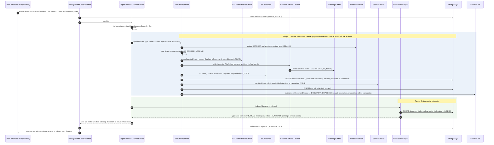
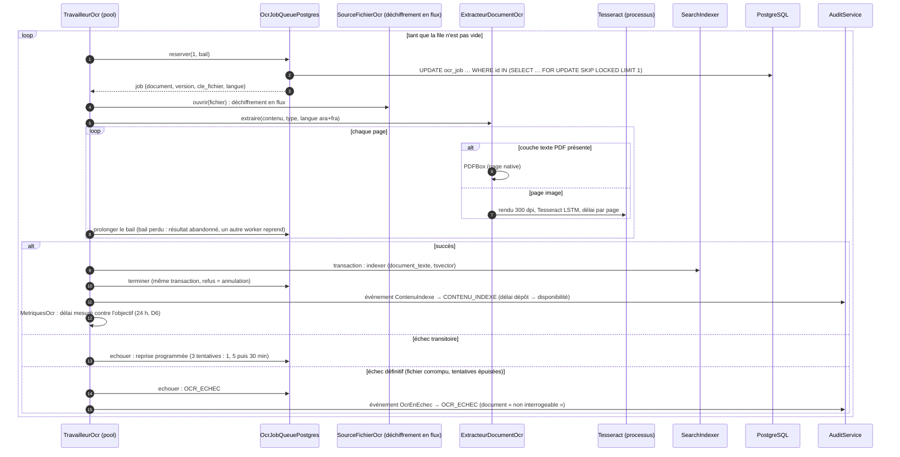
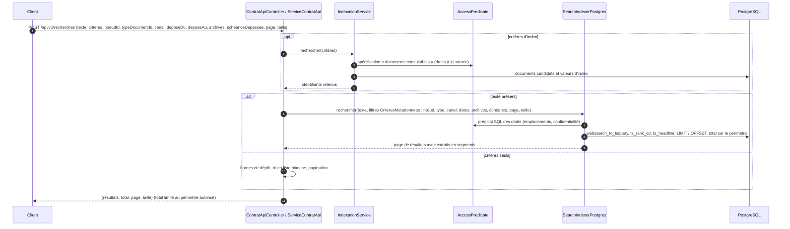
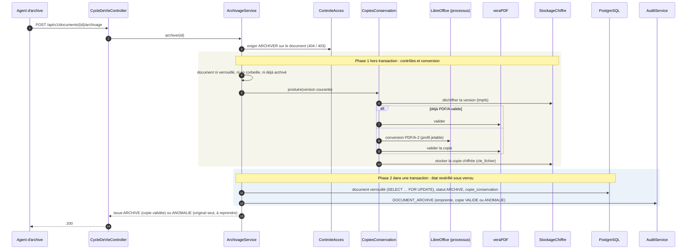

# Diagrammes de séquence des flux principaux (P-05, DAT §4.5)

Cinq flux : dépôt en deux temps, OCR asynchrone, recherche filtrée par les
droits, appel délégué d'une application, archivage. Les noms sont ceux des
classes du code (voir `CLASSES.md`) ; les tables, ceux du schéma
(`SCHEMA-BASE.md`). À tenir à jour à chaque changement de flux :
`SequencesDocumenteesTest` fait échouer la suite si une classe citée ici
disparaît ou change de nom.

Relu contre le code le 30/09/2026 (intégration `71bdc1d`) : chaîne des filtres
complétée (modules métier, journalisation) ; dépôt complété (source du dépôt
T-040, modèle documentaire §12.7, circuit de validation §12.8, dossier archivé) ;
OCR précisé (bail prolongé par page, reprise et échec définitif) ; recherche
complétée (canal, archives, échéance dépassée T-112) ; délégation : garde des
règles de workflow (D8) et décision D15 à venir.

Filtres communs à toute requête d'API (ordre d'exécution, `FilterRegistrationBean`) :
`FiltreContexteRequete` (traceId, adresse de confiance) → filtre des modules
métier (`ConfigurationModules` : 404 `MODULE_INACTIF` avant toute authentification
si le module de la route est désactivé, T-088) → chaîne de sécurité (`FiltreCleApi`
pour une clé d'API, `FiltreJwt` sinon) → `FiltreUtilisateurJournalisation`
(identité dans le MDC) → `FiltreConventionsApi` (64 Ko, pagination) →
`FiltreIdempotence` (créations) → contrôleur.

## 1. Dépôt en deux temps (§12.11, §5.3.1 `POST /documents`)



## 2. OCR asynchrone (§4.3.4)



## 3. Recherche filtrée par les droits (§4.4, §5.3.1 `POST /recherches`)



## 4. Appel d'une application pour le compte d'un utilisateur (§5.4, §5.5)

```mermaid
sequenceDiagram
  autonumber
  participant App as Application cliente
  participant F as FiltreCleApi
  participant Q as QuotasCleApi
  participant D as ResolveurDelegationAnnuaire
  participant L as Annuaire (LDAPS)
  participant P as AccessPredicate
  participant H as SourceHabilitationsApplications
  participant Svc as Service métier
  participant A as AuditService
  App->>F: requête + X-API-Key + X-On-Behalf-Of: identifiant
  F->>F: format, empreinte SHA-256 (temps constant), environnement, révocation, expiration
  F->>F: application active, adresse source autorisée
  F->>Q: consommer (600 / min, 100 000 / jour) — sinon 429 + Retry-After
  F->>D: clé autorisée à déléguer ? adresses déclarées ?
  D->>D: identité GED connue ?
  opt identité jamais connectée
    D->>L: rechercher par identifiant (compte de service)
  end
  D->>L: userAccountControl seul, par objectGUID (D15 ; cache court ≤ 5 min)
  alt compte désactivé (bit 0x2), absent ou état illisible
    D-->>F: 422 IDENTITE_DELEGUEE_INVALIDE (motif au journal CLE_API_REFUSEE, rien provisionné)
  else compte actif
    opt identité jamais connectée
      D->>D: provisionner sans rôle (cache_annuaire)
    end
  end
  D-->>F: principal de l'utilisateur délégué (sinon 422 IDENTITE_DELEGUEE_INVALIDE)
  Note over D,L: Décision D15 (30/09) : lecture de userAccountControl, compte désactivé = 422, à livrer par dev1 (T-055)
  F->>F: contexte de sécurité : sujet = la clé, principal = l'utilisateur
  F->>Svc: requête
  Note over F,Svc: Avant le contrôleur, GardeDroitsRequetes (intercepteur), règles de workflow (D8) : GardeReglesWorkflowApplications exige délégation, portée WORKFLOW_PILOTAGE et GERER_REFERENTIELS de la personne
  Svc->>P: décision (permission, objet)
  P->>H: attributions du sujet
  alt lecture (GET, HEAD)
    H->>P: droits de la clé ∩ droits de l'utilisateur, nœud par nœud
  else écriture
    H->>P: portée de la clé (cle_api_portee)
  end
  Svc->>A: événement : acteur_utilisateur_id = délégué, acteur_application_id = application
  Svc-->>F: réponse
  F->>A: APPEL_API (méthode, chemin, statut, clé)
  F-->>App: réponse
```

## 5. Archivage d'un document (§12.6, §6.1.4)


