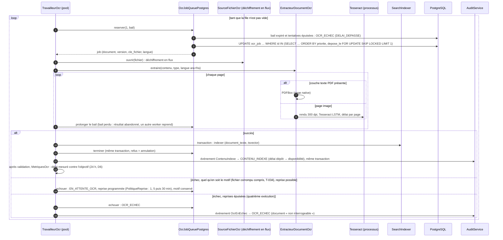
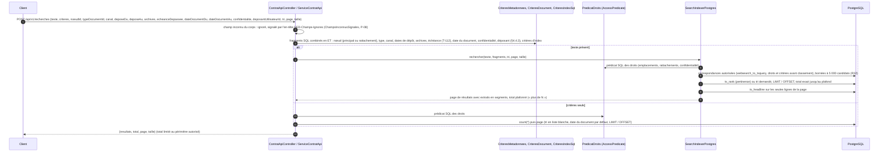
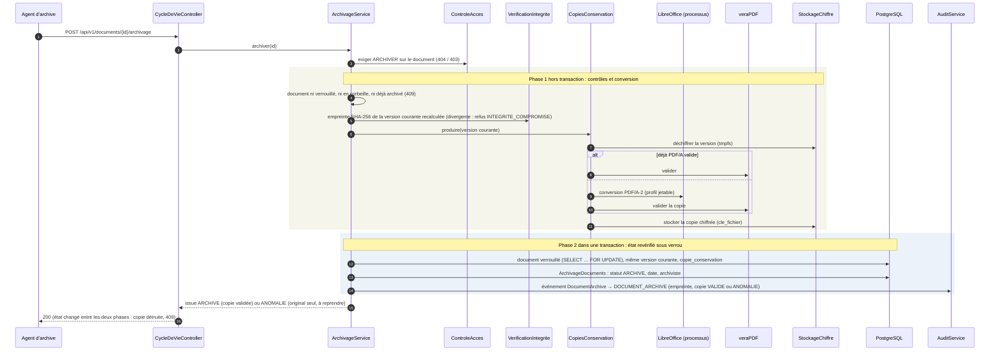

# Diagrammes de séquence des flux principaux (P-05, DAT §4.5)

Six flux : dépôt en deux temps, OCR asynchrone, recherche filtrée par les
droits (contrat d'API), recherche par index (écran), appel délégué d'une
application, archivage. Les noms sont ceux des classes du code (voir
`CLASSES.md`) ; les tables, ceux du schéma (`SCHEMA-BASE.md`) ; les codes
d'erreur, ceux que l'API renvoie. À tenir à jour à chaque changement de flux :
`SequencesDocumenteesTest` fait échouer la suite si une classe ou un code
d'erreur cité ici disparaît ou change de nom, ou si le document annonce
comme futur ce que le code fait déjà.

Relu contre le code le 01/10/2026 (intégration `ff20f21`, après le tour 2) :

- dépôt : emplacement choisi dans un espace d'échange (D12, ANO-F-016),
  désignation du déposant d'un document Confidentiel, aucun circuit quand le
  module workflow est inactif (ANO-E10-008) ;
- OCR : tout échec suit la politique de reprise, fichier corrompu compris
  (T-034), file servie par priorité ;
- recherche du contrat d'API : critères traduits en SQL (R32, plus de passage
  par `IndexationService`), ensemble classé et total plafonnés, critères
  imposés du §4.4.3 (date du document, confidentialité, déposant),
  champ inconnu ignoré et signalé par l'en-tête `GED-Champs-Ignores` (P-08,
  tour 3 ; le 400 `PARAMETRE_INCONNU` du tour 2 n'est plus émis) ;
- recherche par index : flux nouveau (§4 ci-dessous, ANO-F-010) ;
- délégation : D15 livrée (T-055), bascule d'un contrôleur de domaine muet
  sur le suivant (ANO-E2-002), annuaire injoignable = 503 ;
- archivage : empreinte recalculée avant la conversion (§6.1.4).

Filtres communs à toute requête d'API (ordre d'exécution, `FilterRegistrationBean`) :
`FiltreContexteRequete` (traceId, adresse de confiance) → filtre des modules
métier (`ConfigurationModules` : 404 `MODULE_INACTIF` avant toute authentification
si le module de la route est désactivé, T-088) → chaîne de sécurité (`FiltreCleApi`
pour une clé d'API, `FiltreJwt` sinon) → `FiltreUtilisateurJournalisation`
(identité dans le MDC) → `FiltreConventionsApi` (64 Ko, pagination, plafond
de taille des fichiers : 413 `FICHIER_TROP_VOLUMINEUX`) → `FiltreIdempotence`
(créations) → contrôleur.

## 1. Dépôt en deux temps (§12.11, §5.3.1 `POST /documents`)

```mermaid
sequenceDiagram
  autonumber
  participant C as Client (interface ou application)
  participant F as Filtres (sécurité, idempotence)
  participant D as DepotController / DepotService
  participant S as DocumentService
  participant M as ServiceModeleDocument
  participant O as SourceDepot
  participant K as ControleFichiers + clamd
  participant X as StockageChiffre
  participant P as ControleAcces
  participant W as ServiceCircuits
  participant I as IndexationAuDepot
  participant B as PostgreSQL
  participant A as AuditService
  C->>F: POST /api/v1/documents (multipart : file, metadonnees ; typeDocumentId, noeudId facultatif) + Idempotency-Key
  F->>B: réserver idempotence_cle (EN_COURS)
  F->>D: requête
  D->>D: lire et valider les métadonnées (MetadonneesDepot, 64 Ko), écrites au temps 2 seulement
  rect rgb(235, 242, 250)
  Note over S,B: Temps 1 : transaction courte, tout ce qui peut échouer est contrôlé avant d'écrire le fichier
  D->>S: upload(fichier, type, objet, date du document, emplacement)
  S->>S: emplacement : dossier du type, ou noeudId du même espace d'échange (D12), sinon 422 EMPLACEMENT_HORS_ESPACE_ECHANGE
  S->>P: exiger DEPOSER sur cet emplacement (404 / 403)
  S->>S: type vivant, dossier archivé : 409 DOSSIER_ARCHIVE
  S->>M: appliquerAuDepot : version du plan, valeurs par défaut, objet, date (§12.7)
  S->>K: taille, type réel (Tika), liste blanche, antivirus (échec fermé)
  K->>X: écrire le fichier chiffré (AES-256-GCM, cle_fichier)
  S->>O: courante() : canal, application, déposant, dépôt délégué (T-040)
  S->>B: INSERT document (statut_indexation provisoire), version_document n° 1 courante
  opt confidentialité CONFIDENTIEL
    S->>B: désigner le déposant (document_confidentiel_designe)
  end
  S->>W: ouvrirAuDepot (§12.8)
  alt aucune règle applicable
    W->>W: document actif, sans circuit
  else règle applicable, module workflow inactif (T-088, ANO-E10-008)
    W->>W: document actif, sans circuit, avertissement au journal technique
  else règle applicable
    W->>B: circuit figé dans la transaction, document inactif jusqu'à la validation
  end
  S->>B: INSERT ocr_job (EnfilageOcr, si texte à extraire)
  S->>A: événement DocumentDepose → DOCUMENT_DEPOSE (déposant, application, empreinte), même transaction
  end
  rect rgb(240, 248, 240)
  Note over I,B: Temps 2 : transaction séparée
  D->>I: indexer(document, valeurs)
  I->>B: INSERT document_index_valeur, statut_indexation = INDEXE
  I-->>D: type sans plan : SANS_PLAN, rien reçu ou échec : A_INDEXER (le temps 1 reste acquis)
  end
  D-->>F: 201 (ou 202 si OCR en attente), document et issue d'indexation
  F->>B: mémoriser la réponse (TERMINEE, 24 h)
  F-->>C: réponse, un rejeu identique renvoie la même, sans doublon
```

## 2. OCR asynchrone (§4.3.4)



## 3. Recherche filtrée par les droits (§4.4, §5.3.1 `POST /recherches`)



## 4. Recherche par index (écran « Rechercher par index », §12.7, §4.4.3, ANO-F-010)

```mermaid
sequenceDiagram
  autonumber
  participant U as Utilisateur (écran #/recherche-par-index)
  participant IC as IndexationController
  participant DC as DocumentController
  participant RM as RechercheMetadonnees
  participant P as AccessPredicate
  participant CD as CriteresDocument
  participant S as DocumentService
  participant B as PostgreSQL
  U->>IC: GET /api/v1/indexation/criteres
  IC-->>U: index cochés « recherche » (code, nature, valeurs d'une liste)
  U->>DC: POST /api/v1/documents/recherche?sortBy&sortDir {texte, typeDocumentId, noeudId, criteres[code, valeur | de, a], statutConservation, echeanceDepassee, dateDocumentDu, dateDocumentAu, confidentialite, deposantUtilisateurId, page, size}
  DC->>DC: champ inconnu du corps : ignoré, signalé par l'en-tête GED-Champs-Ignores (ChampsInconnusSignales, P-08)
  DC->>RM: rechercher(requête, tri)
  RM->>RM: tri en liste blanche (dateDocument par défaut, name, createdAt), sinon 400
  RM->>P: predicatSql(CONSULTER) : périmètre de l'utilisateur, confidentialité comprise
  RM->>RM: type, nœud (principal ou rattachement), nom ou objet « contient », conservation, échéance
  RM->>CD: date du document, confidentialité, déposant (identité, à défaut employé auteur du dépôt)
  loop chaque critère d'index (ET)
    RM->>B: index_def par code (index inconnu : 400)
    alt date ou nombre
      RM->>RM: bornes meta_date / meta_nombre (index d'expression)
    else liste ou booléen
      RM->>RM: metadonnees @> {code: valeur} (index GIN)
    else texte
      RM->>RM: meta_texte « contient », insensible à la casse
    end
  end
  RM->>B: count(*) sur le périmètre, puis identifiants de la page (ORDER BY tri, id ; LIMIT / OFFSET)
  RM->>S: pageDe(documents de la page) : fiches, état OCR
  RM-->>DC: page {content, total, page, size, totalPages}
  DC-->>U: 200, résultats triés et paginés côté serveur
```

## 5. Appel d'une application pour le compte d'un utilisateur (§5.4, §5.5)

```mermaid
sequenceDiagram
  autonumber
  participant App as Application cliente
  participant F as FiltreCleApi
  participant Q as AuthentificationCleApi / QuotasCleApi
  participant D as ResolveurDelegationAnnuaire
  participant E as EtatCompteEnCache / EtatCompteAnnuaireLdap
  participant K as ControleursAnnuaire
  participant L as Annuaire (contrôleurs de domaine, LDAPS)
  participant P as AccessPredicate
  participant H as SourceHabilitationsApplications
  participant Svc as Service métier
  participant A as AuditService
  App->>F: requête + X-API-Key + X-On-Behalf-Of: identifiant
  F->>Q: verifier(clé, adresse source)
  Q->>Q: format, empreinte SHA-256 (temps constant), environnement, révocation, expiration
  Q->>Q: application active, adresse source autorisée
  Q->>Q: consommer (600 / min, 100 000 / jour) — sinon 429 + Retry-After
  Q-->>F: application authentifiée (refus : 401 / 403 / 429, CLE_API_REFUSEE ou QUOTA_DEPASSE au journal)
  F->>F: clé autorisée à déléguer ? sinon 403 DELEGATION_NON_AUTORISEE
  F->>D: resoudre(application, identifiant)
  D->>D: adresses déclarées pour l'application ? sinon 403 DELEGATION_SANS_ADRESSES
  D->>D: identité GED connue (identifiant ou objectGUID) ?
  opt identité jamais connectée
    D->>K: rechercher par identifiant ou objectGUID (AnnuaireLdap, compte de service, même bascule)
    D->>D: absente de l'annuaire, identifiant mal formé ou provisionnement désactivé : 422
  end
  D->>E: etat(objectGUID) (D15 : userAccountControl seul)
  alt état en cache (≤ 5 min, jamais un état illisible)
    E-->>D: état mémorisé
  else
    E->>K: executer(lecture par objectGUID)
    loop contrôleurs : disponibles dans l'ordre déclaré, puis ceux mis à l'écart
      K->>L: recherche (délais de connexion et de lecture)
      alt réponse (résultat ou refus)
        L-->>K: userAccountControl
      else injoignable ou muet (délai de lecture dépassé)
        K->>K: contrôleur mis à l'écart 30 s, bascule sur le suivant (ANO-E2-002)
      end
    end
    K-->>E: résultat, ou AnnuaireIndisponibleException si aucun ne répond
  end
  alt aucun contrôleur ne répond
    D-->>F: 503 ANNUAIRE_INDISPONIBLE (jamais d'exécution au nom d'une identité non vérifiée)
  else compte désactivé (bit 0x2), absent ou état illisible
    D-->>F: 422 IDENTITE_DELEGUEE_INVALIDE (motif au journal CLE_API_REFUSEE, rien provisionné)
  else compte actif
    opt identité jamais connectée
      D->>D: provisionner sans rôle (cache_annuaire) ; appartenances en attente converties (groupe_membre_attente → groupe_membre, T-025), chacune tracée GROUPE_MEMBRE_ACTIVE (acteur système) et notifiée ACCES_ESPACE_ATTRIBUE (ANO-F-030)
    end
    D-->>F: principal de l'utilisateur délégué
  end
  F->>F: contexte de sécurité : sujet = la clé, principal = l'utilisateur
  F->>Svc: requête
  Note over F,Svc: Avant le contrôleur, GardeDroitsRequetes (intercepteur), règles de workflow (D8) : GardeReglesWorkflowApplications exige délégation, portée WORKFLOW_PILOTAGE et GERER_REFERENTIELS de la personne
  Svc->>P: décision (permission, objet)
  P->>H: attributions du sujet
  alt lecture (GET, HEAD)
    H->>P: droits de la clé ∩ droits de l'utilisateur, nœud par nœud
  else écriture
    H->>P: portée de la clé (cle_api_portee)
  end
  Svc->>A: événement : acteur_utilisateur_id = délégué, acteur_application_id = application
  Svc-->>F: réponse
  F->>A: APPEL_API (méthode, chemin, statut, clé)
  F->>F: métrique ged_api_appels_total (application, clé, résultat, statut)
  F-->>App: réponse
```

## 6. Archivage d'un document (§12.6, §6.1.4)



Restauration depuis la corbeille d'un document dont le dossier a été archivé
entre-temps (ANO-E7-006) : `DocumentService` l'archive par le même traitement,
dans la transaction de la restauration (archiviste du dossier) ; s'il ne peut
pas l'être, la restauration est refusée (409 `DOSSIER_ARCHIVE`).
