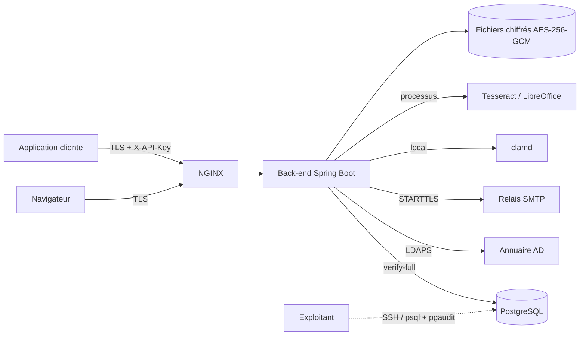

# Modèle de menaces de la GED Marchica Med (P-11)

Méthode : STRIDE (usurpation, altération, répudiation, divulgation, déni de
service, élévation de privilège), module par module. Pour chaque menace : la
parade en place (avec sa référence DAT ou son test) et, le cas échéant, le risque
résiduel et son traitement. Date : 27/09/2026 — à revoir à chaque lot qui ajoute
un point d'entrée, une donnée sensible ou un appel sortant.

## 0. Actifs, acteurs et frontières de confiance

**Actifs** : contenu des documents (confidentialité PUBLIC / PRIVE / CONFIDENTIEL),
métadonnées et texte extrait, journal d'audit (preuve, Article 49.11), clés de
chiffrement des fichiers (KEK), clés d'API et jetons de session, disponibilité du
dépôt pour le bureau d'ordre.

**Acteurs** : utilisateurs de l'annuaire (rôles GED), Administrateur, applications
clientes (clés d'API, éventuellement déléguées), exploitants (système, base),
attaquant externe (réseau de MMED), attaquant interne authentifié.

**Frontières** : navigateur → NGINX (TLS) → back-end ; applications → NGINX → API
(`X-API-Key`) ; back-end → PostgreSQL, annuaire, SMTP, clamd (réseau interne,
TLS) ; back-end → processus Tesseract et LibreOffice (même machine) ; exploitants
→ machines (SSH, `psql`).

## 1. Identité et sessions (lot E2)

| STRIDE | Menace | Parade | Résiduel |
|---|---|---|---|
| S | Vol ou rejeu d'un jeton | JWT RS256 de 15 min, renouvellement par cookie `HttpOnly` avec rotation et détection de réutilisation, durée absolue de session, révocation par l'Administrateur | Session volée pendant sa validité : durée absolue 4 h recommandée (R26) |
| S | Mot de passe deviné | Authentification déléguée à l'AD (verrouillage de l'AD), limiteur de tentatives par identifiant et adresse | — |
| T | Jeton forgé | Signature RS256, clé privée dans un keystore 0400 hors dépôt, refus de démarrer sans clé en prod | — |
| R | Nier une connexion | `CONNEXION_REUSSIE` / `CONNEXION_REFUSEE` au journal d'audit, adresse de confiance (`X-Forwarded-For` du seul NGINX) | — |
| I | Énumération des comptes | Réponse identique pour identifiant inconnu, mot de passe faux, compte désactivé (D1) | — |
| D | Annuaire indisponible | Sessions ouvertes non affectées, sonde par contrôleur (D4), alertes `GedAnnuaireIndisponible` et `GedAnnuaireControleurIndisponible` | Nouvelles connexions impossibles pendant la panne |
| E | Rôle déduit de l'annuaire | Aucun attribut d'appartenance lu (P2, D3) ; rôles uniquement par habilitation GED | — |

## 2. Autorisation (lot E3)

| STRIDE | Menace | Parade | Résiduel |
|---|---|---|---|
| E | Accès direct par identifiant (IDOR) | Point d'application unique `AccessPredicate` sur chaque lecture et écriture, filtres « à la source » des listes, totaux et recherches ; `ArchitectureDroitsTest` interdit les lectures en masse hors du prédicat | — |
| I | Existence d'un objet révélée | 404 identique pour objet absent ou hors périmètre (P5), libellé fixe | — |
| I | Document privé ou confidentiel vu par un tiers | Prédicat de confidentialité (déposant, `VOIR_PRIVE`, désignés, `VOIR_CONFIDENTIEL`) dans la même décision | — |
| T | Modification d'habilitation non tracée | `HabilitationModifiee` au journal (avant / après), compteur `version_habilitations` par déclencheurs | — |
| E | Cache de droits périmé | Cache invalidé par version (déclencheurs sur nœuds, habilitations, groupes, rôles) : effet immédiat | — |

## 3. Dépôt, stockage, OCR et aperçu (lots E5, E6)

| STRIDE | Menace | Parade | Résiduel |
|---|---|---|---|
| T | Fichier malveillant | Type réel par signature (Tika), liste blanche par type documentaire, taille bornée (100 Mo par type, 200 Mo plateforme), antivirus en échec fermé | Antivirus à jour : exploitation (freshclam) |
| I | Vol du support de stockage | Chiffrement AES-256-GCM par fichier, clé par fichier chiffrée par une KEK du keystore ; volumes LUKS2 (P-10) | Accès à la machine en marche : comptes système, keystore 0400 |
| T | Altération d'un fichier stocké | Empreinte SHA-256 à l'écriture, vérification d'intégrité planifiée, `INTEGRITE_ANOMALIE` au journal | — |
| I | Fuite par fichiers en clair temporaires | Temporaires sur tmpfs (`ged-tmpfs.exemple.fstab`), aperçus en cache chiffré | — |
| E | Exécution via un document converti (LibreOffice, Tesseract) | Processus sans interpréteur, arguments fixés, profil LibreOffice jetable, service systemd durci (`NoNewPrivileges`, `ProtectSystem=strict`), sorties réseau filtrées (P-12) | Vulnérabilité de LibreOffice : mises à jour système |
| D | Saturation de l'OCR | File `ocr_job` asynchrone (SKIP LOCKED), délai par page, 3 tentatives, alertes de profondeur et d'âge de file | — |
| R | Nier un dépôt | `DOCUMENT_DEPOSE` (déposant, application, empreinte) au journal ; source et horodatage (Article 49.3.a) | — |

## 4. Recherche (lots E6, E3)

| STRIDE | Menace | Parade | Résiduel |
|---|---|---|---|
| I | Résultats ou totaux hors périmètre | Prédicat SQL des droits dans la requête plein texte, total calculé sur le périmètre autorisé | — |
| T | Injection SQL par la recherche | `websearch_to_tsquery` paramétré, tri en liste blanche, critères paramétrés | — |
| I | Extrait piégé (script dans un texte OCR) | Extraits en segments de texte, jamais de HTML ; affichage échappé par Angular | — |
| D | Recherche coûteuse | Texte limité à 500 caractères, pagination plafonnée à 200, quotas par clé | — |

## 5. Cycle de vie : archivage, purge, export (lot E7)

| STRIDE | Menace | Parade | Résiduel |
|---|---|---|---|
| T | Modification d'un document archivé | Refus en 409 de toute écriture (service et base : versions gelées) | — |
| R / T | Purge abusive | Permission `PURGER`, document en corbeille seulement, `DOCUMENT_PURGE` au journal ; aucune suppression automatique (P4) | — |
| I | Export d'un dossier hors droits | Même prédicat que la recherche, documents non autorisés omis, `DOCUMENT_EXPORTE` par document | — |
| D | Export massif | Traitement de fond au-delà de 500 documents ou 2 Go, archive en flux | — |

## 6. Circuits de validation (lot E8)

| STRIDE | Menace | Parade | Résiduel |
|---|---|---|---|
| S | Décision au nom d'un autre validateur | Validateur = identité authentifiée ou déléguée vérifiée ; `PAS_VALIDATEUR` | — |
| R | Nier une décision | Décision nominative, horodatée, motivée au refus, auditée | — |
| T | Règle modifiée après dépôt | Circuit figé au dépôt (copie de la règle) | — |

## 7. Notifications (lot E8, dev2)

| STRIDE | Menace | Parade | Résiduel |
|---|---|---|---|
| I | Contenu envoyé à une mauvaise adresse | Adresse lue dans le cache d'annuaire, jamais saisie ; trois cas de notification seulement | Boîte e-mail de l'utilisateur hors de la GED : textes sans contenu de document |
| T | Injection dans l'e-mail | Texte brut (`text/plain`), valeurs insérées littéralement | — |
| S | Usurpation de l'expéditeur | Relais SMTP de MMED en STARTTLS, expéditeur fixé par la configuration | SPF / DKIM : domaine de MMED |
| D | Relais indisponible | Boîte d'envoi, 3 tentatives, notification in-app toujours présente | — |

## 8. API d'intégration : clés, délégation, idempotence (lot E9)

| STRIDE | Menace | Parade | Résiduel |
|---|---|---|---|
| S | Vol d'une clé d'API | Secret de 256 bits montré une fois, empreinte SHA-256 seule en base, comparaison à temps constant, adresses autorisées, expiration 12 mois, révocation immédiate, clé refusée hors de son environnement | Clé volée utilisée depuis une adresse autorisée : révocation, quotas, `APPEL_API` au journal |
| E | Application au-delà de son périmètre | La clé est un sujet des droits : portée par nœud et par opération, décidée par `AccessPredicate` ; routes d'administration refusées à toute clé | — |
| S / E | Délégation abusive (`X-On-Behalf-Of`) | Attribut « délégation » par clé, adresses sources obligatoires, identité vérifiée (annuaire), lecture en intersection des droits, écriture avec les droits de la clé | Compte désactivé encore accepté (QR9, D1) : option `verifier-compte-annuaire` |
| R | Nier un appel | Double identité au journal (`acteur_utilisateur_id`, `acteur_application_id`) | — |
| T | Rejeu d'une création | `Idempotency-Key` obligatoire, empreinte de requête, 422 sur contenu différent | — |
| D | Épuisement par une application | Quotas par clé (600 / min, 100 000 / jour, 429 + `Retry-After`), limitation de débit NGINX, 64 Ko de métadonnées | Quotas comptés par instance (plusieurs instances : quota multiplié) |
| I | Spécification publiée en production | springdoc désactivé et routes refusées en profil prod | — |

## 9. Journal d'audit (lot E4)

| STRIDE | Menace | Parade | Résiduel |
|---|---|---|---|
| T | Modification ou suppression d'une trace | INSERT seul pour `ged_app` (droits et déclencheurs), scellement horaire chaîné, copie des scellements hors base en ajout seul, vérification mensuelle et à la demande | Superutilisateur PostgreSQL : détecté par le scellement, tracé par pgaudit (P-16) |
| I | Consultation du journal par un tiers | Permission `CONSULTER_AUDIT`, consultation et export eux-mêmes audités | — |
| D | Saturation du volume | Partitions mensuelles, 2,5 Go par an (§6.6), supervision de l'espace | — |

## 10. Exploitation : déploiement, base, sauvegardes, supervision

| STRIDE | Menace | Parade | Résiduel |
|---|---|---|---|
| T | Migration de schéma non maîtrisée | Liquibase seule source du schéma, `ged_owner` au déploiement seulement, retour arrière éprouvé en UAT (GARANTIE.md) | — |
| I | Écoute réseau | TLS partout (T-065), contrôle au démarrage en uat/prod | — |
| I | Vol de sauvegarde | Sauvegardes chiffrées, clés sauvegardées à part (RESTAURATION.md), volumes LUKS2 | — |
| E | Compromission d'un exploitant de base | Rôles distincts, aucun superutilisateur applicatif, pgaudit sur les rôles d'administration | Séparation administrateur GED / administrateur de base : organisation de MMED |
| D | Panne majeure | Sondes, alertes, procédure de contournement sous 24 h (GARANTIE.md), restauration testée | — |
| I | SSRF, appels sortants | Aucun client HTTP, inventaire figé par test, sorties filtrées (REVUE-SSRF.md) | — |

## 11. Interface Angular

| STRIDE | Menace | Parade | Résiduel |
|---|---|---|---|
| T | XSS | Liaison de données Angular échappée, pas de `innerHTML` sur des données, CSP stricte sans script en ligne (NGINX) | — |
| S | Vol du jeton par script | Jeton d'accès en mémoire, renouvellement par cookie `HttpOnly`, `SameSite` | — |
| E | Contournement par masquage d'un menu | Les menus ne sont qu'un confort : le serveur décide à chaque requête | — |
| T | Clickjacking | `X-Frame-Options: DENY`, `frame-ancestors 'none'` | — |
