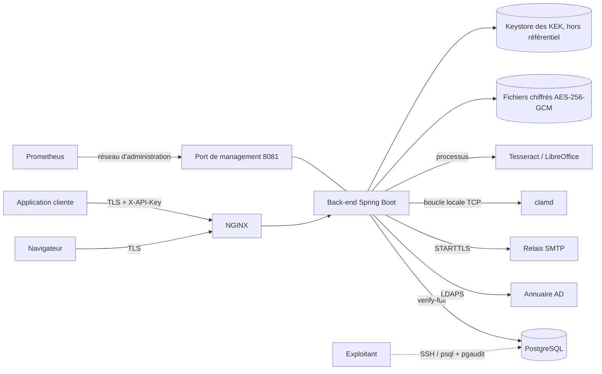

# Modèle de menaces de la GED Marchica Med (P-11)

Méthode : STRIDE (usurpation, altération, répudiation, divulgation, déni de
service, élévation de privilège), module par module. Pour chaque menace : la
parade en place (avec sa référence DAT ou son test) et, le cas échéant, le risque
résiduel et son traitement. Date : 27/09/2026 — à revoir à chaque lot qui ajoute
un point d'entrée, une donnée sensible ou un appel sortant. Révision du 30/09/2026 :
réserves de qa (vague 5) levées — compromission de la KEK (§3 bis), port de management
(§10 bis), incohérence sur clamd (§0), renvoi de chaque parade d'échec fermé à son test
(§12).

## 0. Actifs, acteurs et frontières de confiance

**Actifs** : contenu des documents (confidentialité PUBLIC / PRIVE / CONFIDENTIEL),
métadonnées et texte extrait, journal d'audit (preuve, Article 49.11), clés de
chiffrement des fichiers (KEK), clés d'API et jetons de session, disponibilité du
dépôt pour le bureau d'ordre.

**Acteurs** : utilisateurs de l'annuaire (rôles GED), Administrateur, applications
clientes (clés d'API, éventuellement déléguées), exploitants (système, base),
attaquant externe (réseau de MMED), attaquant interne authentifié.

**Frontières** : navigateur → NGINX (TLS) → back-end ; applications → NGINX → API
(`X-API-Key`) ; back-end → PostgreSQL, annuaire, SMTP (réseau interne, TLS) ;
back-end → clamd (**boucle locale** du serveur d'application, TCP sans TLS :
`GED_CLAMAV_HOTE=127.0.0.1`, `clamd.conf` `TCPAddr 127.0.0.1`, `EXPLOITATION.md` §2 et
§6) ; back-end → processus Tesseract et LibreOffice (même machine) ; supervision
(Prometheus) → **port de management** (Actuator, 8081, interface du réseau
d'administration, jamais relayé par NGINX) ; exploitants → machines (SSH, `psql`).

Correction du 30/09/2026 (réserve de qa, vague 5) : la version précédente disait clamd
« réseau interne, TLS » ici et « local » dans le schéma. Le déploiement retenu est
**local** : le contenu des fichiers ne quitte pas le serveur d'application pour
l'analyse, et un clamd distant n'est pas prévu (le client `ClientClamd` ne parle pas
TLS). Un clamd sur une autre machine exigerait un tunnel chiffré (stunnel) et une mise
à jour de ce document et de `REVUE-SSRF.md`.

## 1. Identité et sessions (lot E2)

| STRIDE | Menace | Parade | Résiduel |
|---|---|---|---|
| S | Vol ou rejeu d'un jeton | JWT RS256 de 15 min, renouvellement par cookie `HttpOnly` avec rotation et détection de réutilisation, durée absolue de session, révocation par l'Administrateur | Session volée pendant sa validité : durée absolue 4 h recommandée (R26) |
| S | Mot de passe deviné | Authentification déléguée à l'AD (verrouillage de l'AD), limiteur de tentatives par identifiant et adresse | — |
| T | Jeton forgé | Signature RS256, clé privée dans un keystore 0400 hors dépôt, refus de démarrer sans clé en prod | — |
| R | Nier une connexion | `CONNEXION_REUSSIE` / `CONNEXION_REFUSEE` au journal d'audit, adresse de confiance (`X-Forwarded-For` du seul NGINX) | — |
| I | Énumération des comptes | Réponse identique pour identifiant inconnu, mot de passe faux, compte désactivé (D1) | — |
| D | Annuaire indisponible | Sessions ouvertes non affectées, sonde par contrôleur (D4), alertes `GedAnnuaireIndisponible` et `GedAnnuaireControleurIndisponible` | Nouvelles connexions impossibles pendant la panne |
| E | Rôle déduit de l'annuaire | Aucun attribut d'appartenance lu (P2, D3) ; rôles uniquement par habilitation GED | — |

## 2. Autorisation (lot E3)

| STRIDE | Menace | Parade | Résiduel |
|---|---|---|---|
| E | Accès direct par identifiant (IDOR) | Point d'application unique `AccessPredicate` sur chaque lecture et écriture, filtres « à la source » des listes, totaux et recherches ; `ArchitectureDroitsTest` interdit les lectures en masse hors du prédicat | — |
| I | Existence d'un objet révélée | 404 identique pour objet absent ou hors périmètre (P5), libellé fixe | — |
| I | Document privé ou confidentiel vu par un tiers | Prédicat de confidentialité (déposant, `VOIR_PRIVE`, désignés, `VOIR_CONFIDENTIEL`) dans la même décision | — |
| T | Modification d'habilitation non tracée | `HabilitationModifiee` au journal (avant / après), compteur `version_habilitations` par déclencheurs | — |
| E | Cache de droits périmé | Cache invalidé par version (déclencheurs sur nœuds, habilitations, groupes, rôles) : effet immédiat | — |

## 3. Dépôt, stockage, OCR et aperçu (lots E5, E6)

| STRIDE | Menace | Parade | Résiduel |
|---|---|---|---|
| T | Fichier malveillant | Type réel par signature (Tika), liste blanche par type documentaire, taille bornée (100 Mo par type, 200 Mo plateforme), antivirus en échec fermé | Antivirus à jour : exploitation (freshclam) |
| I | Vol du support de stockage | Chiffrement AES-256-GCM par fichier, clé par fichier chiffrée par une KEK du keystore ; volumes LUKS2 (P-10) | Accès à la machine en marche : comptes système, keystore 0400 |
| T | Altération d'un fichier stocké | Empreinte SHA-256 à l'écriture, vérification d'intégrité planifiée, `INTEGRITE_ANOMALIE` au journal | — |
| I | Fuite par fichiers en clair temporaires | Temporaires sur tmpfs (`ged-tmpfs.exemple.fstab`), aperçus en cache chiffré | — |
| E | Exécution via un document converti (LibreOffice, Tesseract) | Processus sans interpréteur, arguments fixés, profil LibreOffice jetable, service systemd durci (`NoNewPrivileges`, `ProtectSystem=strict`), sorties réseau filtrées (P-12) | Vulnérabilité de LibreOffice : mises à jour système |
| D | Saturation de l'OCR | File `ocr_job` asynchrone (SKIP LOCKED), délai par page, 3 tentatives, alertes de profondeur et d'âge de file | — |
| R | Nier un dépôt | `DOCUMENT_DEPOSE` (déposant, application, empreinte) au journal ; source et horodatage (Article 49.3.a) | — |

## 3 bis. Clés de chiffrement des fichiers (KEK) — compromission

Rappel du mécanisme (§6.1.2) : une DEK AES-256 par fichier ; la DEK est enveloppée
(AES-256-GCM, données authentifiées = identifiant de la KEK + identifiant du fichier)
par la KEK active du keystore PKCS#12 ; l'enveloppe est rangée dans `cle_fichier`
(base) ; le keystore est hors du référentiel de fichiers, sa phrase secrète vient de
l'environnement (`GED_KEYSTORE_MDP`, coffre de secrets). Lire un document exige donc
**trois** éléments : le fichier `.enc`, la ligne `cle_fichier` et la KEK (keystore +
phrase secrète).

| STRIDE | Menace | Parade | Résiduel |
|---|---|---|---|
| I | Vol du keystore **seul** (copie du fichier `.p12`) | Phrase secrète hors du keystore (environnement, coffre), keystore propriété de `ged` dans `/var/lib/ged/cles` (0700), jamais sous la racine des fichiers (`ConfigurationFichiersTest.keystoreHorsStockage`) ni dans le dépôt (`ConfigurationFichiersTest.keystoreDevHorsDepot`) | Phrase secrète faible : imposée par la procédure (coffre de MMED) |
| I | Vol de la KEK (keystore **et** phrase secrète, par exemple compte `ged` ou `root` compromis) sans la base | La KEK seule ne déchiffre rien : il faut aussi `cle_fichier` et les fichiers. **Rotation immédiate** : `--ged.fichiers.cles.rotation-immediate=true` crée une nouvelle KEK et réenveloppe toutes les DEK courantes (`RotationImmediateKekTest.rotationSansRetrait`) ; `--ged.fichiers.cles.retirer-ancienne=true` retire ensuite la KEK compromise du keystore (`RotationImmediateKekTest.rotationAvecRetrait`) ; un réenveloppement incomplet fait échouer le lancement et interdit le retrait (`RotationImmediateKekTest.rotationIncomplete`). Puis changement de la phrase secrète du keystore et sauvegarde des clés (procédure `EXPLOITATION.md` §2, « Compromission présumée de la KEK ») | Toute copie **antérieure** de `cle_fichier` (sauvegarde de la base) reste déchiffrable avec la KEK volée : la rotation réenveloppe, elle ne change pas les DEK (`RotationKek`) |
| I | Vol de la KEK **et** de la base (ou d'une sauvegarde) **et** des fichiers | Aucune parade technique a posteriori dans la GED livrée : les DEK volées ouvrent les fichiers volés. Prévention : séparation des supports (sauvegardes des clés à part, `RESTAURATION.md`), LUKS2 sur les volumes (P-10), comptes système nominatifs, pgaudit (P-16) | **Risque résiduel déclaré** : à traiter comme une violation de données. Un rechiffrement des fichiers sous de nouvelles DEK n'est pas développé ; il ne protégerait pas les copies déjà volées. À arbitrer par MMED si elle veut l'exiger après compromission |
| T | Substitution d'une enveloppe (DEK d'un fichier réutilisée pour un autre) | Contexte lié à l'identifiant du fichier (`KeystoreKeyProviderTest.contexteLie`) | — |
| D | Perte ou corruption du keystore | Sauvegarde du keystore après chaque rotation (`sauvegarder-cles.sh`, `RESTAURATION.md`) ; refus de démarrer plutôt que de créer un keystore neuf en production (`KeystoreKeyProviderTest.refusDeDemarrer`) | Keystore non sauvegardé après une rotation : fichiers écrits ensuite illisibles après restauration (procédure, avertissement au journal) |
| E | Retrait de la KEK active ou d'une KEK encore utilisée | Refus (`KeystoreKeyProviderTest.retrait`, `StockageChiffreTest.retraitKek`) | Sauvegardes qui référencent une KEK retirée : garder le keystore sauvegardé correspondant |

## 4. Recherche (lots E6, E3)

| STRIDE | Menace | Parade | Résiduel |
|---|---|---|---|
| I | Résultats ou totaux hors périmètre | Prédicat SQL des droits dans la requête plein texte, total calculé sur le périmètre autorisé | — |
| T | Injection SQL par la recherche | `websearch_to_tsquery` paramétré, tri en liste blanche, critères paramétrés | — |
| I | Extrait piégé (script dans un texte OCR) | Extraits en segments de texte, jamais de HTML ; affichage échappé par Angular | — |
| D | Recherche coûteuse | Texte limité à 500 caractères, pagination plafonnée à 200, quotas par clé | — |

## 5. Cycle de vie : archivage, purge, export (lot E7)

| STRIDE | Menace | Parade | Résiduel |
|---|---|---|---|
| T | Modification d'un document archivé | Refus en 409 de toute écriture (service et base : versions gelées) | — |
| R / T | Purge abusive | Permission `PURGER`, document en corbeille seulement, `DOCUMENT_PURGE` au journal ; aucune suppression automatique (P4) | — |
| I | Export d'un dossier hors droits | Même prédicat que la recherche, documents non autorisés omis, `DOCUMENT_EXPORTE` par document | — |
| D | Export massif | Traitement de fond au-delà de 500 documents ou 2 Go, archive en flux | — |

## 6. Circuits de validation (lot E8)

| STRIDE | Menace | Parade | Résiduel |
|---|---|---|---|
| S | Décision au nom d'un autre validateur | Validateur = identité authentifiée ou déléguée vérifiée ; `PAS_VALIDATEUR` | — |
| R | Nier une décision | Décision nominative, horodatée, motivée au refus, auditée | — |
| T | Règle modifiée après dépôt | Circuit figé au dépôt (copie de la règle) | — |

## 7. Notifications (lot E8, dev2)

| STRIDE | Menace | Parade | Résiduel |
|---|---|---|---|
| I | Contenu envoyé à une mauvaise adresse | Adresse lue dans le cache d'annuaire, jamais saisie ; trois cas de notification seulement | Boîte e-mail de l'utilisateur hors de la GED : textes sans contenu de document |
| T | Injection dans l'e-mail | Texte brut (`text/plain`), valeurs insérées littéralement | — |
| S | Usurpation de l'expéditeur | Relais SMTP de MMED en STARTTLS, expéditeur fixé par la configuration | SPF / DKIM : domaine de MMED |
| D | Relais indisponible | Boîte d'envoi, 3 tentatives, notification in-app toujours présente | — |

## 8. API d'intégration : clés, délégation, idempotence (lot E9)

| STRIDE | Menace | Parade | Résiduel |
|---|---|---|---|
| S | Vol d'une clé d'API | Secret de 256 bits montré une fois, empreinte SHA-256 seule en base, comparaison à temps constant, adresses autorisées, expiration 12 mois, révocation immédiate, clé refusée hors de son environnement | Clé volée utilisée depuis une adresse autorisée : révocation, quotas, `APPEL_API` au journal |
| E | Application au-delà de son périmètre | La clé est un sujet des droits : portée par nœud et par opération, décidée par `AccessPredicate` ; routes d'administration refusées à toute clé | — |
| S / E | Délégation abusive (`X-On-Behalf-Of`) | Attribut « délégation » par clé, adresses sources obligatoires, identité vérifiée (annuaire), lecture en intersection des droits, écriture avec les droits de la clé | Compte désactivé : levé par D15 — `userAccountControl` lu à chaque délégation (lecture seule, cet attribut seul, cache ≤ 5 min), compte désactivé = 422 tracé ; reste la fenêtre du cache (2 min par défaut) |
| R | Nier un appel | Double identité au journal (`acteur_utilisateur_id`, `acteur_application_id`) | — |
| T | Rejeu d'une création | `Idempotency-Key` obligatoire, empreinte de requête, 422 sur contenu différent | — |
| D | Épuisement par une application | Quotas par clé (600 / min, 100 000 / jour, 429 + `Retry-After`), limitation de débit NGINX, 64 Ko de métadonnées | Quotas comptés par instance (plusieurs instances : quota multiplié) |
| I | Spécification publiée en production | springdoc désactivé et routes refusées en profil prod | — |

## 9. Journal d'audit (lot E4)

| STRIDE | Menace | Parade | Résiduel |
|---|---|---|---|
| T | Modification ou suppression d'une trace | INSERT seul pour `ged_app` (droits et déclencheurs), scellement horaire chaîné, copie des scellements hors base en ajout seul, vérification mensuelle et à la demande | Superutilisateur PostgreSQL : détecté par le scellement, tracé par pgaudit (P-16) |
| I | Consultation du journal par un tiers | Permission `CONSULTER_AUDIT`, consultation et export eux-mêmes audités | — |
| D | Saturation du volume | Partitions mensuelles, 2,5 Go par an (§6.6), supervision de l'espace | — |

## 10. Exploitation : déploiement, base, sauvegardes, supervision

| STRIDE | Menace | Parade | Résiduel |
|---|---|---|---|
| T | Migration de schéma non maîtrisée | Liquibase seule source du schéma, `ged_owner` au déploiement seulement, retour arrière éprouvé en UAT (GARANTIE.md) | — |
| I | Écoute réseau | TLS partout (T-065), contrôle au démarrage en uat/prod | — |
| I | Vol de sauvegarde | Sauvegardes chiffrées, clés sauvegardées à part (RESTAURATION.md), volumes LUKS2 | — |
| E | Compromission d'un exploitant de base | Rôles distincts, aucun superutilisateur applicatif, pgaudit sur les rôles d'administration | Séparation administrateur GED / administrateur de base : organisation de MMED |
| D | Panne majeure | Sondes, alertes, procédure de contournement sous 24 h (GARANTIE.md), restauration testée | — |
| I | SSRF, appels sortants | Aucun client HTTP, inventaire figé par test, sorties filtrées (REVUE-SSRF.md) | — |

## 10 bis. Port de management (Actuator)

Actuator n'est servi que sur un port séparé (`GED_MANAGEMENT_PORT`, 8081 par défaut),
lié à l'interface du réseau d'administration (`GED_MANAGEMENT_ADRESSE`, 127.0.0.1 par
défaut) ; seuls `health` et `prometheus` y sont exposés. La restriction est **réseau** :
la chaîne de sécurité de ce port (`SecuritePortManagement`) n'exige pas de jeton, pour
que Prometheus collecte sans compte utilisateur.

| STRIDE | Menace | Parade | Résiduel |
|---|---|---|---|
| I | Lecture des sondes détaillées et des métriques depuis le réseau des utilisateurs | Port distinct lié à l'interface d'administration (`SupervisionIntegrationTest.portDeManagement`) ; NGINX ne le relaie pas et renvoie 404 sur `/actuator` (`deploiement/nginx/ged.conf`) ; filtre systemd (`sorties.conf` : réseau de supervision seul autorisé en plus de NGINX et des services d'exploitation) ; pare-feu (`EXPLOITATION.md` §1 : 8081 depuis la supervision seulement) | Tout hôte du réseau de supervision lit les métriques sans authentification : ni document, ni métadonnée, ni secret n'y figure (état des briques, compteurs, identifiants de clés d'API en étiquette) |
| E | Une route de l'API servie sans authentification parce qu'elle arrive sur le port de management | La chaîne sans jeton ne s'applique qu'aux requêtes reçues sur le port de management effectif, jamais sur celui de l'API ; ports confondus : elle ne s'applique jamais et Actuator reste authentifié (`SecuritePortManagementTest.seulLePortDeManagement`, `SecuritePortManagementTest.avantDemarrage`) | — |
| I | Actuator joignable sur le port de l'API | `/actuator/prometheus` répond 401 ou 404 à un anonyme sur le port de l'API (`SupervisionIntegrationTest.portDeManagement`) | — |
| T | Arrêt ou reconfiguration à distance (`shutdown`, `env`, `loggers` en écriture) | Exposition limitée à `health,prometheus` (`SupervisionIntegrationTest.portDeManagement`) ; le niveau de journalisation se change par fichier relu à chaud, pas par Actuator | — |
| I | Processus enfant (LibreOffice) joignant Actuator par la boucle locale | En UAT et PROD, `GED_MANAGEMENT_ADRESSE` est l'adresse du serveur, jamais 127.0.0.1, et l'adresse propre du serveur n'est pas autorisée en sortie (`sorties.conf`, `REVUE-SSRF.md` §3) | — |
| D | Interrogation abusive des sondes (chaque appel interroge base, clamd, annuaire) | Réseau de supervision seulement ; sondes à délai borné | Pas de limitation de débit sur ce port |

## 11. Interface Angular

| STRIDE | Menace | Parade | Résiduel |
|---|---|---|---|
| T | XSS | Liaison de données Angular échappée, pas de `innerHTML` sur des données, CSP stricte sans script en ligne (NGINX) | — |
| S | Vol du jeton par script | Jeton d'accès en mémoire, renouvellement par cookie `HttpOnly`, `SameSite` | — |
| E | Contournement par masquage d'un menu | Les menus ne sont qu'un confort : le serveur décide à chaque requête | — |
| T | Clickjacking | `X-Frame-Options: DENY`, `frame-ancestors 'none'` | — |

## 12. Échec fermé : chaque parade et le test qui la prouve

Principe (§6.2.3 A04) : une brique de sécurité indisponible ou mal configurée
**refuse** l'opération (ou le démarrage) ; elle ne la laisse jamais passer sans
contrôle. Chaque ligne renvoie au test automatisé qui la démontre (suite `mvn test`,
`Classe.méthode`). Colonne « Éprouvé contre » : ce que le test a réellement exercé sur
le poste de développement.

| Brique indisponible ou affaiblie | Comportement fermé | Test | Éprouvé contre |
|---|---|---|---|
| ClamAV injoignable (port fermé) | 503 `ANTIVIRUS_INDISPONIBLE`, dépôt refusé | `ClientClamdTest.injoignable` | clamd simulé (`FauxClamd`) |
| ClamAV muet, connexion coupée, réponse incompréhensible, limite de flux | 503, dépôt refusé | `ClientClamdTest.muet`, `ClientClamdTest.coupure`, `ClientClamdTest.reponsesAnormales` | clamd simulé |
| ClamAV indisponible pendant un dépôt | Rien n'est écrit (ni fichier, ni clé, ni ligne) | `ControleFichiersTest.echecFerme` | clamd simulé |
| ClamAV indisponible, réponse HTTP | 503 problem+json sans révéler l'hôte ni le port | `ErreursFichierHttpTest.codes`, `ErreursFichierHttpTest.pasDeFuite` | — |
| Antivirus désactivé par configuration hors dev et test | Démarrage refusé (prod, uat, profil inconnu) | `ConfigurationFichiersTest.antivirusObligatoireEnProd` | configuration réelle |
| clamd arrêté, vu de la supervision | Sonde `antivirus` DOWN, instance retirée de la disponibilité | `SondesTest.antivirusInjoignable` | clamd simulé |
| Annuaire (LDAP) : aucun contrôleur ne répond | 503 `ANNUAIRE_INDISPONIBLE`, événement d'échec au journal, sonde DOWN, aucun mode dégradé | `AnnuaireIndisponibleApiTest.annuaireIndisponible`, `AnnuaireLdapTest.annuaireIndisponible` | annuaire embarqué UnboundID |
| Annuaire en `ldap://` quand LDAPS est exigé ; certificat inconnu | Démarrage refusé ; liaison refusée | `AnnuaireLdapTest.ldapEnClairInterdit`, `AnnuaireLdapTest.ldaps` | annuaire embarqué |
| Délégation (`X-On-Behalf-Of`) : identité non vérifiable dans l'annuaire | 422 `IDENTITE_DELEGUEE_INVALIDE`, jamais d'appel accepté sous l'identité de l'application seule | `ClesApiTest.delegation` | annuaire embarqué |
| Keystore des KEK (tient lieu de KMS) absent, illisible, phrase secrète fausse ou absente en production | Refus de démarrer, jamais de keystore neuf créé en production | `KeystoreKeyProviderTest.refusDeDemarrer`, `ConfigurationFichiersTest.keystoreHorsStockage` | keystore PKCS#12 réel |
| KEK inconnue ou enveloppe d'un autre fichier | `CleIndisponibleException`, lecture refusée | `KeystoreKeyProviderTest.contexteLie` | réel |
| Rotation après compromission incomplète | Échec du lancement, KEK compromise non retirée | `RotationImmediateKekTest.rotationIncomplete` | réel |
| Fichier altéré sur le disque | Lecture refusée (étiquette GCM) ; 500 `INTEGRITE_COMPROMISE` avant tout envoi, aperçu et export compris | `StockageChiffreTest.alterationDetectee`, `ApercuTelechargementApiTest` (ANO-E5-002), `ExportApiTest` (ANO-E5-003) | réel |
| Magasin de la clé de signature des jetons absent ou illisible ; clé trop courte | Refus de démarrer | `ServiceJetonTest.magasinObligatoire`, `ServiceJetonTest.cleTropCourte` | réel |
| Jeton forgé (autre clé, HS256, `alg none`) ou revendications hors norme | Refusé (401) | `ServiceJetonTest.signaturesRefusees`, `ServiceJetonTest.revendicationsRefusees` | réel |
| TLS affaibli par variable d'environnement en uat/prod (`sslmode`, autorité, STARTTLS) | Démarrage refusé, écarts nommés | `ControleTransportsChiffresTest.affaiblissementsRefuses` | configuration réelle |
| Clé d'API révoquée, expirée, hors adresses autorisées, application désactivée | 401 / 403, refus tracé | `ClesApiTest.revocation`, `ClesApiTest.expiration`, `ClesApiTest.adresses`, `ClesApiTest.desactivation` | réel |
| Port de management confondu avec celui de l'API | Actuator reste derrière l'authentification | `SecuritePortManagementTest.seulLePortDeManagement` | réel |
| LibreOffice absent (aperçu bureautique) | 503 `CONVERSION_INDISPONIBLE`, rien d'envoyé | `ApercuTelechargementApiTest.apercuBureautiqueSansLibreOffice` | inopérant sur un poste où LibreOffice est installé (échec connu de la suite de référence, à rendre indépendant du poste) |
| Moteur OCR absent | `MOTEUR_INDISPONIBLE` (transitoire), job reprogrammé | `MoteurTesseractTest` (« Binaire absent ») | réel |

Hors de ce tableau, parce qu'aucun test automatisé ne peut les prouver sur le poste :
chiffrement LUKS2 des volumes (P-10, `EXPLOITATION.md` §11), refus du service systemd
de démarrer sans tmpfs monté (`ged-backend.service`), filtre de sortie systemd (P-12,
`verifier-sorties.sh` éprouvé avec un résolveur simulé). Ils sont à rejouer en UAT.
